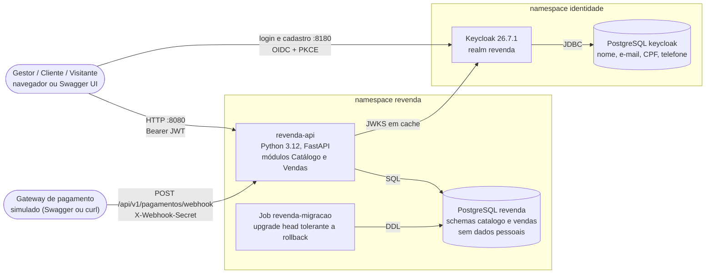

# Revenda de Veículos — API

[](https://github.com/Caina-Climaco/fiap-soat-revenda-veiculos/actions/workflows/ci.yml)

Trabalho Substitutivo do Tech Challenge — FIAP PósTech Software Architecture (SOAT), Fase 3.
Autor: Cainã Clímaco (trabalho individual).

Este README segue o que o enunciado pede: [o que é o projeto](#1-o-que-é), [como foi implementado](#2-como-foi-implementado), [como usar localmente](#3-como-usar-localmente) e [como testar](#4-como-testar). Os detalhes de cada decisão estão em [`docs/`](docs/01-visao-geral.md).

## Sumário

1. [O que é](#1-o-que-é)
2. [Como foi implementado](#2-como-foi-implementado)
3. [Como usar localmente](#3-como-usar-localmente)
4. [Como testar](#4-como-testar)
5. [Fluxo de contribuição](#5-fluxo-de-contribuição)
6. [Estrutura de pastas](#6-estrutura-de-pastas)
7. [Limitações conhecidas](#7-limitações-conhecidas)
8. [Autor](#8-autor)

---

## 1. O que é

### 1.1 Problema

Uma revenda de veículos quer vender pela internet. A interface (front-end) é de outros times; este projeto entrega o **back-end**: uma API REST e a infraestrutura que a executa, com implantação automatizada. Toda mudança, de código ou de infraestrutura, entra por Pull Request e passa por pipeline de CI/CD.

### 1.2 Funcionalidades

Pedidas no enunciado:

| Funcionalidade | Endpoint / onde |
|---|---|
| Cadastrar veículo (marca, modelo, ano, cor, preço) | `POST /api/v1/veiculos` (gestor) |
| Editar veículo | `PATCH /api/v1/veiculos/{id}` (gestor) |
| Cadastro de compradores em serviço de identidade separado | Tela de registro do Keycloak (realm `revenda`) |
| Compra pela internet, só por pessoas cadastradas | `POST /api/v1/vendas` (cliente) |
| Efetivação da compra | `POST /api/v1/pagamentos/webhook` (gateway de pagamento simulado) |
| Listar veículos à venda, do mais barato ao mais caro | `GET /api/v1/veiculos/a-venda` (público) |
| Listar veículos vendidos, do mais barato ao mais caro | `GET /api/v1/veiculos/vendidos` (público) |

Descobertas na modelagem (o enunciado avisa que "nem todos os campos e funcionalidades estão descritos"; regras completas em [docs/02, seção 2.7](docs/02-modelagem-ddd.md#27-regras-de-negócio-descobertas)):

- **Reserva com expiração**: a compra reserva o veículo por 30 minutos (configurável); sem pagamento, a venda é cancelada (`RESERVA_EXPIRADA`) e o veículo volta à vitrine.
- **Preço congelado**: o preço de venda é copiado no início da compra; editar o veículo depois não afeta a compra.
- **Edição só de veículo à venda**: veículo reservado ou vendido não pode ser editado (409).
- **Uma venda ativa por veículo**: dois compradores simultâneos nunca levam o mesmo carro (um recebe 201, o outro 409).
- **Pagamento recusado** cancela a venda e devolve o veículo à vitrine; notificações repetidas do gateway são idempotentes.
- **Cancelamento** pelo comprador (desistência) ou pela loja enquanto a venda aguarda pagamento.
- **Gestor não compra** (403), mesmo que tenha também o papel `cliente`.
- **Minhas compras**, consulta de venda (cliente vê só as próprias; venda alheia retorna 404) e listagem de vendas para o gestor, com filtro por status.
- Consulta de veículo por id, paginação nas listagens (`limite` ≤ 100, `deslocamento` ≤ 1.000.000), validação estrita de entrada (mensagens em português), erros em `application/problem+json` (RFC 9457), endpoints de saúde (`/health/live`, `/health/ready`) e métricas Prometheus em `/metrics`.

### 1.3 Identidade separada dos dados transacionais

Cadastro, login e papéis ficam no **Keycloak**, com banco PostgreSQL **próprio**, em outra instância e em outro namespace do Kubernetes. Nome, sobrenome, e-mail, CPF e telefone existem só ali. A API não tem credencial para esse banco: ela valida o token (JWT) e guarda na venda apenas o `comprador_id`, que é o identificador opaco `sub` do token.

Do ponto de vista da LGPD, isso aplica o princípio da necessidade (art. 6º, III): o banco transacional não contém dados pessoais diretos, e a ligação entre venda e pessoa só pode ser refeita com a informação mantida separadamente no serviço de identidade. A análise completa (base legal, direitos do titular, exclusão de conta) está em [docs/07](docs/07-seguranca-lgpd.md).

---

## 2. Como foi implementado

### 2.1 Visão de containers

Diagrama resumido; a versão C4 completa (contexto, containers, componentes e implantação) está em [docs/04](docs/04-arquitetura.md).



### 2.2 Stack

| Camada | Tecnologia |
|---|---|
| API | Python 3.12, FastAPI, Pydantic v2, SQLAlchemy 2 (síncrono), Alembic, PyJWT (JWKS), psycopg 3, Uvicorn |
| Identidade | Keycloak 26.7.1 (`start-dev --import-realm`), realm versionado em [`keycloak/realm-revenda.json`](keycloak/README.md) |
| Bancos | PostgreSQL 16 (duas instâncias: `revenda` e `keycloak`) |
| Infraestrutura | Docker Desktop, kind (Kubernetes 1.34), Terraform (providers `kubernetes`, `helm`, `random`), kustomize, metrics-server |
| CI/CD | GitHub Actions: CI no runner hospedado, CD em runner self-hosted em container |
| Qualidade | pytest, pytest-cov, ruff, mypy (strict), import-linter, Trivy, kubeconform, hadolint, shellcheck |
| Ferramentas de desenvolvimento | uv (com `uv.lock`), docker compose |

### 2.3 Domain-Driven Design

O domínio foi modelado com Domain Storytelling e Event Storming ([docs/02](docs/02-modelagem-ddd.md)). Resultado:

- **Contextos delimitados**: Vendas (subdomínio principal), Catálogo (suporte), Identidade e Acesso (genérico, resolvido com Keycloak) e Gateway de Pagamento (externo, simulado).
- **Agregados**: `Veiculo` (estados `A_VENDA`, `RESERVADO`, `VENDIDO`) e `Venda` (`AGUARDANDO_PAGAMENTO`, `EFETIVADA`, `CANCELADA`), com invariantes e máquinas de estado.
- **Mapa de contextos**: Identidade publica OIDC/JWT (Open Host Service) e os módulos se conformam; Catálogo é fornecedor de Vendas pela porta `CatalogoPort`; o webhook do gateway é uma camada anticorrupção.
- **Linguagem ubíqua** em português no código (`Veiculo`, `Venda`, `reservar`, `efetivar`, `codigo_pagamento`).

Requisitos e rastreabilidade em [docs/03](docs/03-requisitos.md).

### 2.4 Clean Architecture e monólito modular

Uma única API (`revenda-api`) com dois módulos, `catalogo` e `vendas`, cada um com as camadas `domain`, `application`, `infrastructure` e `interfaces`. O domínio usa só a biblioteca padrão; casos de uso não conhecem FastAPI nem SQLAlchemy; Vendas fala com Catálogo apenas pela porta `CatalogoPort`, ligada em `composicao.py`. Essas regras são verificadas no CI pelo **import-linter** (contratos em `pyproject.toml`) e por um teste de arquitetura.

Por que monólito modular e não microsserviços: a separação exigida pelo enunciado é identidade × transacional, e ela é física (Keycloak à parte). Entre Catálogo e Vendas basta a fronteira lógica, o que permite reservar o veículo e criar a venda na **mesma transação** sem saga nem mensageria ([ADR-002](docs/adrs/ADR-002-monolito-modular.md)). Cada módulo tem seu schema (`catalogo`, `vendas`) e não há chave estrangeira entre eles ([ADR-004](docs/adrs/ADR-004-postgresql-schemas.md)).

### 2.5 Keycloak

- Realm `revenda` importado na subida: autocadastro habilitado, login por e-mail, e-mail único, proteção contra força bruta, idioma `pt-BR`.
- Perfil de usuário declarativo: nome, sobrenome, e-mail e **CPF** obrigatórios (11 dígitos), telefone opcional.
- Papéis `cliente` (padrão de todo autocadastro) e `gestor` (usuário seed `gestor.loja`).
- Clients: `revenda-swagger` (público, Authorization Code + PKCE S256, usado pelo botão *Authorize* do Swagger), `revenda-e2e` (password grant, **só no ambiente local**, para os testes e2e) e `revenda-api` (apenas audiência).
- A API valida assinatura RS256 pelo JWKS (em cache), `iss`, `exp`, `aud = revenda-api` e `azp`; os papéis vêm de `realm_access.roles`.
- A senha do `gestor.loja` não está no repositório: o arquivo de realm usa o placeholder `${GESTOR_PASSWORD}`, preenchido a partir de um Secret gerado pelo Terraform.

Detalhes em [keycloak/README.md](keycloak/README.md) e [ADR-001](docs/adrs/ADR-001-keycloak-identidade.md).

### 2.6 Concorrência e expiração da reserva

- A reserva é um `UPDATE` condicional: `UPDATE catalogo.veiculos SET status='RESERVADO' ... WHERE id=:id AND status='A_VENDA'`. Com zero linhas afetadas, o veículo está indisponível e a API responde 409. Um **índice único parcial** (`ux_vendas_veiculo_ativa`) garante no banco no máximo uma venda ativa por veículo ([ADR-008](docs/adrs/ADR-008-concorrencia-update-condicional.md)). Um teste de integração dispara compras simultâneas do mesmo veículo e confirma exatamente um 201.
- A expiração é **preguiçosa**, sem agendador: a venda vencida é cancelada quando alguém a toca (nova compra do veículo, webhook, cancelamento, consulta do veículo ou da venda, listagens de vendas) e a listagem `a-venda` faz uma varredura limitada antes de consultar; nenhuma leitura mostra reserva vencida como ativa ([ADR-009](docs/adrs/ADR-009-expiracao-preguicosa.md)).

### 2.7 Pagamento por webhook

A compra devolve um `codigo_pagamento` (`PAG-` + 12 hexadecimais). O gateway, externo e aqui simulado, notifica o resultado em `POST /api/v1/pagamentos/webhook` com `{"codigo_pagamento": "...", "status": "APROVADO" | "RECUSADO"}` e o header `X-Webhook-Secret`, comparado em tempo constante. `APROVADO` efetiva a venda e marca o veículo como vendido; `RECUSADO` cancela e libera o veículo; repetições são idempotentes; aprovação após a expiração cancela a venda e responde 409 ([ADR-007](docs/adrs/ADR-007-pagamento-webhook.md), [docs/05, seção 4.13](docs/05-api.md#413-post-apiv1pagamentoswebhook--notificação-do-gateway)).

### 2.8 Infraestrutura

Tudo roda no PC do autor (Windows 11, Docker Desktop), sem nuvem:

- **Cluster kind** `revenda` criado pela **CLI `kind`** a partir de [`infra/kind/cluster.yaml`](infra/kind/cluster.yaml) (um nó, imagem fixada por digest, portas do host em `127.0.0.1`: 8080 → API, 8180 → Keycloak, 15432 → banco da API para demonstração). O plano original usava o provider Terraform `tehcyx/kind`, mas o binário dele não tem assinatura de código e foi bloqueado pelo **Smart App Control** do Windows 11; a CLI `kind` é assinada ([ADR-005](docs/adrs/ADR-005-kind-terraform-nodeport.md): kind via CLI, plataforma por Terraform, NodePort sem Ingress).
- **Terraform** ([`infra/terraform`](infra/README.md)) cuida de tudo o que fica **dentro** do cluster: namespaces `revenda` e `identidade`, senhas aleatórias entregues como Secrets, os dois PostgreSQL (StatefulSet + PVC), Keycloak com o realm, NetworkPolicies dos bancos e metrics-server. O state fica fora do repositório, em `%USERPROFILE%\.revenda` ([ADR-011](docs/adrs/ADR-011-segredos-terraform.md)).
- **Aplicação** por kustomize ([`k8s/`](k8s/README.md)): Deployment `revenda-api` (não root, sistema de arquivos somente leitura, probes), Service NodePort 30080, HPA 2..5 réplicas e Job de migração Alembic executado antes de cada rollout. A imagem `revenda-api:<sha>` é carregada no nó com `kind load`, sem registry ([ADR-010](docs/adrs/ADR-010-kind-load-sem-registry.md)).

### 2.9 CI/CD

| Etapa | Onde | O que faz |
|---|---|---|
| Pull Request | GitHub | `main` protegida: PR obrigatório, 4 checks obrigatórios, branch atualizada, histórico linear, sem force push, regras valendo também para administradores, só squash merge |
| CI ([`ci.yml`](.github/workflows/ci.yml)) | Runner hospedado (`ubuntu-latest`), em todo PR e push na `main` | `qualidade`: ruff (lint e formato), mypy, import-linter. `testes`: unit + integração contra PostgreSQL de serviço, cobertura mínima de 80%. `imagem`: build da imagem, Trivy (vulnerabilidades CRITICAL/HIGH corrigíveis) e varredura de segredos. `infra`: `terraform fmt`/`validate`, kubeconform nos manifestos, validação do `cluster.yaml`, hadolint e shellcheck do runner, contrato mínimo do realm. Um quinto job, `titulo-pr`, valida o título no padrão Conventional Commits (não é obrigatório na proteção) |
| CD ([`cd.yml`](.github/workflows/cd.yml)) | Runner **self-hosted** num **container Linux** no Docker Desktop (labels `self-hosted`, `Linux`, `kind-local`), só em push na `main` (PR mergeado) ou disparo manual com `ref` ancestral da `main` (outra `ref` é recusada) | Cria o cluster kind se faltar; `terraform apply`; build `revenda-api:<sha>`; `kind load`; Job de migração; rollout do Deployment; aguarda API e Keycloak; **testes e2e** contra o ambiente implantado; resumo no job summary |

O runner roda em container porque o runner nativo para Windows também foi bloqueado pelo Smart App Control. O container fica na rede docker `kind` e compartilha o state do Terraform com os scripts do Windows por bind mount ([ADR-006](docs/adrs/ADR-006-ci-hospedado-cd-self-hosted.md), [docs/08](docs/08-ci-cd-infra.md)). O primeiro deploy automático passou com os 18 testes e2e verdes. Rollback: *Actions > CD > Run workflow* com `ref` = SHA anterior da `main`; o Job de migração da versão anterior reconhece o schema mais novo e não o altera ([docs/08, seção 6](docs/08-ci-cd-infra.md#6-rollback)).

### 2.10 Observabilidade

Logs JSON em stdout com `X-Request-ID` e sem dados pessoais; probes de vida e prontidão; métricas Prometheus em `GET /metrics` (latência, volume e erros por rota template, contadores de negócio), com anotações `prometheus.io/scrape` no pod; metrics-server para o HPA. O APM (New Relic ou Datadog) fica como evolução documentada ([docs/12](docs/12-observabilidade.md), [ADR-012](docs/adrs/ADR-012-observabilidade-prometheus.md)). Não há API Gateway nem Serverless nesta entrega; o motivo e onde eles entrariam estão no [ADR-013](docs/adrs/ADR-013-sem-api-gateway-e-serverless.md).

### 2.11 Documentação

| Documento | Conteúdo |
|---|---|
| [01 — Visão geral](docs/01-visao-geral.md) | Problema, escopo, atores, premissas, restrições |
| [02 — Modelagem DDD](docs/02-modelagem-ddd.md) | Domain Storytelling, Event Storming, linguagem ubíqua, contextos, agregados, máquinas de estado, regras descobertas |
| [03 — Requisitos](docs/03-requisitos.md) | Requisitos funcionais e não funcionais, rastreabilidade |
| [04 — Arquitetura](docs/04-arquitetura.md) | C4 (contexto, containers, componentes), implantação, sequências, camadas |
| [05 — API](docs/05-api.md) | Contrato dos endpoints, autenticação, erros, paginação |
| [06 — Dados](docs/06-dados.md) | Modelo físico, índices, migrações, separação dos dados pessoais |
| [07 — Segurança e LGPD](docs/07-seguranca-lgpd.md) | Ameaças (STRIDE), controles, OWASP, LGPD |
| [08 — CI/CD e infraestrutura](docs/08-ci-cd-infra.md) | kind, Terraform, manifestos, pipelines, governança Git, runner, rollback |
| [09 — Testes](docs/09-testes.md) | Estratégia, níveis, cenários BDD |
| [10 — Plano de execução](docs/10-plano-execucao.md) | Backlog, DoR/DoD, cronograma, riscos |
| [11 — Roteiro do vídeo](docs/11-roteiro-video.md) | Roteiro da demonstração em vídeo e checklist de preparação |
| [12 — Observabilidade](docs/12-observabilidade.md) | Logs, métricas Prometheus (`/metrics`), golden signals, SLIs/SLOs, alertas e APM |
| [13 — Design Approval Sheet](docs/13-das.md) | Folha de aprovação do desenho: escopo, decisões, qualidade, riscos, custos |
| [infra/README.md](infra/README.md) | Detalhes da plataforma (kind, Terraform, runner) |
| [k8s/README.md](k8s/README.md) | Manifestos da aplicação e contrato com o CD |
| [keycloak/README.md](keycloak/README.md) | Configuração do realm |

| ADR | Decisão |
|---|---|
| [ADR-001](docs/adrs/ADR-001-keycloak-identidade.md) | Keycloak como provedor de identidade apartado |
| [ADR-002](docs/adrs/ADR-002-monolito-modular.md) | Monólito modular para Catálogo e Vendas |
| [ADR-003](docs/adrs/ADR-003-stack-python-fastapi.md) | Stack Python 3.12, FastAPI, SQLAlchemy 2, Alembic e PyJWT |
| [ADR-004](docs/adrs/ADR-004-postgresql-schemas.md) | PostgreSQL com schemas por módulo e instância separada para identidade |
| [ADR-005](docs/adrs/ADR-005-kind-terraform-nodeport.md) | Kubernetes local (kind via CLI) com plataforma provisionada por Terraform, NodePort sem Ingress |
| [ADR-006](docs/adrs/ADR-006-ci-hospedado-cd-self-hosted.md) | CI no runner hospedado e CD em runner self-hosted |
| [ADR-007](docs/adrs/ADR-007-pagamento-webhook.md) | Pagamento simulado por webhook com segredo compartilhado |
| [ADR-008](docs/adrs/ADR-008-concorrencia-update-condicional.md) | Concorrência por UPDATE condicional e índice único parcial |
| [ADR-009](docs/adrs/ADR-009-expiracao-preguicosa.md) | Reserva com expiração preguiçosa |
| [ADR-010](docs/adrs/ADR-010-kind-load-sem-registry.md) | Imagem carregada no kind sem registry, tag = SHA |
| [ADR-011](docs/adrs/ADR-011-segredos-terraform.md) | Segredos gerados pelo Terraform, nada sensível versionado |
| [ADR-012](docs/adrs/ADR-012-observabilidade-prometheus.md) | Métricas Prometheus nativas na API, APM como evolução |
| [ADR-013](docs/adrs/ADR-013-sem-api-gateway-e-serverless.md) | Sem API Gateway e sem Serverless nesta entrega |

---

## 3. Como usar localmente

Há duas formas. As duas publicam a API em `http://localhost:8080` e o Keycloak em `http://localhost:8180`, portanto **não rode as duas ao mesmo tempo**.

| | Opção A — docker compose | Opção B — ambiente completo (kind) |
|---|---|---|
| Para quê | Desenvolvimento rápido | Mesmo ambiente do CD |
| Requer | Docker | Windows, Docker Desktop, kind, Terraform, kubectl, gh |
| Segredos | Você define no `.env` | Gerados pelo Terraform, lidos com `kubectl` |

### 3.1 Opção A — docker compose (desenvolvimento)

```bash
cp .env.example .env      # PowerShell: Copy-Item .env.example .env
# edite o .env e troque todos os valores "troque-..." (o .env é ignorado pelo Git)
docker compose up -d --build
docker compose ps         # aguarde api e keycloak como "healthy"
```

O compose sobe o banco da API, o Job de migração (`alembic upgrade head`), a API, o Keycloak e o banco do Keycloak, em redes separadas. O realm `revenda` é importado só na primeira subida; para recomeçar do zero, `docker compose down -v`.

| Serviço | URL |
|---|---|
| API | http://localhost:8080 |
| Swagger UI | http://localhost:8080/docs |
| Métricas Prometheus | http://localhost:8080/metrics |
| Keycloak (console admin, realm `master`) | http://localhost:8180/admin/ — usuário e senha: `KC_BOOTSTRAP_ADMIN_USERNAME` e `KC_BOOTSTRAP_ADMIN_PASSWORD` do `.env` |
| Conta do cliente | http://localhost:8180/realms/revenda/account |
| PostgreSQL da API | `localhost:5432` (usuário `DB_USER`, senha `DB_PASSWORD` do `.env`) |

Token: pelo Swagger (passo a passo na [seção 3.3](#33-passo-a-passo-de-uso-pelo-swagger)) ou, para scripts, pelo client `revenda-e2e` (password grant, só local). Exemplo com o gestor, em bash:

```bash
GESTOR_PASSWORD='<valor de GESTOR_PASSWORD no .env>'
TOKEN=$(curl -s http://localhost:8180/realms/revenda/protocol/openid-connect/token \
  -d grant_type=password -d client_id=revenda-e2e -d username=gestor.loja \
  --data-urlencode "password=$GESTOR_PASSWORD" | jq -r .access_token)
curl -s http://localhost:8080/api/v1/vendas -H "Authorization: Bearer $TOKEN"
```

### 3.2 Opção B — ambiente completo no Windows (igual ao CD)

**Pré-requisitos**: Windows 10/11, Docker Desktop (com o `kubectl` que ele instala), kind, Terraform, gh (autenticado com `gh auth login`) e git. O script 01 instala kind, Terraform e Helm via winget. Portas livres: 8080, 8180 e 15432.

Rode na raiz do repositório, em PowerShell normal (sem administrador), um script por vez:

| # | Script | O que faz | Quando |
|---|---|---|---|
| 00 | `scripts\windows\00-verificar-ambiente.ps1` | Relatório de ferramentas, versões, Docker, clusters kind, `gh auth` e portas em uso (`.setup\relatorio-ambiente.txt`) | Sempre, para conferir |
| 01 | `scripts\windows\01-instalar-ferramentas.ps1` | Instala o que falta (kind, Terraform, Helm) e inicia o Docker Desktop | Primeira vez |
| 02 | `scripts\windows\02-criar-repositorio.ps1` | Cria o repositório no GitHub, faz o push, aplica a proteção da `main` (4 checks, PR obrigatório, squash, histórico linear), aprovação para workflows de forks e o environment `local` | Uma vez, pelo dono do repositório (num fork: `-Dono <seu-usuario>`) |
| 03 | `scripts\windows\03-instalar-runner.ps1` | Constrói a imagem do runner (`infra/runner`) e sobe o container `revenda-runner` na rede `kind`, registrado com a label `kind-local`; `-Remover` desfaz | Uma vez, depois do 04 (precisa do cluster e da rede `kind`) |
| 04 | `scripts\windows\04-subir-ambiente.ps1` | Cria o cluster kind (se faltar) e roda `terraform init` + `apply` com o mesmo state do CD; mostra pods, URLs e como ler os segredos. `-Recriar` apaga cluster e state antes; `-SemBancoExposto` não publica o banco em 15432 | Para subir a plataforma |
| 05 | `scripts\windows\05-destruir-ambiente.ps1` | `terraform destroy`, `kind delete cluster` e remoção do state (pede confirmação; `-Forcar` não pede) | Para apagar tudo |

Exemplo: `powershell -ExecutionPolicy Bypass -File .\scripts\windows\04-subir-ambiente.ps1`.

Ordem na primeira vez: **00 → 01 → 02 → 04 → 03**, e então implantar a aplicação. O script 04 sobe a plataforma (bancos e Keycloak); a **API vem do CD**: faça merge de um PR na `main` ou dispare o workflow manualmente:

```powershell
gh workflow run cd.yml -R Caina-Climaco/fiap-soat-revenda-veiculos
gh run watch -R Caina-Climaco/fiap-soat-revenda-veiculos
```

<details>
<summary>Sem runner (por exemplo, num clone sem acesso de administrador ao repositório): os mesmos passos do CD, à mão</summary>

Depois do script 04, na raiz do repositório (PowerShell):

```powershell
$sha = git rev-parse HEAD
docker build -t "revenda-api:$sha" .
kind load docker-image "revenda-api:$sha" --name revenda

kubectl -n revenda delete job revenda-migracao --ignore-not-found --wait=true
(kubectl kustomize k8s/migracao) -replace 'revenda-api:dev', "revenda-api:$sha" | kubectl apply -n revenda -f -
kubectl -n revenda wait --for=condition=complete --timeout=300s job/revenda-migracao

(kubectl kustomize k8s/base) -replace 'revenda-api:dev', "revenda-api:$sha" | kubectl apply -f -
kubectl -n revenda rollout status deployment/revenda-api --timeout=180s
```

</details>

**Segredos.** Todos são gerados pelo Terraform (`random_password`) e ficam apenas no state local e em Secrets do cluster; nenhum está no repositório.

| Secret (namespace/nome) | Chaves | Para quê |
|---|---|---|
| `identidade/keycloak-gestor` | `GESTOR_PASSWORD` | Senha do usuário `gestor.loja` |
| `identidade/keycloak-admin` | `KC_BOOTSTRAP_ADMIN_USERNAME`, `KC_BOOTSTRAP_ADMIN_PASSWORD` | Console admin do Keycloak (realm `master`; usuário `admin`) |
| `revenda/revenda-webhook-secret` | `WEBHOOK_SECRET` | Header `X-Webhook-Secret` do gateway simulado |
| `revenda/revenda-db-credentials` | `DB_USER`, `DB_PASSWORD`, `DB_NAME` | Banco da API (`revenda`/`revenda`) |
| `identidade/keycloak-db-credentials` | `KC_DB_USERNAME`, `KC_DB_PASSWORD` | Banco do Keycloak (não exposto no host) |

PowerShell:

```powershell
function Segredo([string]$ns, [string]$nome, [string]$chave) {
  $b64 = kubectl -n $ns get secret $nome -o "jsonpath={.data.$chave}"
  [Text.Encoding]::UTF8.GetString([Convert]::FromBase64String($b64))
}
Segredo identidade keycloak-gestor GESTOR_PASSWORD
Segredo identidade keycloak-admin KC_BOOTSTRAP_ADMIN_PASSWORD
Segredo revenda revenda-webhook-secret WEBHOOK_SECRET
Segredo revenda revenda-db-credentials DB_PASSWORD
# copiar sem mostrar na tela: Segredo revenda revenda-webhook-secret WEBHOOK_SECRET | Set-Clipboard
```

bash (Git Bash ou Linux):

```bash
segredo() { kubectl -n "$1" get secret "$2" -o jsonpath="{.data.$3}" | base64 -d; }
segredo identidade keycloak-gestor GESTOR_PASSWORD
segredo identidade keycloak-admin KC_BOOTSTRAP_ADMIN_PASSWORD
segredo revenda revenda-webhook-secret WEBHOOK_SECRET
segredo revenda revenda-db-credentials DB_PASSWORD
```

**URLs** (todas só em `127.0.0.1`):

| Serviço | Endereço |
|---|---|
| API | http://localhost:8080 |
| Swagger UI | http://localhost:8080/docs (OpenAPI em `/openapi.json`) |
| Métricas Prometheus | http://localhost:8080/metrics |
| Keycloak | http://localhost:8180 |
| Console admin do Keycloak | http://localhost:8180/admin/ (usuário `admin`, senha `KC_BOOTSTRAP_ADMIN_PASSWORD`) |
| Conta do cliente (dados do titular) | http://localhost:8180/realms/revenda/account |
| Banco da API (demonstração) | `localhost:15432`, usuário `revenda`, banco `revenda`, senha `DB_PASSWORD`; por exemplo `psql -h localhost -p 15432 -U revenda -d revenda`, ou sem psql instalado: `kubectl -n revenda exec -it statefulset/revenda-db -- psql -U revenda -d revenda` |

Outros comandos úteis: `kubectl get pods -A`, `kubectl -n revenda get hpa revenda-api`, `kubectl -n identidade logs deployment/keycloak --tail=100`.

### 3.3 Passo a passo de uso pelo Swagger

Vale para as duas opções. Use `http://localhost:8080/docs`.

Dica: o Keycloak mantém a sessão no navegador. Para alternar entre gestor e cliente, use janelas separadas (uma normal, outra anônima, ou outro navegador) ou, na mesma janela, clique em *Logout* no diálogo *Authorize* e saia da sessão do Keycloak em http://localhost:8180/realms/revenda/account.

1. **Login do gestor.** Clique em **Authorize**. Na seção `keycloak (OAuth2, authorizationCode with PKCE)`, o `client_id` já vem como `revenda-swagger` e o `client_secret` fica vazio; marque o escopo `openid` e clique em **Authorize**. Na tela do Keycloak entre com `gestor.loja` (ou `gestor@revenda.local`) e a senha `GESTOR_PASSWORD`. De volta ao Swagger, feche o diálogo.
2. **Cadastrar veículos.** `POST /api/v1/veiculos` > *Try it out*, corpo:
   ```json
   { "marca": "Fiat", "modelo": "Argo Drive 1.3", "ano": 2023, "cor": "Vermelho", "preco": "79900.00" }
   ```
   Resposta 201 com `id`, `status: "A_VENDA"` e `versao: 1`. Cadastre mais alguns (por exemplo, `"Volkswagen"`/`"Gol 1.0 MPI"`/`2021`/`"Branco"`/`"54900.00"` e `"Toyota"`/`"Corolla XEi 2.0"`/`2022`/`"Prata"`/`"124900.00"`). O preço é texto decimal com duas casas.
3. **Editar.** `PATCH /api/v1/veiculos/{veiculo_id}` com `{ "preco": "52900.00" }`: resposta 200 com `versao: 2`.
4. **Cliente se cadastra.** Em outra janela (anônima), abra o Swagger, clique em **Authorize** e, na tela de login do Keycloak, use o link de cadastro (*Register*). Preencha usuário, e-mail, nome, sobrenome, **CPF** (11 dígitos, sem pontos), telefone (opcional, 10 ou 11 dígitos) e senha. Ao concluir, o Keycloak devolve para o Swagger já autenticado; o novo usuário recebe o papel `cliente`.
5. **Listar à venda.** `GET /api/v1/veiculos/a-venda` (público): itens do mais barato ao mais caro, com `total`, `limite` e `deslocamento`.
6. **Comprar.** Como cliente, `POST /api/v1/vendas` com `{ "veiculo_id": "<id do veículo>" }`: resposta 201 com `status: "AGUARDANDO_PAGAMENTO"`, `codigo_pagamento` (`PAG-...`), `preco_venda` e `expira_em`. O veículo sai da lista à venda. Uma segunda compra do mesmo veículo, por outro cliente, recebe 409 `veiculo-indisponivel`; o gestor tentando comprar recebe 403.
7. **Simular o gateway.** Clique em **Authorize**, na seção `webhook (apiKey)` informe o valor de `WEBHOOK_SECRET` e confirme (o Swagger passa a enviar o header `X-Webhook-Secret`). Em `POST /api/v1/pagamentos/webhook`:
   ```json
   { "codigo_pagamento": "PAG-xxxxxxxxxxxx", "status": "APROVADO" }
   ```
   Resposta 200 com `status: "EFETIVADA"` e `efetivada_em`. Com `"RECUSADO"` a venda seria cancelada e o veículo voltaria à vitrine. Sem o segredo correto: 401.
8. **Listar vendidos.** `GET /api/v1/veiculos/vendidos`: o veículo aparece com `status: "VENDIDO"`, em ordem de preço.
9. **Minhas compras.** Como cliente, `GET /api/v1/vendas/minhas`: a venda aparece `EFETIVADA`. O gestor vê todas as vendas, com `comprador_id`, em `GET /api/v1/vendas` (filtro opcional `?status=`).

<details>
<summary>O mesmo fluxo com curl (bash, requer curl e jq)</summary>

Funciona com as duas opções. Na opção A, use os valores do `.env` em vez de `kubectl`. O cliente é criado pela Admin API do Keycloak, como fazem os testes e2e (equivale ao autocadastro: recebe o papel `cliente`).

```bash
API=http://localhost:8080
KC=http://localhost:8180
segredo() { kubectl -n "$1" get secret "$2" -o jsonpath="{.data.$3}" | base64 -d; }
GESTOR_PASSWORD=$(segredo identidade keycloak-gestor GESTOR_PASSWORD)
WEBHOOK_SECRET=$(segredo revenda revenda-webhook-secret WEBHOOK_SECRET)
KC_ADMIN_USER=$(segredo identidade keycloak-admin KC_BOOTSTRAP_ADMIN_USERNAME)
KC_ADMIN_PASSWORD=$(segredo identidade keycloak-admin KC_BOOTSTRAP_ADMIN_PASSWORD)

token() {  # token(usuario, senha) pelo client revenda-e2e (somente ambiente local)
  curl -s "$KC/realms/revenda/protocol/openid-connect/token" \
    -d grant_type=password -d client_id=revenda-e2e \
    -d "username=$1" --data-urlencode "password=$2" | jq -r .access_token
}

# 1. Gestor cadastra e edita um veículo
TG=$(token gestor.loja "$GESTOR_PASSWORD")
VEICULO=$(curl -s -X POST "$API/api/v1/veiculos" -H "Authorization: Bearer $TG" \
  -H "Content-Type: application/json" \
  -d '{"marca":"Fiat","modelo":"Argo Drive 1.3","ano":2023,"cor":"Vermelho","preco":"79900.00"}' | jq -r .id)
curl -s -X PATCH "$API/api/v1/veiculos/$VEICULO" -H "Authorization: Bearer $TG" \
  -H "Content-Type: application/json" -d '{"preco":"77900.00"}' | jq

# 2. Cliente: cadastro pela Admin API do Keycloak (ou pela tela de registro)
#    Dados fictícios: o CPF 12345678901 tem só o formato válido (11 dígitos), não os dígitos verificadores
TA=$(curl -s "$KC/realms/master/protocol/openid-connect/token" \
  -d grant_type=password -d client_id=admin-cli -d "username=$KC_ADMIN_USER" \
  --data-urlencode "password=$KC_ADMIN_PASSWORD" | jq -r .access_token)
curl -s -o /dev/null -w "cadastro: %{http_code}\n" -X POST "$KC/admin/realms/revenda/users" \
  -H "Authorization: Bearer $TA" -H "Content-Type: application/json" \
  -d '{"username":"maria.silva","email":"maria@example.com","emailVerified":true,"enabled":true,
       "firstName":"Maria","lastName":"Silva","attributes":{"cpf":["12345678901"]},
       "credentials":[{"type":"password","value":"Senha-Forte-123","temporary":false}]}'
TC=$(token maria.silva 'Senha-Forte-123')

# 3. Vitrine (pública), compra e efetivação
curl -s "$API/api/v1/veiculos/a-venda" | jq '.itens[] | {marca, modelo, preco}'
CODIGO=$(curl -s -X POST "$API/api/v1/vendas" -H "Authorization: Bearer $TC" \
  -H "Content-Type: application/json" -d "{\"veiculo_id\":\"$VEICULO\"}" | tee /dev/stderr | jq -r .codigo_pagamento)
curl -s -X POST "$API/api/v1/pagamentos/webhook" -H "X-Webhook-Secret: $WEBHOOK_SECRET" \
  -H "Content-Type: application/json" -d "{\"codigo_pagamento\":\"$CODIGO\",\"status\":\"APROVADO\"}" | jq

# 4. Vendidos (público) e minhas compras
curl -s "$API/api/v1/veiculos/vendidos" | jq '.itens[] | {marca, modelo, preco, status}'
curl -s "$API/api/v1/vendas/minhas" -H "Authorization: Bearer $TC" | jq '.itens[] | {status, codigo_pagamento, preco_venda}'
```

O access token do realm vale 5 minutos (`accessTokenLifespan` = 300 s); se um comando responder 401, gere o token de novo.

</details>

---

## 4. Como testar

Pré-requisitos: [uv](https://docs.astral.sh/uv/) (instala o Python 3.12 do `.python-version`) e Docker.

```bash
uv sync --frozen        # dependências da aplicação e de desenvolvimento, pelo uv.lock
```

### 4.1 Unidade e integração

Os testes de unidade não usam banco nem rede. Os de integração precisam de um PostgreSQL real, indicado por `TEST_DATABASE_URL`; sem a variável, eles são pulados com aviso. O docker compose cria o banco `revenda_test` na primeira subida do serviço `postgres` (requer o `.env` da [opção A](#31-opção-a--docker-compose-desenvolvimento)):

```bash
docker compose up -d postgres
export TEST_DATABASE_URL="postgresql+psycopg://revenda:<DB_PASSWORD do .env>@localhost:5432/revenda_test"
# PowerShell: $env:TEST_DATABASE_URL = "postgresql+psycopg://revenda:<DB_PASSWORD do .env>@localhost:5432/revenda_test"

uv run pytest -m unit           # só unidade
uv run pytest -m integration    # só integração
uv run pytest                   # unidade + integração (o e2e fica fora por padrão)
```

Cobertura com o mesmo critério do CI:

```bash
uv run pytest -m "unit or integration" --cov=revenda --cov-branch \
  --cov-report=term-missing --cov-report=xml --cov-fail-under=80
```

### 4.2 Lint, tipos e regras de arquitetura

```bash
uv run ruff check .
uv run ruff format --check .
uv run mypy src
uv run lint-imports      # camadas por módulo, independência Catálogo x Vendas, domínio sem frameworks
```

### 4.3 Ponta a ponta (e2e) contra o ambiente implantado

Os testes em `tests/e2e` exercitam o fluxo completo contra a API e o Keycloak reais: criam clientes pela Admin API, obtêm tokens pelo client `revenda-e2e`, compram, efetivam, testam 401/403/404/409 e removem os usuários de teste ao final. Os veículos que criam (modelos com "E2E") ficam no catálogo. Variáveis:

| Variável | Obrigatória | Valor |
|---|---|---|
| `E2E_API_URL` | não | Padrão `http://localhost:8080` |
| `E2E_KEYCLOAK_URL` | não | Padrão `http://localhost:8180` |
| `E2E_GESTOR_PASSWORD` | sim | `identidade/keycloak-gestor` → `GESTOR_PASSWORD` |
| `E2E_WEBHOOK_SECRET` | sim | `revenda/revenda-webhook-secret` → `WEBHOOK_SECRET` |
| `E2E_KC_ADMIN_USER` | sim | `identidade/keycloak-admin` → `KC_BOOTSTRAP_ADMIN_USERNAME` |
| `E2E_KC_ADMIN_PASSWORD` | sim | `identidade/keycloak-admin` → `KC_BOOTSTRAP_ADMIN_PASSWORD` |
| `E2E_EXIGIR` | não | `1` transforma variável ausente em erro (usado no CD); sem ela, os testes são pulados |

bash:

```bash
segredo() { kubectl -n "$1" get secret "$2" -o jsonpath="{.data.$3}" | base64 -d; }
export E2E_GESTOR_PASSWORD="$(segredo identidade keycloak-gestor GESTOR_PASSWORD)"
export E2E_WEBHOOK_SECRET="$(segredo revenda revenda-webhook-secret WEBHOOK_SECRET)"
export E2E_KC_ADMIN_USER="$(segredo identidade keycloak-admin KC_BOOTSTRAP_ADMIN_USERNAME)"
export E2E_KC_ADMIN_PASSWORD="$(segredo identidade keycloak-admin KC_BOOTSTRAP_ADMIN_PASSWORD)"
uv run pytest tests/e2e -m e2e -p no:cacheprovider -o addopts="" -v
```

PowerShell (com a função `Segredo` da [seção 3.2](#32-opção-b--ambiente-completo-no-windows-igual-ao-cd)):

```powershell
$env:E2E_GESTOR_PASSWORD   = Segredo identidade keycloak-gestor GESTOR_PASSWORD
$env:E2E_WEBHOOK_SECRET    = Segredo revenda revenda-webhook-secret WEBHOOK_SECRET
$env:E2E_KC_ADMIN_USER     = Segredo identidade keycloak-admin KC_BOOTSTRAP_ADMIN_USERNAME
$env:E2E_KC_ADMIN_PASSWORD = Segredo identidade keycloak-admin KC_BOOTSTRAP_ADMIN_PASSWORD
uv run pytest tests/e2e -m e2e -p no:cacheprovider -o addopts="" -v
```

O `tests/e2e/pytest.ini` isola o e2e da configuração do `pyproject.toml`; o e2e depende apenas de `pytest` e `httpx` (`tests/e2e/requirements.txt`) e não importa o pacote `revenda`. Na opção A, o mesmo comando funciona com os valores do `.env` (`E2E_KC_ADMIN_USER` = `KC_BOOTSTRAP_ADMIN_USERNAME`).

### 4.4 Carga (k6) e métricas

O teste de carga `tests/carga/listagens.js` usa o [k6](https://grafana.com/docs/k6/latest/): 20 usuários virtuais por 1 minuto nas listagens públicas, com os *thresholds* p95 < 300 ms e erro < 1% (RNF-10). Com a API de pé (opção A ou B):

```bash
k6 run tests/carga/listagens.js
kubectl -n revenda get hpa revenda-api -w      # em outro terminal (opção B), para ver o HPA
curl -s http://localhost:8080/metrics | grep '^revenda_'
```

`GET /metrics` expõe, no formato Prometheus, a latência e o volume por rota e status e os contadores de negócio (vendas iniciadas, efetivadas e canceladas por motivo; veículos cadastrados). Golden signals, SLOs e alertas propostos estão em [docs/12](docs/12-observabilidade.md).

### 4.5 O que o CI e o CD rodam

| Pipeline | Testes e verificações |
|---|---|
| CI, job `qualidade` | `ruff check`, `ruff format --check`, `mypy src`, `lint-imports` |
| CI, job `testes` | `pytest -m "unit or integration"` com cobertura de ramos e `--cov-fail-under=80`, contra o *service container* `postgres:16-alpine`; publica o `coverage.xml` como artefato |
| CI, job `imagem` | Build da imagem; Trivy na imagem (CRITICAL/HIGH corrigíveis) e varredura de segredos no repositório |
| CI, job `infra` | `terraform fmt -check`, `terraform validate`, kubeconform em `k8s/base` e `k8s/migracao`, validação do `infra/kind/cluster.yaml`, hadolint e shellcheck do runner, contrato mínimo do realm |
| CD, job `deploy` | Após o rollout: espera `/health/ready` e o discovery do Keycloak; roda `pytest tests/e2e -m e2e` com `E2E_EXIGIR=1`; o resultado e a contagem de testes vão para o job summary |

### 4.6 Cobertura

O CI exige no mínimo **80%** de cobertura (linhas e ramos) em `src/revenda`. Com os testes de integração habilitados, a suíte local atinge cerca de **99%**. A estratégia completa, com os cenários BDD, está em [docs/09](docs/09-testes.md).

---

## 5. Fluxo de contribuição

1. Crie a mudança numa branch de vida curta: `feat/*`, `fix/*`, `docs/*` ou `infra/*`.
2. Abra o PR com o script, que cria a branch a partir da `origin/main` levando as mudanças não commitadas, faz commit, push e `gh pr create` com o template:
   ```powershell
   powershell -ExecutionPolicy Bypass -File .\scripts\windows\abrir-pr.ps1 `
     -Branch docs/ajuste-readme -Titulo "docs: ajustar README" -Acompanhar
   ```
   `-Acompanhar` segue os checks ao vivo; `-AutoMerge` faz squash merge automático quando os checks passarem.
3. O título do PR segue **Conventional Commits** (`tipo(escopo): descrição`; o script e o job `titulo-pr` validam). Ele vira a mensagem do commit na `main`.
4. A `main` só aceita **squash merge** de PR com os checks `qualidade`, `testes`, `imagem` e `infra` verdes e a branch atualizada; force push e exclusão são bloqueados, inclusive para administradores. Aprovações exigidas: zero, por ser trabalho individual (o GitHub não deixa o autor aprovar o próprio PR).
5. O merge dispara o CD, que implanta no kind e roda o e2e. Para investigar falhas de pipeline: `scripts\windows\diagnostico-ci.ps1`.

## 6. Estrutura de pastas

```text
.
├── src/revenda/
│   ├── shared/            # config, banco, autenticação (JWT/JWKS), erros problem+json, logs, saúde
│   ├── catalogo/          # domain, application, infrastructure, interfaces
│   ├── vendas/            # domain, application, infrastructure, interfaces (inclui o webhook)
│   ├── composicao.py      # ligação dos módulos (CatalogoPort)
│   └── main.py            # app FastAPI
├── migrations/            # Alembic
├── tests/
│   ├── unit/  integration/  e2e/  apoio/
│   └── carga/             # teste de carga k6 (listagens.js)
├── keycloak/              # realm-revenda.json
├── infra/
│   ├── kind/cluster.yaml  # cluster kind (CLI kind)
│   ├── terraform/         # conteúdo do cluster
│   └── runner/            # imagem do runner self-hosted
├── k8s/
│   ├── base/              # Deployment, Service, HPA, ConfigMap
│   └── migracao/          # Job de migração
├── scripts/windows/       # 00 a 05, abrir-pr.ps1, diagnostico-ci.ps1
├── docs/                  # 01 a 13 e adrs/
├── .github/               # workflows ci.yml e cd.yml, template de PR, dependabot
├── docker-compose.yml, Dockerfile, .env.example
└── pyproject.toml, uv.lock, alembic.ini
```

## 7. Limitações conhecidas

- **Pagamento simulado**: não há integração com provedor real; o gateway é representado por chamadas ao webhook com segredo compartilhado (sem assinatura HMAC do corpo, sem estorno).
- **Ambiente local sem TLS**: API e Keycloak respondem em HTTP, só em `127.0.0.1`.
- **Keycloak em `start-dev`**: adequado ao ambiente de demonstração, não a produção; o client `revenda-e2e` (password grant) existe só localmente.
- **CPF sem unicidade garantida**: o Keycloak valida o formato, mas não impede o mesmo CPF em duas contas; o identificador único do cadastro é o e-mail.
- **State local do Terraform**: fica em `%USERPROFILE%\.revenda`, sem backend remoto nem *locking*; contém os segredos em texto claro e por isso nunca vai para o repositório.
- **Sem API Gateway nem rate limiting na borda**: a API é exposta direto por NodePort; os limites de paginação e as validações de entrada reduzem o risco de abuso ([ADR-013](docs/adrs/ADR-013-sem-api-gateway-e-serverless.md)).
- **Métricas sem Prometheus instalado**: a API expõe `/metrics` e o pod tem as anotações de *scrape*, mas o cluster local não roda Prometheus, Grafana nem APM ([docs/12](docs/12-observabilidade.md)).
- **CD depende do PC ligado**: o runner self-hosted roda no PC do autor; com ele desligado, o deploy fica na fila até o runner voltar (ou é disparado de novo com *Run workflow*).

## 8. Autor

**Cainã Clímaco** — FIAP PósTech Software Architecture (SOAT), Trabalho Substitutivo do Tech Challenge, Fase 3.
Repositório: https://github.com/Caina-Climaco/fiap-soat-revenda-veiculos
