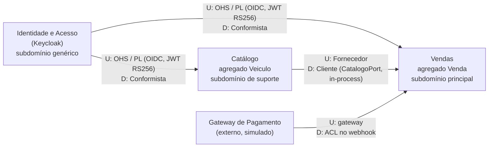
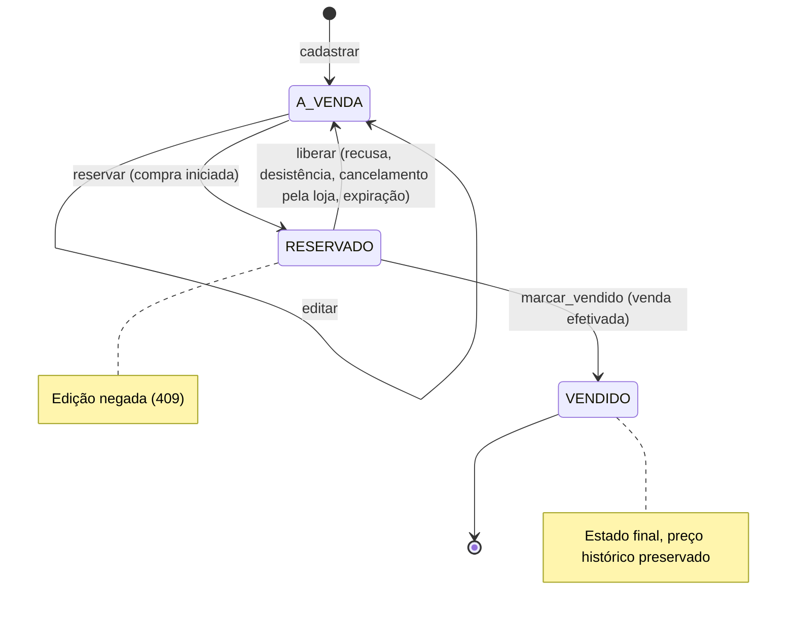
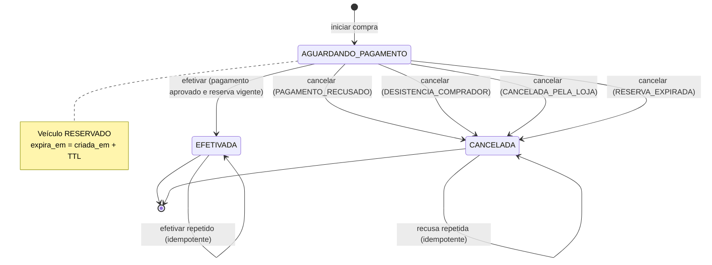

# 2. Modelagem de domínio (DDD)

Este documento registra a modelagem do domínio da revenda de veículos: o fluxo de compra contado em Domain Storytelling, o Event Storming, a linguagem ubíqua, os subdomínios e contextos delimitados, os agregados com suas invariantes, as máquinas de estado e as regras de negócio descobertas que não constavam do enunciado. É a base dos requisitos ([03-requisitos.md](03-requisitos.md)) e da estrutura do código (`src/revenda/catalogo` e `src/revenda/vendas`).

## 2.1 Domain Storytelling — fluxo de compra

Notação: cada passo segue o padrão **ator → atividade → objeto de trabalho** (com quem/onde). A história cobre o caminho feliz e, em seguida, as variantes.

### 2.1.1 Caminho feliz

| # | Ator | Atividade | Objeto de trabalho | Com / em |
|---|---|---|---|---|
| 1 | Gestor da loja | faz login | credenciais | Identidade (Keycloak) |
| 2 | Gestor da loja | cadastra | veículo (marca, modelo, ano, cor, preço) | Catálogo |
| 3 | Gestor da loja | ajusta o preço de | veículo à venda (anúncio) | Catálogo |
| 4 | Visitante anônimo | consulta | lista de veículos à venda, do mais barato ao mais caro | Catálogo |
| 5 | Visitante anônimo | se cadastra informando | dados pessoais (nome, sobrenome, e-mail, CPF, telefone, senha) | Identidade |
| 6 | Identidade | atribui | papel `cliente` ao novo cadastro | Identidade |
| 7 | Cliente | faz login e recebe | token de acesso | Identidade |
| 8 | Cliente | solicita a compra de | veículo à venda | Vendas |
| 9 | Vendas | reserva | veículo | Catálogo |
| 10 | Vendas | registra | venda aguardando pagamento, com preço de venda congelado, código de pagamento e prazo de expiração | Vendas |
| 11 | Cliente | paga, informando | código de pagamento | Gateway de pagamento (fora do sistema) |
| 12 | Gateway de pagamento | notifica | resultado do pagamento (aprovado) | Vendas (webhook) |
| 13 | Vendas | efetiva | venda | Vendas |
| 14 | Vendas | marca como vendido | veículo | Catálogo |
| 15 | Cliente | consulta | minhas compras | Vendas |
| 16 | Visitante anônimo | consulta | lista de veículos vendidos, do mais barato ao mais caro | Catálogo |

### 2.1.2 Variantes

| # | Variante | Sequência |
|---|---|---|
| V1 | Pagamento recusado | 12'. Gateway notifica resultado **recusado** → Vendas cancela a venda (motivo `PAGAMENTO_RECUSADO`) → Vendas libera o veículo no Catálogo → veículo volta à lista de veículos à venda |
| V2 | Desistência | Após o passo 10, o Cliente cancela a própria compra → Vendas cancela (motivo `DESISTENCIA_COMPRADOR`) → Vendas libera o veículo |
| V3 | Cancelamento pela loja | Após o passo 10, o Gestor cancela a venda → motivo `CANCELADA_PELA_LOJA` → veículo liberado |
| V4 | Reserva expirada | O prazo da reserva passa sem resultado de pagamento → na próxima interação que envolva o veículo ou a venda, Vendas cancela (motivo `RESERVA_EXPIRADA`) e libera o veículo |
| V5 | Compra concorrente | Dois clientes solicitam o mesmo veículo ao mesmo tempo → apenas um consegue reservar; o outro recebe "veículo indisponível" |
| V6 | Sem cadastro | Visitante anônimo tenta comprar → é solicitado a se autenticar |
| V7 | Gestor tenta comprar | Gestor solicita compra → operação negada (funcionário não compra pelo canal de clientes) |

## 2.2 Event Storming

O Event Storming foi conduzido no nível de *process modelling*: eventos (laranja), comandos (azul), atores (amarelo), agregados (amarelo-claro), políticas (lilás), sistemas externos (rosa) e modelos de leitura (verde). Os eventos são publicados apenas em processo e registrados em log estruturado; não há broker.

```mermaid
flowchart LR
    classDef evento fill:#f59e0b,stroke:#92400e,color:#111111
    classDef comando fill:#3b82f6,stroke:#1e3a8a,color:#ffffff
    classDef ator fill:#fde047,stroke:#a16207,color:#111111
    classDef agregado fill:#fef3c7,stroke:#a16207,color:#111111
    classDef politica fill:#c084fc,stroke:#6b21a8,color:#111111
    classDef externo fill:#f472b6,stroke:#9d174d,color:#111111
    classDef leitura fill:#86efac,stroke:#166534,color:#111111

    %% Cadastro e edição de veículo
    GES["Gestor da loja"]:::ator
    CMD_CAD["Cadastrar veículo"]:::comando
    CMD_EDT["Editar veículo"]:::comando
    AGG_V1["Veiculo"]:::agregado
    EV_CAD["VeiculoCadastrado"]:::evento
    EV_EDT["VeiculoEditado"]:::evento
    RM_AV["Veículos à venda (preço asc)"]:::leitura

    GES --> CMD_CAD --> AGG_V1 --> EV_CAD --> RM_AV
    GES --> CMD_EDT --> AGG_V1
    AGG_V1 --> EV_EDT --> RM_AV

    %% Cadastro de cliente
    VIS["Visitante anônimo"]:::ator
    CMD_REG["Registrar-se"]:::comando
    KC["Identidade (Keycloak)"]:::externo
    EV_CLI["ClienteCadastrado"]:::evento
    POL_PAPEL["Quando ClienteCadastrado: atribuir papel cliente"]:::politica

    VIS --> RM_AV
    VIS --> CMD_REG --> KC --> EV_CLI --> POL_PAPEL

    %% Compra
    CLI["Cliente / Comprador"]:::ator
    CMD_COMP["Iniciar compra"]:::comando
    AGG_VD1["Venda"]:::agregado
    EV_INI["CompraIniciada"]:::evento
    POL_RES["Quando CompraIniciada: reservar veículo e congelar preço"]:::politica
    CMD_RES["Reservar veículo"]:::comando
    AGG_V2["Veiculo"]:::agregado
    EV_RES["VeiculoReservado"]:::evento
    RM_MIN["Minhas compras"]:::leitura

    POL_PAPEL -.-> CLI
    CLI --> RM_AV
    CLI --> CMD_COMP --> AGG_VD1 --> EV_INI --> POL_RES --> CMD_RES --> AGG_V2 --> EV_RES
    EV_INI --> RM_MIN

    %% Pagamento
    GW["Gateway de pagamento (simulado)"]:::externo
    CMD_WH["Registrar resultado do pagamento"]:::comando
    AGG_VD2["Venda"]:::agregado
    EV_APR["PagamentoAprovado"]:::evento
    EV_REC["PagamentoRecusado"]:::evento
    POL_EFE["Quando PagamentoAprovado: efetivar venda e marcar veículo vendido"]:::politica
    POL_REC["Quando PagamentoRecusado: cancelar venda e liberar veículo"]:::politica
    CMD_EFE["Efetivar venda"]:::comando
    CMD_VEND["Marcar veículo vendido"]:::comando
    EV_EFE["VendaEfetivada"]:::evento
    EV_VEND["VeiculoVendido"]:::evento
    RM_VEND["Veículos vendidos (preço asc)"]:::leitura

    GW --> CMD_WH --> AGG_VD2
    AGG_VD2 --> EV_APR --> POL_EFE
    AGG_VD2 --> EV_REC --> POL_REC
    POL_EFE --> CMD_EFE --> EV_EFE --> RM_MIN
    POL_EFE --> CMD_VEND --> EV_VEND --> RM_VEND

    %% Cancelamentos (recusa, desistência, expiração)
    CMD_CANC["Cancelar venda"]:::comando
    CMD_LIB["Liberar veículo"]:::comando
    EV_VCANC["VendaCancelada"]:::evento
    EV_LIB["VeiculoLiberado"]:::evento
    CMD_DES["Desistir da compra"]:::comando
    EV_DES["CompraCanceladaPeloComprador"]:::evento
    POL_DES["Quando CompraCanceladaPeloComprador: liberar veículo"]:::politica
    EV_EXP["ReservaExpirada"]:::evento
    POL_EXP["Quando reserva vencida é detectada: cancelar venda e liberar veículo"]:::politica

    POL_REC --> CMD_CANC --> EV_VCANC --> RM_MIN
    POL_REC --> CMD_LIB
    CLI --> CMD_DES --> AGG_VD1
    AGG_VD1 --> EV_DES --> POL_DES --> CMD_LIB
    AGG_VD1 --> EV_EXP --> POL_EXP
    POL_EXP --> CMD_CANC
    POL_EXP --> CMD_LIB
    CMD_LIB --> EV_LIB --> RM_AV
```

### 2.2.1 Tabela de eventos

| Evento | Gatilho (ator / sistema) | Comando | Agregado | Política disparada |
|---|---|---|---|---|
| `VeiculoCadastrado` | Gestor da loja | Cadastrar veículo (`POST /api/v1/veiculos`) | Veiculo | — (atualiza *Veículos à venda*) |
| `VeiculoEditado` | Gestor da loja | Editar veículo (`PATCH /api/v1/veiculos/{id}`) | Veiculo | — (atualiza *Veículos à venda*) |
| `ClienteCadastrado` | Visitante anônimo | Registrar-se (tela do realm `revenda`) | — (Keycloak) | Atribuir papel `cliente` (default role do realm) |
| `CompraIniciada` | Cliente | Iniciar compra (`POST /api/v1/vendas`) | Venda | Reservar veículo e congelar preço |
| `VeiculoReservado` | Política de reserva | Reservar veículo (`CatalogoPort.reservar`) | Veiculo | — (sai de *Veículos à venda*) |
| `PagamentoAprovado` | Gateway de pagamento | Registrar resultado do pagamento (`POST /api/v1/pagamentos/webhook`, `APROVADO`) | Venda | Efetivar venda e marcar veículo vendido |
| `VendaEfetivada` | Política de efetivação | Efetivar venda (`Venda.efetivar`) | Venda | — (atualiza *Minhas compras*) |
| `VeiculoVendido` | Política de efetivação | Marcar veículo vendido (`CatalogoPort.marcar_vendido`) | Veiculo | — (entra em *Veículos vendidos*) |
| `PagamentoRecusado` | Gateway de pagamento | Registrar resultado do pagamento (`RECUSADO`) | Venda | Cancelar venda e liberar veículo |
| `VendaCancelada` | Políticas de recusa, desistência, expiração ou Gestor | Cancelar venda (`Venda.cancelar(motivo)`) | Venda | Liberar veículo |
| `CompraCanceladaPeloComprador` | Cliente | Desistir da compra (`POST /api/v1/vendas/{id}/cancelar`) | Venda | Liberar veículo |
| `ReservaExpirada` | Relógio (detectado de forma preguiçosa) | Cancelar venda com motivo `RESERVA_EXPIRADA` | Venda | Liberar veículo |
| `VeiculoLiberado` | Políticas de cancelamento | Liberar veículo (`CatalogoPort.liberar`) | Veiculo | — (volta a *Veículos à venda*) |

Observação: `VendaCancelada` é o evento genérico de cancelamento e sempre carrega `motivo_cancelamento`. `CompraCanceladaPeloComprador` e `ReservaExpirada` são especializações nomeadas para leitura do log; o cancelamento pela loja é registrado como `VendaCancelada` com motivo `CANCELADA_PELA_LOJA`.

### 2.2.2 Pontos quentes (hot spots) resolvidos

| Ponto quente | Resolução |
|---|---|
| Dois clientes compram o mesmo carro ao mesmo tempo | UPDATE condicional no veículo + índice único parcial de venda ativa por veículo (RN-03) |
| Cliente inicia a compra e nunca paga | Reserva com prazo de expiração, verificada de forma preguiçosa (RN-04) |
| Gateway reenvia a mesma notificação | Efetivação idempotente (RN-08) |
| Pagamento aprovado chega depois da expiração | Venda não é efetivada: é cancelada com `RESERVA_EXPIRADA`, o veículo é liberado e o webhook responde 409 (RN-14) |
| Gestor altera o preço durante a compra | Edição só com veículo à venda e preço congelado na venda (RN-01, RN-02) |

## 2.3 Linguagem ubíqua

Identificadores de domínio em português sem acento; termos técnicos podem ficar em inglês.

| Termo | Definição | Onde aparece no código |
|---|---|---|
| Veículo | Unidade física à venda na revenda, identificada por marca, modelo, ano, cor e preço | `catalogo.domain.Veiculo`; tabela `catalogo.veiculos` |
| Anúncio / veículo à venda | Veículo com status `A_VENDA`, visível na listagem pública | `StatusVeiculo.A_VENDA`; `GET /api/v1/veiculos/a-venda`; caso de uso `ListarAVenda` |
| Veículo vendido | Veículo cuja venda foi efetivada; estado final | `StatusVeiculo.VENDIDO`; `GET /api/v1/veiculos/vendidos`; caso de uso `ListarVendidos` |
| Gestor da loja | Funcionário que mantém o estoque e acompanha as vendas | Papel de realm `gestor`; dependência `exigir_papel("gestor")` |
| Cliente / Comprador | Pessoa cadastrada no Identidade com papel `cliente`; na Venda é representada só pelo identificador pseudônimo | Papel `cliente`; `Venda.comprador_id` (claim `sub`) |
| Cadastro | Registro da pessoa no serviço de identidade, com seus dados pessoais | Realm `revenda` (Keycloak); fora da API |
| Compra | Ação do cliente de iniciar a aquisição de um veículo; gera uma Venda | Caso de uso `IniciarCompra`; `POST /api/v1/vendas` |
| Reserva | Travamento do veículo para um comprador enquanto aguarda pagamento | `StatusVeiculo.RESERVADO`; `Veiculo.reservar()`; `CatalogoPort.reservar` |
| Venda | Registro transacional da compra de um veículo por um comprador | `vendas.domain.Venda`; tabela `vendas.vendas` |
| Venda ativa | Venda em `AGUARDANDO_PAGAMENTO` ou `EFETIVADA` | Índice único parcial `ux_vendas_veiculo_ativa` |
| Código de pagamento | Identificador único que o comprador usa para pagar e o gateway devolve no webhook (`PAG-` + 12 hexadecimais) | `Venda.codigo_pagamento`; `CodigoPagamento` (value object) |
| Preço de venda | Preço do veículo congelado no momento em que a compra é iniciada | `Venda.preco_venda` |
| Efetivação | Confirmação do pagamento que conclui a venda e torna o veículo vendido | `Venda.efetivar()`; `StatusVenda.EFETIVADA` |
| Cancelamento | Encerramento da venda sem conclusão, sempre com motivo | `Venda.cancelar(motivo)`; `StatusVenda.CANCELADA`; `MotivoCancelamento` |
| Desistência | Cancelamento solicitado pelo próprio comprador | `MotivoCancelamento.DESISTENCIA_COMPRADOR` |
| Expiração da reserva | Fim do prazo para pagamento; a venda é cancelada e o veículo liberado | `Venda.expira_em`; `Venda.esta_expirada(agora)`; `MotivoCancelamento.RESERVA_EXPIRADA` |
| Liberação | Retorno do veículo reservado para a venda | `Veiculo.liberar()`; `CatalogoPort.liberar` |
| Gateway de pagamento | Sistema externo que informa o resultado do pagamento | `POST /api/v1/pagamentos/webhook`; ACL do webhook (`vendas/interfaces`); caso de uso `ProcessarPagamento` |
| Resultado do pagamento | `APROVADO` ou `RECUSADO`, informado pelo gateway | `ResultadoPagamento` (enum) |

## 2.4 Subdomínios e contextos delimitados

### 2.4.1 Subdomínios

| Subdomínio | Tipo | Justificativa | Solução |
|---|---|---|---|
| Vendas | **Principal (core)** | É onde está o diferencial da plataforma: vender pela internet com segurança contra venda dupla, reserva, efetivação e cancelamento | Código próprio, modelado com mais rigor (módulo `vendas`) |
| Catálogo | **Suporte** | Necessário para vender, mas é um cadastro com poucas regras (estados e edição condicionada) | Código próprio, modelo simples (módulo `catalogo`) |
| Identidade e Acesso | **Genérico** | Problema resolvido pelo mercado; o enunciado sugere produto pronto | Keycloak 26.7.1 com PostgreSQL próprio |
| Pagamento | **Genérico (externo)** | Fora do negócio da revenda | Gateway simulado por webhook |

### 2.4.2 Contextos delimitados

| Contexto | Responsabilidade | Agregados / dados | Implementação |
|---|---|---|---|
| Identidade e Acesso | Cadastro de pessoas, login, emissão de tokens, papéis, direitos do titular | Usuários, credenciais, atributos pessoais (nome, e-mail, CPF, telefone) | Keycloak, realm `revenda`, namespace `identidade`, banco `keycloak` em instância própria |
| Catálogo | Estoque e anúncio de veículos | `Veiculo` | Módulo `catalogo`, schema `catalogo` do banco `revenda` |
| Vendas | Processo de compra, reserva, efetivação e cancelamento | `Venda` | Módulo `vendas`, schema `vendas` do banco `revenda` |
| Gateway de Pagamento | Cobrança do comprador e notificação do resultado | — | Externo, simulado (Swagger UI / `curl`) |

### 2.4.3 Mapa de contextos

Legenda: **U** = upstream (fornece o modelo), **D** = downstream (consome o modelo).

| Relação | Padrão | Explicação |
|---|---|---|
| Identidade → Catálogo e Vendas | **Open Host Service / Published Language** (upstream) e **Conformista** (downstream) | O Keycloak expõe um protocolo público e padronizado (OpenID Connect) e uma linguagem publicada (JWT com claims `sub`, `iss`, `aud`/`azp`, `realm_access.roles`). Catálogo e Vendas se conformam a esse modelo sem traduzi-lo: usam `sub` como identificador do comprador e os papéis `cliente`/`gestor` diretamente. Não há chamada síncrona da API ao Keycloak além da obtenção do JWKS (com cache). |
| Catálogo → Vendas | **Cliente-Fornecedor** | Vendas (cliente, downstream) depende de operações do Catálogo (fornecedor, upstream): `reservar`, `liberar`, `marcar_vendido` e consulta de dados do veículo. O contrato é a porta `CatalogoPort`, definida pelas necessidades de Vendas e implementada por um adaptador do módulo Catálogo, chamado em processo e na mesma transação. Vendas nunca acessa a tabela `catalogo.veiculos` diretamente. |
| Gateway → Vendas | **Anticorruption Layer (ACL)** | O payload do gateway (`codigo_pagamento`, `status` `APROVADO`/`RECUSADO`) é traduzido no endpoint de webhook para comandos do domínio (`efetivar` ou `cancelar(PAGAMENTO_RECUSADO)`). O vocabulário do gateway não entra no agregado `Venda`; trocar de gateway exige apenas um novo adaptador. |

## 2.5 Agregados

### 2.5.1 Veiculo (contexto Catálogo)

**Atributos**

| Atributo | Tipo | Regra |
|---|---|---|
| `id` | UUID | Gerado na criação |
| `marca` | texto | 1 a 60 caracteres, sem espaços nas extremidades |
| `modelo` | texto | 1 a 60 caracteres |
| `ano` | inteiro | 1950 ≤ ano ≤ ano corrente + 1 |
| `cor` | texto | 1 a 30 caracteres |
| `preco` | decimal(12,2) | > 0, no máximo 2 casas decimais |
| `status` | enum `StatusVeiculo` | `A_VENDA`, `RESERVADO`, `VENDIDO` |
| `versao` | inteiro | Incrementado a cada alteração (controle otimista) |
| `criado_em`, `atualizado_em` | timestamp UTC | Definidos pelo relógio injetado |

**Invariantes**

1. Todo veículo nasce `A_VENDA`.
2. Só pode ser editado (marca, modelo, ano, cor, preço) quando `A_VENDA`.
3. `status` não é editável diretamente; só muda pelos comandos abaixo.
4. `VENDIDO` é estado final.
5. Transição inválida lança `TransicaoInvalidaError` (HTTP 409).

**Comandos**

| Comando | Pré-condição | Efeito | Evento |
|---|---|---|---|
| `cadastrar(marca, modelo, ano, cor, preco)` | Dados válidos | Cria com `status = A_VENDA`, `versao = 1` | `VeiculoCadastrado` |
| `editar(campos)` | `status = A_VENDA` | Altera campos informados, incrementa `versao` | `VeiculoEditado` |
| `reservar()` | `status = A_VENDA` | `A_VENDA → RESERVADO` | `VeiculoReservado` |
| `liberar()` | `status = RESERVADO` | `RESERVADO → A_VENDA` | `VeiculoLiberado` |
| `marcar_vendido()` | `status = RESERVADO` | `RESERVADO → VENDIDO` | `VeiculoVendido` |

Na persistência, `reservar` é aplicado por UPDATE condicional (`... SET status = 'RESERVADO', versao = versao + 1 WHERE id = :id AND status = 'A_VENDA'`); zero linhas afetadas significa veículo indisponível.

### 2.5.2 Venda (contexto Vendas)

**Atributos**

| Atributo | Tipo | Regra |
|---|---|---|
| `id` | UUID | Gerado na criação |
| `veiculo_id` | UUID | Referência ao Veiculo (por identidade, não por objeto) |
| `comprador_id` | texto | Claim `sub` do token; pseudônimo, sem dado pessoal |
| `preco_venda` | decimal(12,2) | Cópia do preço do veículo no início da compra |
| `veiculo_descricao` | value object (marca, modelo, ano, cor) | Cópia para histórico |
| `status` | enum `StatusVenda` | `AGUARDANDO_PAGAMENTO`, `EFETIVADA`, `CANCELADA` |
| `codigo_pagamento` | texto | `PAG-` + 12 hexadecimais; único |
| `expira_em` | timestamp UTC | `criada_em + TTL` (padrão 30 min) |
| `criada_em` | timestamp UTC | — |
| `efetivada_em` | timestamp UTC, opcional | Preenchido na efetivação |
| `cancelada_em` | timestamp UTC, opcional | Preenchido no cancelamento |
| `motivo_cancelamento` | enum `MotivoCancelamento`, opcional | `PAGAMENTO_RECUSADO`, `DESISTENCIA_COMPRADOR`, `CANCELADA_PELA_LOJA`, `RESERVA_EXPIRADA` |

**Invariantes**

1. Toda venda nasce `AGUARDANDO_PAGAMENTO`.
2. `efetivar()` só a partir de `AGUARDANDO_PAGAMENTO` e com `agora < expira_em`.
3. `efetivar()` sobre venda já `EFETIVADA` não tem efeito (idempotência); recusa de pagamento sobre venda já `CANCELADA` também não tem efeito.
4. `cancelar(motivo)` só a partir de `AGUARDANDO_PAGAMENTO`; `motivo` obrigatório.
5. `EFETIVADA` e `CANCELADA` são estados finais.
6. No máximo uma venda ativa (`AGUARDANDO_PAGAMENTO` ou `EFETIVADA`) por veículo (garantido também no banco).
7. Exatamente um entre `efetivada_em` e `cancelada_em` é preenchido em estado final; nenhum em `AGUARDANDO_PAGAMENTO`.

**Comandos**

| Comando | Pré-condição | Efeito | Evento |
|---|---|---|---|
| `iniciar(veiculo, comprador_id, agora, ttl)` | Veículo reservado com sucesso | Cria venda com preço e descrição congelados, gera código, define `expira_em` | `CompraIniciada` |
| `efetivar(agora)` | `AGUARDANDO_PAGAMENTO` e não expirada | `→ EFETIVADA`, `efetivada_em = agora` | `PagamentoAprovado`, `VendaEfetivada` |
| `cancelar(motivo, agora)` | `AGUARDANDO_PAGAMENTO` | `→ CANCELADA`, `cancelada_em = agora` | `VendaCancelada` (+ `PagamentoRecusado`, `CompraCanceladaPeloComprador` ou `ReservaExpirada`, conforme o motivo) |
| `esta_expirada(agora)` | — | Consulta: `status = AGUARDANDO_PAGAMENTO` e `agora ≥ expira_em` | — |

### 2.5.3 Consistência entre agregados

Por se tratar de monólito modular com os dois schemas no mesmo banco, a alteração da `Venda` e a do `Veiculo` correspondente (reservar, liberar, marcar vendido) ocorrem **na mesma transação de banco**, coordenadas pelo caso de uso. É um desvio consciente da recomendação "um agregado por transação": evita saga e mensageria, e garante consistência forte entre o estado da venda e o do veículo. Se os módulos forem separados em serviços no futuro, a porta `CatalogoPort` é o ponto de troca para uma integração assíncrona.

## 2.6 Máquinas de estado

### 2.6.1 Veiculo

### 2.6.2 Venda

## 2.7 Regras de negócio descobertas

O enunciado informa que "nem todos os campos e funcionalidades estão descritos". As regras abaixo surgiram na modelagem e passam a fazer parte do domínio.

| ID | Regra | Justificativa |
|---|---|---|
| RN-01 | **Preço congelado**: o preço de venda é copiado do veículo no momento em que a compra é iniciada e não muda depois | O comprador paga o que viu; edição posterior pelo gestor não afeta compras em andamento nem o histórico |
| RN-02 | **Edição só com veículo à venda**: veículo `RESERVADO` ou `VENDIDO` não pode ser editado (409) | Evita alterar um bem que está sendo pago ou já foi vendido; preserva o histórico |
| RN-03 | **Uma venda ativa por veículo**: no máximo uma venda `AGUARDANDO_PAGAMENTO` ou `EFETIVADA` por veículo | Um veículo é unidade física única; impede venda dupla, inclusive sob concorrência |
| RN-04 | **Reserva expira**: a venda aguardando pagamento expira após TTL configurável (padrão 30 min); ao ser detectada, a venda é cancelada com `RESERVA_EXPIRADA` e o veículo é liberado. A detecção é preguiçosa (sem agendador): `IniciarCompra` cancela a venda vencida do veículo pedido; `ProcessarPagamento` e `CancelarVenda` verificam a venda envolvida; `ListarAVenda` faz antes da consulta uma varredura limitada (até 100 vendas vencidas por chamada); as leituras `ObterVeiculo`, `ObterVenda` e as listagens de vendas também aplicam a expiração antes de responder, para nenhuma leitura mostrar reserva vencida como ativa | Impede que um comprador que desistiu sem avisar trave o veículo indefinidamente; rodar na listagem evita que um veículo com reserva vencida fique invisível para quem quer comprar |
| RN-05 | **Gestor não compra**: usuário com papel `gestor` não pode iniciar compra (403), mesmo que também tenha papel `cliente` | Segregação de funções; evita conflito de interesse e compras internas pelo canal público |
| RN-06 | **Cadastro antes da compra**: só usuário autenticado com papel `cliente` compra; anônimo recebe 401 | Exigência do enunciado ("pessoas cadastradas previamente") |
| RN-07 | **Estados finais**: `VENDIDO` (veículo), `EFETIVADA` e `CANCELADA` (venda) não admitem transição | Integridade do histórico; um cancelamento não "ressuscita" uma venda — uma nova compra gera nova venda |
| RN-08 | **Notificação idempotente**: notificação de pagamento aprovado repetida para venda já efetivada retorna 200 sem efeito; notificação de pagamento recusado para venda já cancelada também retorna 200 sem efeito. Aprovação para venda cancelada retorna 409 | Gateways reenviam notificações; repetição não pode gerar erro nem efeito duplicado |
| RN-09 | **Pagamento recusado libera o veículo**: a venda é cancelada com `PAGAMENTO_RECUSADO` e o veículo volta a `A_VENDA` | O veículo deve voltar a ser ofertado sem intervenção manual |
| RN-10 | **Cancelamento só antes do pagamento**: comprador (desistência) ou gestor (cancelamento pela loja) podem cancelar apenas vendas `AGUARDANDO_PAGAMENTO` (409 caso contrário) | Venda efetivada envolve dinheiro recebido; desfazer exigiria estorno, fora do escopo |
| RN-11 | **Venda sem dados pessoais**: a venda guarda apenas `comprador_id` (claim `sub`); nome, e-mail, CPF e telefone ficam somente no Identidade | Separação exigida pelo enunciado; minimização de dados (LGPD, art. 6º, III) |
| RN-12 | **Descrição do veículo congelada na venda**: marca, modelo, ano e cor são copiados para a venda | O histórico de compras permanece legível mesmo que o catálogo mude |
| RN-13 | **Venda visível só para o dono e o gestor**: cliente que consulta venda de outro recebe 404 | Não revelar a existência de vendas de terceiros |
| RN-14 | **Aprovação após expiração não efetiva**: webhook `APROVADO` para venda expirada cancela a venda com `RESERVA_EXPIRADA`, libera o veículo e responde 409 | Respeita a reserva; o tratamento do valor pago (estorno) é responsabilidade do gateway, fora do escopo |
| RN-15 | **Validação do veículo**: ano entre 1950 e o ano corrente + 1; preço maior que zero com até 2 casas decimais; textos não vazios com limites de tamanho | Evita dados absurdos; ano + 1 cobre modelos do ano seguinte já à venda |
| RN-16 | **Veículo nasce à venda**: o cadastro já publica o anúncio (`A_VENDA`) | Simplicidade; não há fluxo de aprovação de anúncio no enunciado |
| RN-17 | **Ordenação determinística**: listagens ordenadas por preço ascendente com desempate por `criado_em` ascendente e, por fim, `id` | Paginação estável; mesma consulta devolve a mesma ordem |
| RN-18 | **Código de pagamento único e não previsível**: `PAG-` + 12 hexadecimais gerados aleatoriamente | Evita colisão e adivinhação de códigos |
| RN-19 | **Resultado do gateway só com segredo válido**: webhook sem `X-Webhook-Secret` correto recebe 401 e não altera estado | Impede que qualquer pessoa efetive uma venda chamando o webhook |
