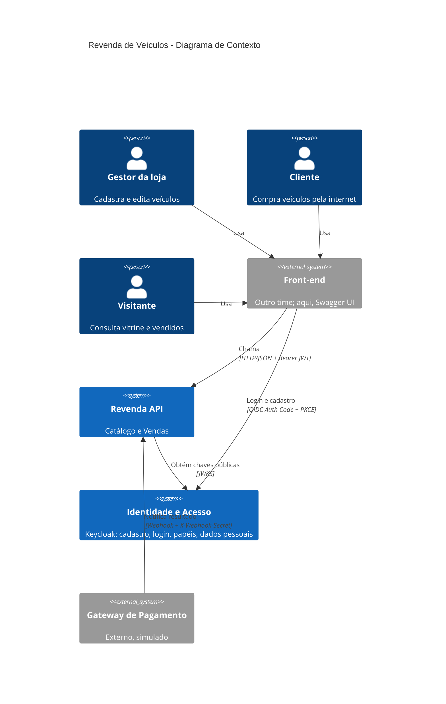
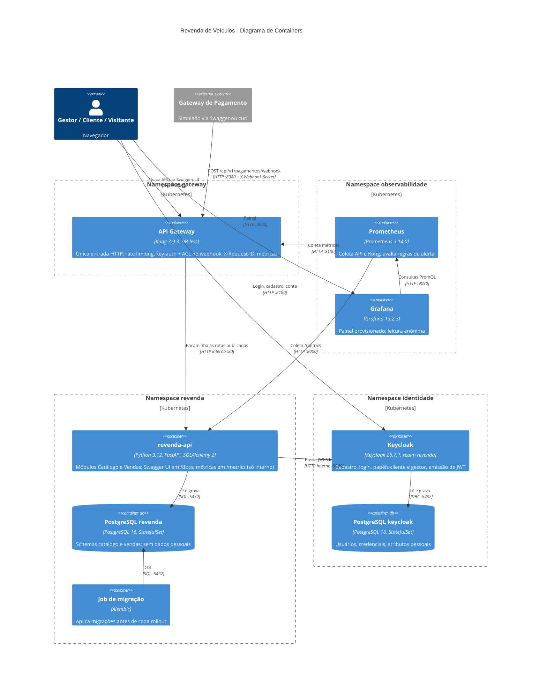
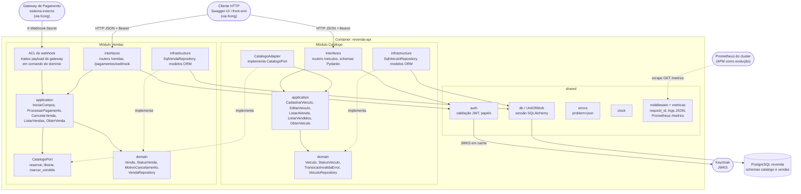
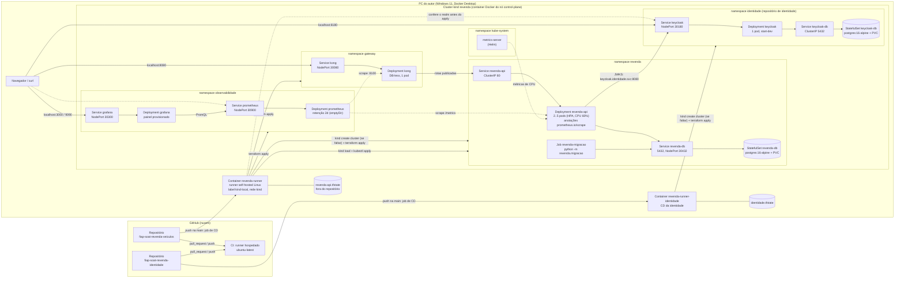
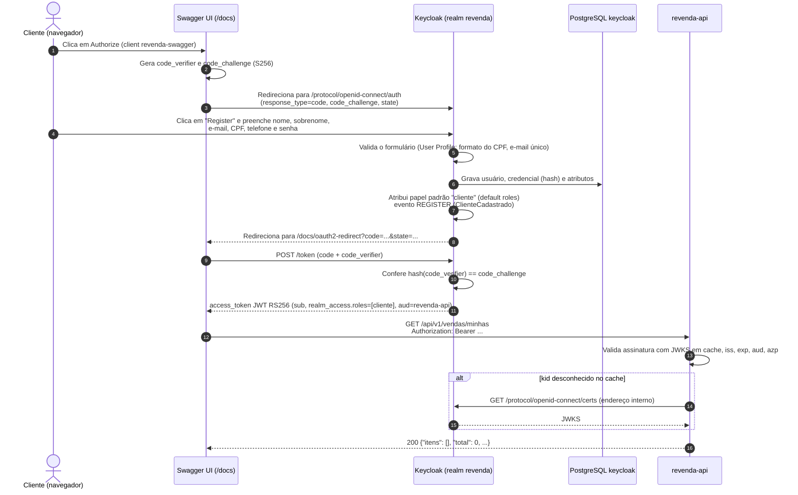
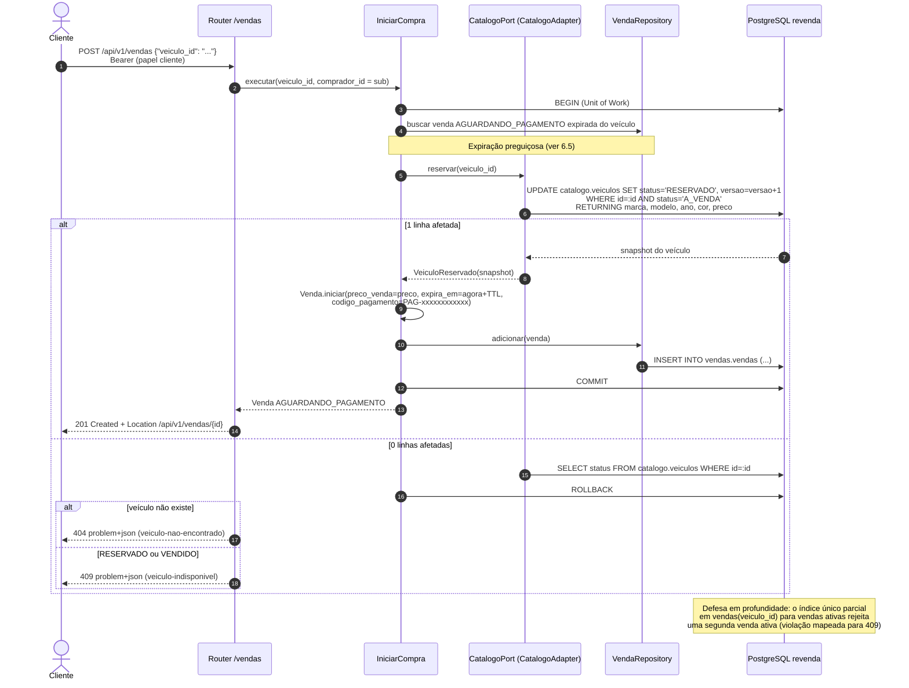
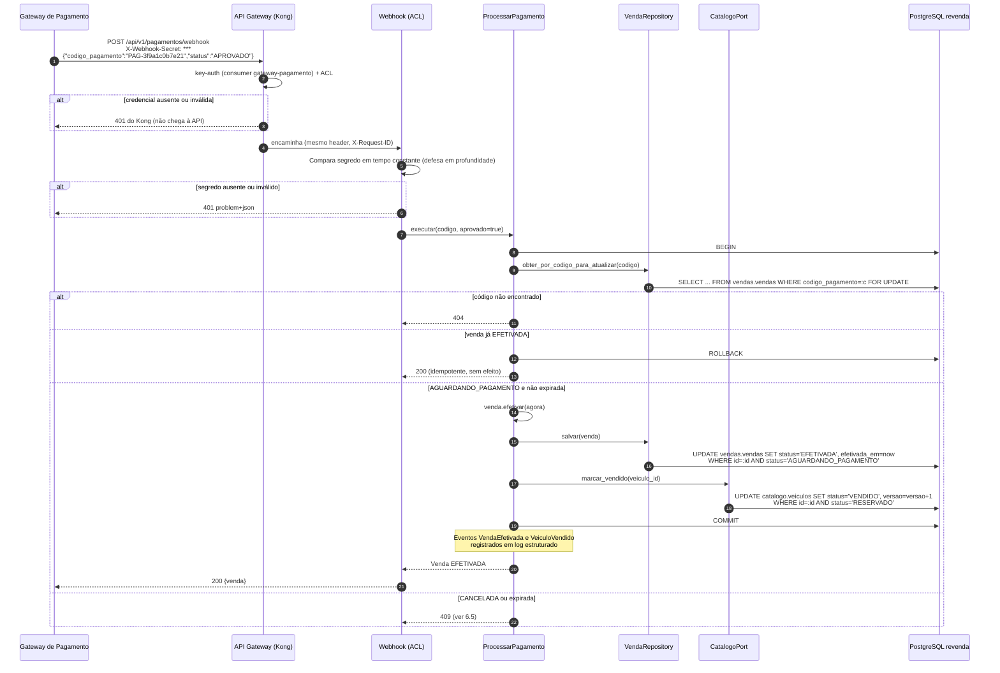
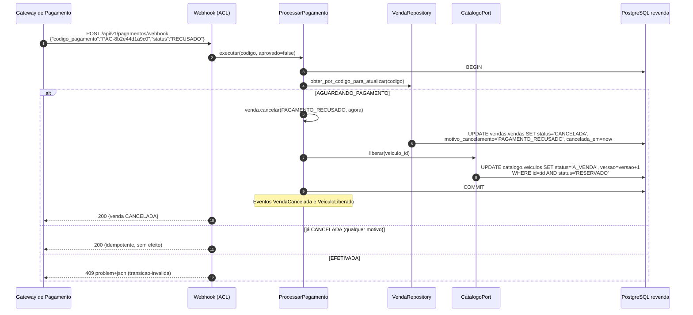
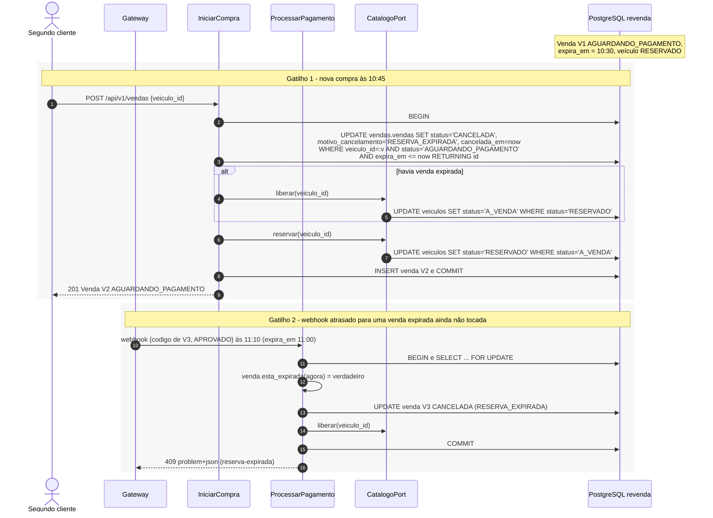

# 04 — Arquitetura

Este documento descreve a arquitetura da API de revenda de veículos em dois níveis: a visão de alto nível (HLD), com o estilo arquitetural, os atributos de qualidade e os diagramas C4 de contexto, containers e componentes, e a visão de baixo nível (LLD), com a organização do código, as responsabilidades por camada e a forma como os módulos colaboram dentro de uma mesma transação. Também apresenta a visão de implantação no cluster kind e os principais fluxos em diagramas de sequência. As decisões aqui resumidas estão justificadas nos [ADRs](adrs/README.md); o modelo de domínio está em [02-modelagem-ddd.md](02-modelagem-ddd.md), o contrato HTTP em [05-api.md](05-api.md) e o modelo físico em [06-dados.md](06-dados.md).

## 1. Visão de alto nível (HLD)

### 1.1 Estilo arquitetural

A solução é composta por **dois sistemas implantáveis de forma independente**:

| Sistema | Estilo | Responsabilidade | Persistência |
|---|---|---|---|
| `revenda-api` | **Monólito modular** com Clean Architecture por módulo | Contextos **Catálogo** (suporte) e **Vendas** (principal) | PostgreSQL `revenda`, schemas `catalogo` e `vendas` |
| Keycloak (realm `revenda`) | Produto pronto (identity provider OIDC), em **outro repositório** ([fiap-soat-revenda-identidade](https://github.com/Caina-Climaco/fiap-soat-revenda-identidade)) | Contexto **Identidade e Acesso** (genérico): cadastro, login, papéis, dados pessoais | PostgreSQL `keycloak`, **outra instância** |

A fronteira física relevante para o enunciado é **identidade × transacional**: os dados pessoais dos clientes ficam apenas no Keycloak e no seu banco, que são mantidos e implantados por outro repositório, com pipeline, Terraform e state próprios ([ADR-014](adrs/ADR-014-identidade-em-repositorio-proprio.md)); a API só conhece o identificador opaco `sub` do token (ver [07-seguranca-lgpd.md](07-seguranca-lgpd.md)). Entre Catálogo e Vendas a fronteira é **lógica** (módulos, schemas e uma porta explícita), o que permite uma transação ACID única na compra sem saga nem mensageria ([ADR-002](adrs/ADR-002-monolito-modular.md)).

O Gateway de Pagamento é um sistema externo **simulado**; ele notifica o resultado do pagamento por webhook, tratado por uma camada anticorrupção (ACL) no módulo Vendas ([ADR-007](adrs/ADR-007-pagamento-webhook.md)).

Na frente da API há um **API Gateway** (Kong DB-less, namespace `gateway`), única entrada HTTP: *rate limiting*, credencial do parceiro de pagamento, `X-Request-ID`, limite de payload e métricas na borda; a API continua validando JWT, papéis e o segredo do webhook ([ADR-015](adrs/ADR-015-api-gateway-kong.md)). Prometheus e Grafana (namespace `observabilidade`) coletam a API e o gateway, com painel e alertas versionados ([ADR-016](adrs/ADR-016-prometheus-grafana.md)). Não são sistemas de negócio, por isso aparecem a partir da visão de containers.

### 1.2 Atributos de qualidade priorizados

| Prioridade | Atributo | Cenário de qualidade | Táticas adotadas |
|---|---|---|---|
| 1 | **Segurança e privacidade** | Um invasor com acesso somente leitura ao banco da API não obtém nome, e-mail, CPF ou telefone de nenhum cliente | Identidade apartada (repositório, pipeline, namespace e instância de banco distintos); `comprador_id` = `sub` (pseudônimo); JWT RS256 validado; RBAC; segredos fora do Git; API Gateway como única entrada, com *rate limiting* e key-auth no webhook |
| 2 | **Consistência / integridade** | Dois clientes que compram o mesmo veículo no mesmo instante: exatamente um recebe 201, o outro 409 | UPDATE condicional, índice único parcial, transação única (Unit of Work) ([ADR-008](adrs/ADR-008-concorrencia-update-condicional.md)) |
| 3 | **Implantabilidade** | Um PR mergeado na `main` chega ao cluster sem passo manual, com migração aplicada e teste e2e verde | CLI kind + Terraform + kustomize + CD self-hosted + Job de migração ([08-ci-cd-infra.md](08-ci-cd-infra.md)) |
| 4 | **Testabilidade** | Regras de domínio testáveis sem banco, sem rede e com relógio controlado | Clean Architecture, portas e adaptadores, `Clock` injetável ([09-testes.md](09-testes.md)) |
| 5 | **Manutenibilidade / evolutividade** | Extrair Vendas para um serviço próprio sem reescrever o domínio | Dependência de Vendas em Catálogo apenas pela porta `CatalogoPort`; schemas separados |
| 6 | **Disponibilidade (local)** | A queda de uma réplica da API não interrompe as requisições | 2 réplicas, readiness probe, HPA 2..5; alertas `RevendaApiFora` e `KongFora` no Prometheus |
| 7 | **Desempenho** | Listagens públicas respondem em p95 < 300 ms com 1.000 veículos | Índice `(status, preco)`, paginação obrigatória com limite máximo 100 |

## 2. C4 nível 1 — Contexto



Pontos de atenção do contexto:

- A API **não** chama o Keycloak a cada requisição; ela apenas baixa e mantém em cache o JWKS (chaves públicas) para validar tokens localmente.
- O gateway inicia a comunicação (push). A API não chama o gateway: a criação da cobrança é simulada pela geração do `codigo_pagamento` ([ADR-007](adrs/ADR-007-pagamento-webhook.md)).

## 3. C4 nível 2 — Containers



| Container | Tecnologia | Exposição |
|---|---|---|
| API Gateway `kong` | `kong:3.9.3`, DB-less, configuração declarativa no Secret `kong-config` | Service NodePort 30080 → host 8080 (proxy); `kong-status` ClusterIP 8100 (métricas e probes); Admin API só em `127.0.0.1` dentro do pod |
| `revenda-api` | Imagem `revenda-api:<sha>`, Uvicorn na porta 8000 | Service **ClusterIP** `revenda-api:80`, alcançado só pelo Kong (NetworkPolicy `revenda-api-somente-gateway`); `/metrics` na mesma porta, sem rota no Kong, coletado pelo Prometheus pelas anotações `prometheus.io/*` do pod |
| Prometheus | `prom/prometheus:v3.14.0`, retenção 2 dias em `emptyDir` | Service NodePort 30900 → host 9090 |
| Grafana | `grafana/grafana:13.2.3`, fonte de dados e painel provisionados | Service NodePort 30300 → host 3000 |
| Job de migração | Mesma imagem, comando `python -m revenda.migracao` (`alembic upgrade head`, mas sem efeito quando o banco está numa revisão mais nova que a imagem, caso de rollback) | Não exposto |
| PostgreSQL `revenda` | `postgres:16.15-alpine`, PVC | Service `revenda-db:5432`, NodePort 30432 → host `127.0.0.1:15432` por padrão, para a demonstração (`expor_banco_revenda = false` o torna ClusterIP) |
| Keycloak (repositório de identidade) | `quay.io/keycloak/keycloak:26.7.1`, *limit* de memória 1536Mi | Service NodePort 30180 → host 8180 |
| PostgreSQL `keycloak` (repositório de identidade) | `postgres:16.15-alpine`, PVC | Service ClusterIP `keycloak-db:5432` (não exposto) |

Os dois últimos containers são implantados pelo repositório de identidade; os detalhes deles estão no `README.md` daquele repositório. Este repositório só consome o contrato (issuer, JWKS, audiência, papéis).

## 4. C4 nível 3 — Componentes da `revenda-api`

O diagrama a seguir usa `flowchart` com subgraphs no estilo C4, porque o `C4Component` do Mermaid não representa bem camadas aninhadas dentro de cada módulo. As setas indicam **dependência de código** (quem conhece quem); a regra de dependência aponta sempre para o domínio.



| Componente | Responsabilidade |
|---|---|
| `shared/auth` | Valida o JWT (assinatura via JWKS em cache, `iss`, `exp`, `aud`, `azp`) e expõe dependências FastAPI `exigir_papel("gestor")`, `exigir_papel("cliente")`, além do `Principal` (`sub`, papéis) |
| `shared/db` | Engine, `sessionmaker` e a `UnitOfWork` que delimita a transação por requisição de escrita |
| `shared/errors` | Mapeia exceções de domínio e de aplicação para `application/problem+json` (RFC 9457) |
| `shared/clock` | Relógio injetável (UTC); substituído por relógio fixo nos testes |
| Middleware e métricas (`shared`) | Gera ou propaga o `X-Request-ID`, registra cada requisição em log JSON (rota, status, latência, sem dados pessoais) e alimenta as métricas Prometheus expostas em `GET /metrics`: histograma de latência e contador de requisições por método, rota template e status, e contadores de negócio (vendas iniciadas, efetivadas e canceladas por motivo; veículos cadastrados). Detalhes em [12-observabilidade.md](12-observabilidade.md) e [ADR-012](adrs/ADR-012-observabilidade-prometheus.md) |
| `CatalogoPort` | Porta **definida por Vendas** (consumidor) com as operações de que Vendas precisa: `reservar`, `liberar`, `marcar_vendido`. Vendas não importa nada de `catalogo.domain` |
| `CatalogoAdapter` | Implementação in-process da porta, no módulo Catálogo; executa as transições do agregado `Veiculo` usando a mesma sessão (Unit of Work) |
| ACL do webhook | Valida o segredo, traduz `{"codigo_pagamento", "status"}` (`APROVADO` ou `RECUSADO`) em `ProcessarPagamento(codigo, aprovado: bool)`; isola o vocabulário do gateway do modelo de Vendas |

## 5. Visão de implantação

O ambiente é um cluster **kind** de um nó (control-plane) criado pela CLI `kind` (a partir de `infra/kind/cluster.yaml`) no PC do autor. O cluster é a plataforma compartilhada pelos dois repositórios: cada um gerencia, com Terraform e state próprios, apenas os seus namespaces (`revenda`, `gateway` e `observabilidade` aqui, `identidade` no repositório de identidade), e o CD de cada um cria o cluster se ele faltar ([ADR-014](adrs/ADR-014-identidade-em-repositorio-proprio.md)). O mesmo PC hospeda os dois runners self-hosted do GitHub Actions (`revenda-runner` e `revenda-runner-identidade`), em containers Linux no Docker Desktop ligados à rede docker `kind` ([ADR-006](adrs/ADR-006-ci-hospedado-cd-self-hosted.md)). Não há Ingress: os serviços são publicados por **NodePort** mapeados para portas do host via `extraPortMappings` do kind ([ADR-005](adrs/ADR-005-kind-terraform-nodeport.md)). A API não tem NodePort: a porta 8080 é do Kong ([ADR-015](adrs/ADR-015-api-gateway-kong.md)).



| Elemento | Detalhe |
|---|---|
| Mapeamento de portas | host `8080` → nodePort `30080` (API Gateway Kong); host `8180` → nodePort `30180` (Keycloak); host `3000` → nodePort `30300` (Grafana); host `9090` → nodePort `30900` (Prometheus). host `15432` → nodePort `30432` (banco da API, só para demonstração; desligável com `expor_banco_revenda=false`). O banco do Keycloak **não** é exposto |
| Secrets (Terraform) | Deste repositório: `revenda-db-credentials`, `revenda-webhook-secret` (ns `revenda`), `kong-config` (ns `gateway`, configuração declarativa com a credencial do consumer `gateway-pagamento`) e `grafana-admin` (ns `observabilidade`). Do repositório de identidade (ns `identidade`): `keycloak-db-credentials`, `keycloak-admin`, `keycloak-gestor`, `keycloak-e2e`; destes, o CD da API lê só os de contrato `keycloak-gestor` e `keycloak-e2e`, para o e2e |
| NetworkPolicy | `revenda-db` só aceita pods com rótulo `app` igual a `revenda-api` ou `revenda-migracao` (mais o tráfego do NodePort de demonstração). `revenda-api-somente-gateway`: a API (porta 8000) só aceita o Kong (ns `gateway`), o Prometheus (ns `observabilidade`) e o tráfego do nó (probes do kubelet). A do `keycloak-db` (só `app=keycloak`) é do repositório de identidade |
| Observabilidade | Logs JSON em stdout (`kubectl logs`, inclusive do Kong, com o mesmo `X-Request-ID`); `GET /metrics` em cada pod, com anotações `prometheus.io/scrape`, `port` e `path`, coletado pelo Prometheus do namespace `observabilidade` (descoberta de pods só em `revenda` e `gateway`, por Roles), junto com as métricas do Kong; regras de alerta em `infra/observabilidade/alertas.yml`; painel no Grafana; metrics-server alimenta o HPA e o `kubectl top`. Sem Alertmanager nem APM ([12-observabilidade.md](12-observabilidade.md), [ADR-016](adrs/ADR-016-prometheus-grafana.md)) |
| Emissor dos tokens | `KC_HOSTNAME=http://localhost:8180`, então `iss = http://localhost:8180/realms/revenda`. A API busca o JWKS pelo endereço interno do Service, mas valida o `iss` público (ver [07-seguranca-lgpd.md](07-seguranca-lgpd.md)) |

## 6. Diagramas de sequência

### 6.1 Cadastro do cliente e obtenção de token (Authorization Code + PKCE pelo Swagger UI)



### 6.2 Compra (reserva com UPDATE condicional)



### 6.3 Efetivação via webhook APROVADO



### 6.4 Recusa via webhook RECUSADO



### 6.5 Expiração preguiçosa da reserva

A reserva vence em `expira_em` (TTL padrão de 30 minutos, configurável). Não há agendador: a venda expirada é cancelada com motivo `RESERVA_EXPIRADA`, e o veículo é liberado, no momento em que alguém a "toca" ([ADR-009](adrs/ADR-009-expiracao-preguicosa.md)). O diagrama mostra os dois gatilhos principais: nova tentativa de compra do mesmo veículo e webhook atrasado.



Além desses gatilhos, a listagem `GET /api/v1/veiculos/a-venda` executa, antes da consulta, uma **varredura preguiçosa** limitada (até 100 vendas expiradas por chamada), para que veículos com reserva vencida voltem a aparecer na vitrine mesmo que ninguém tente comprá-los diretamente. As demais leituras (`GET /api/v1/veiculos/{id}`, `GET /api/v1/vendas/{id}`, `GET /api/v1/vendas/minhas` e `GET /api/v1/vendas`) também aplicam a expiração antes de responder, para nenhuma leitura mostrar reserva vencida como ativa. O cancelamento e a liberação usam os mesmos UPDATEs condicionais, portanto são seguros sob concorrência e idempotentes.

## 7. Visão de baixo nível (LLD)

### 7.1 Organização de pastas

```text
fiap-soat-revenda-veiculos/
├── src/revenda/
│   ├── shared/
│   │   ├── config.py        # Settings (pydantic-settings, variáveis de ambiente)
│   │   ├── db.py            # engine, sessionmaker, UnitOfWork
│   │   ├── auth.py          # validação JWT/JWKS, Principal, exigir_papel
│   │   ├── errors.py        # exceções base e handlers problem+json
│   │   ├── clock.py         # Clock (UTC) e FixedClock para testes
│   │   └── logging.py       # log estruturado JSON e registro de eventos de domínio
│   ├── catalogo/
│   │   ├── domain/          # Veiculo, StatusVeiculo, erros, VeiculoRepository (porta)
│   │   ├── application/     # casos de uso, DTOs, CatalogoAdapter (implementa CatalogoPort)
│   │   ├── infrastructure/  # modelos ORM (schema catalogo), SqlVeiculoRepository
│   │   └── interfaces/      # router FastAPI /veiculos, schemas Pydantic de request/response
│   ├── vendas/
│   │   ├── domain/          # Venda, StatusVenda, MotivoCancelamento, VendaRepository
│   │   ├── application/     # casos de uso, CatalogoPort (porta), gerador de código
│   │   ├── infrastructure/  # modelos ORM (schema vendas), SqlVendaRepository
│   │   └── interfaces/      # routers /vendas e /pagamentos/webhook (ACL)
│   └── main.py              # app factory: monta routers, handlers, composição de dependências
├── migrations/              # Alembic (env.py, versions/)
├── tests/{unit,integration,e2e}
├── infra/terraform/         # só o namespace revenda (o realm e o Keycloak estão no repositório de identidade)
└── k8s/{base,migracao}/
```

### 7.2 Responsabilidades por camada

| Camada | Contém | Pode depender de | Não pode depender de |
|---|---|---|---|
| `domain` | Entidades/agregados, objetos de valor, enums de status, regras de transição, exceções de domínio, interfaces de repositório | Biblioteca padrão do Python | FastAPI, SQLAlchemy, Pydantic, outros módulos |
| `application` | Casos de uso (um por intenção do usuário), portas de saída (`CatalogoPort`, `Clock`), DTOs de entrada e saída, orquestração da transação | `domain` do próprio módulo, `shared` (abstrações) | `infrastructure`, `interfaces`, frameworks web |
| `infrastructure` | Adaptadores de saída: modelos ORM, repositórios SQLAlchemy, mapeamento ORM ↔ domínio | `domain`, `application`, `shared/db`, SQLAlchemy | `interfaces` |
| `interfaces` | Adaptadores de entrada: routers FastAPI, schemas Pydantic, tradução HTTP ↔ caso de uso, ACL do webhook, checagem de papel | `application`, `shared/auth`, `shared/errors`, FastAPI | Repositórios concretos (recebe-os por injeção) |

### 7.3 Regra de dependência

- As dependências de código apontam para dentro: `interfaces` → `application` → `domain`; `infrastructure` implementa interfaces declaradas em `domain`/`application` (inversão de dependência).
- **Entre módulos**, apenas Vendas conhece Catálogo, e somente pela porta `CatalogoPort`, declarada em `vendas/application`. A implementação (`CatalogoAdapter`) mora em `catalogo/application` e é ligada em `main.py`. Vendas nunca importa `catalogo.domain` nem `catalogo.infrastructure`; Catálogo nunca importa Vendas.
- A regra é verificada automaticamente com `import-linter` (contratos de camadas e de independência entre módulos) executado no CI junto com o ruff.

### 7.4 Vendas e Catálogo na mesma transação (Unit of Work)

1. O router de escrita obtém uma `UnitOfWork` por requisição (dependência FastAPI). Ela abre **uma** `Session` SQLAlchemy e uma transação.
2. O caso de uso de Vendas recebe o `VendaRepository` e o `CatalogoPort`, ambos construídos sobre a **mesma** sessão. Assim, o UPDATE em `catalogo.veiculos` e o INSERT/UPDATE em `vendas.vendas` participam da mesma transação PostgreSQL.
3. Ao final do caso de uso, a `UnitOfWork` faz `commit`; qualquer exceção provoca `rollback` (o caso de expiração no webhook é a exceção controlada: o cancelamento é confirmado e só depois a resposta 409 é montada).
4. Os eventos de domínio acumulados nos agregados são registrados em log **após** o commit, para não registrar eventos de transações desfeitas.
5. Isolamento: `READ COMMITTED` (padrão do PostgreSQL). A correção sob concorrência não depende de isolamento mais forte, e sim de UPDATEs condicionais (que bloqueiam a linha e reavaliam o `WHERE`), de `SELECT ... FOR UPDATE` no webhook e do índice único parcial ([ADR-008](adrs/ADR-008-concorrencia-update-condicional.md)).

Esse acoplamento transacional é aceitável porque os dois módulos estão no mesmo processo e no mesmo banco. Se Vendas for extraído para outro serviço, a `CatalogoPort` passa a ter um adaptador HTTP ou de mensageria, e a consistência passa a ser eventual (saga com compensação `liberar`), sem alteração no domínio.
