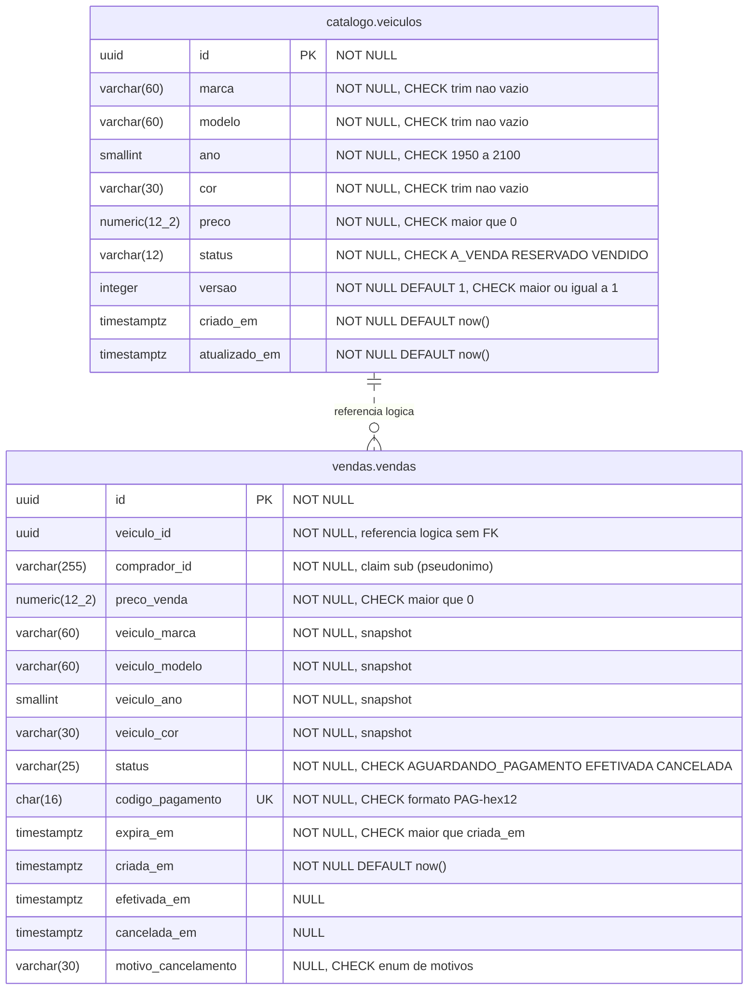

# 06 — Modelo de dados

Este documento descreve o modelo físico de dados da solução: as tabelas dos módulos Catálogo e Vendas no banco `revenda`, com tipos PostgreSQL, constraints e índices, a estratégia de migração com Alembic executada por um Job do Kubernetes e a separação física entre dados transacionais e dados pessoais, estes guardados apenas no banco do Keycloak. O modelo de domínio que origina estas tabelas está em [02-modelagem-ddd.md](02-modelagem-ddd.md); as decisões correspondentes estão nos [ADR-004](adrs/ADR-004-postgresql-schemas.md) e [ADR-008](adrs/ADR-008-concorrencia-update-condicional.md).

## 1. Visão geral das bases

| Instância | Namespace | Banco | Schemas | Dono lógico | Contém dados pessoais? |
|---|---|---|---|---|---|
| StatefulSet `revenda-db` (`postgres:16-alpine`) | `revenda` | `revenda` | `catalogo`, `vendas` (+ `public.alembic_version`) | `revenda-api` | **Não** (apenas o pseudônimo `comprador_id`) |
| StatefulSet `keycloak-db` (`postgres:16-alpine`) | `identidade` | `keycloak` | `public` (schema gerenciado pelo Keycloak) | Keycloak | **Sim** (nome, e-mail, CPF, telefone, credenciais) |

Cada módulo é dono do seu schema: somente o código de `catalogo/infrastructure` mapeia tabelas de `catalogo`, e somente `vendas/infrastructure` mapeia tabelas de `vendas`. A única ligação entre os schemas é a **referência lógica** `vendas.vendas.veiculo_id → catalogo.veiculos.id`, **sem chave estrangeira** entre schemas: isso preserva a fronteira dos módulos e permite extrair Vendas para outro serviço no futuro. A integridade é garantida pela aplicação (a venda só é criada depois de `CatalogoPort.reservar` confirmar o veículo, na mesma transação; veículos não têm endpoint de exclusão) e pelo índice único parcial ([ADR-004](adrs/ADR-004-postgresql-schemas.md)).

## 2. Diagrama entidade-relacionamento

Cardinalidade: um veículo pode ter várias vendas ao longo do tempo (canceladas), mas **no máximo uma ativa** (`AGUARDANDO_PAGAMENTO` ou `EFETIVADA`), garantido pelo índice único parcial da seção 4. No diagrama, a linha tracejada indica referência lógica (sem FK) e `numeric(12_2)` representa `NUMERIC(12,2)` (o Mermaid não aceita vírgula no tipo).

## 3. Tabelas e constraints

### 3.1 `catalogo.veiculos`

| Coluna | Tipo | Nulo | Padrão | Observação |
|---|---|---|---|---|
| `id` | `UUID` | não | gerado pela aplicação (uuid4) | PK |
| `marca` | `VARCHAR(60)` | não | — | |
| `modelo` | `VARCHAR(60)` | não | — | |
| `ano` | `SMALLINT` | não | — | Faixa de negócio (1950..ano corrente + 1) validada no domínio |
| `cor` | `VARCHAR(30)` | não | — | |
| `preco` | `NUMERIC(12,2)` | não | — | Mapeado para `Decimal` no Python |
| `status` | `VARCHAR(12)` | não | `'A_VENDA'` | |
| `versao` | `INTEGER` | não | `1` | Incrementada em toda alteração (edição e transições) |
| `criado_em` | `TIMESTAMPTZ` | não | `now()` | Sempre UTC |
| `atualizado_em` | `TIMESTAMPTZ` | não | `now()` | Atualizada pela aplicação |

Constraints:

| Nome | Definição |
|---|---|
| `pk_veiculos` | `PRIMARY KEY (id)` |
| `ck_veiculos_status` | `CHECK (status IN ('A_VENDA', 'RESERVADO', 'VENDIDO'))` |
| `ck_veiculos_preco_positivo` | `CHECK (preco > 0)` |
| `ck_veiculos_ano_faixa` | `CHECK (ano BETWEEN 1950 AND 2100)` |
| `ck_veiculos_textos_nao_vazios` | `CHECK (length(trim(marca)) > 0 AND length(trim(modelo)) > 0 AND length(trim(cor)) > 0)` |
| `ck_veiculos_versao` | `CHECK (versao >= 1)` |

O limite superior "ano corrente + 1" fica apenas no domínio: uma constraint `CHECK` deve ser imutável, e uma expressão com `now()` mudaria de resultado com o tempo (linhas válidas hoje poderiam falhar numa restauração de backup). O banco garante uma faixa de sanidade; a regra exata é do domínio.

### 3.2 `vendas.vendas`

| Coluna | Tipo | Nulo | Observação |
|---|---|---|---|
| `id` | `UUID` | não | PK |
| `veiculo_id` | `UUID` | não | Referência lógica a `catalogo.veiculos(id)`; **sem FK** entre schemas (integridade garantida pela aplicação) |
| `comprador_id` | `VARCHAR(255)` | não | Claim `sub` do token. Pseudônimo: **nenhum** nome, e-mail ou CPF |
| `preco_venda` | `NUMERIC(12,2)` | não | Preço congelado no momento da compra |
| `veiculo_marca`, `veiculo_modelo`, `veiculo_ano`, `veiculo_cor` | `VARCHAR(60)`, `VARCHAR(60)`, `SMALLINT`, `VARCHAR(30)` | não | Snapshot `veiculo_descricao`, exposto na API como objeto `veiculo` |
| `status` | `VARCHAR(25)` | não | |
| `codigo_pagamento` | `CHAR(16)` | não | `PAG-` + 12 hexadecimais |
| `expira_em` | `TIMESTAMPTZ` | não | `criada_em` + TTL da reserva |
| `criada_em` | `TIMESTAMPTZ` | não | |
| `efetivada_em` | `TIMESTAMPTZ` | sim | Preenchida só em `EFETIVADA` |
| `cancelada_em` | `TIMESTAMPTZ` | sim | Preenchida só em `CANCELADA` |
| `motivo_cancelamento` | `VARCHAR(30)` | sim | Preenchido só em `CANCELADA` |

Constraints:

| Nome | Definição |
|---|---|
| `pk_vendas` | `PRIMARY KEY (id)` |
| `uq_vendas_codigo_pagamento` | `UNIQUE (codigo_pagamento)` |
| `ck_vendas_status` | `CHECK (status IN ('AGUARDANDO_PAGAMENTO', 'EFETIVADA', 'CANCELADA'))` |
| `ck_vendas_motivo` | `CHECK (motivo_cancelamento IS NULL OR motivo_cancelamento IN ('PAGAMENTO_RECUSADO', 'DESISTENCIA_COMPRADOR', 'CANCELADA_PELA_LOJA', 'RESERVA_EXPIRADA'))` |
| `ck_vendas_preco_positivo` | `CHECK (preco_venda > 0)` |
| `ck_vendas_codigo_formato` | `CHECK (codigo_pagamento ~ '^PAG-[0-9a-f]{12}$')` |
| `ck_vendas_expiracao` | `CHECK (expira_em > criada_em)` |
| `ck_vendas_efetivada_coerente` | `CHECK ((status = 'EFETIVADA') = (efetivada_em IS NOT NULL))` |
| `ck_vendas_cancelada_coerente` | `CHECK ((status = 'CANCELADA') = (cancelada_em IS NOT NULL AND motivo_cancelamento IS NOT NULL))` |

As constraints de coerência replicam no banco as invariantes do agregado `Venda`; se um bug na aplicação tentar gravar um estado impossível, o banco recusa.

## 4. Índices

| Tabela | Nome | Definição | Atende |
|---|---|---|---|
| `catalogo.veiculos` | `ix_veiculos_status_preco` | `(status, preco)` | `GET /api/v1/veiculos/a-venda` e `GET /api/v1/veiculos/vendidos`: filtro por status e ordenação por preço sem *sort* adicional (o desempate por `criado_em, id` ocorre apenas entre preços iguais) |
| `vendas.vendas` | `uq_vendas_codigo_pagamento` | `UNIQUE (codigo_pagamento)` | Busca do webhook e unicidade do código |
| `vendas.vendas` | `ux_vendas_veiculo_ativa` | `UNIQUE (veiculo_id) WHERE status IN ('AGUARDANDO_PAGAMENTO', 'EFETIVADA')` | **Índice único parcial**: no máximo uma venda ativa por veículo, mesmo que a camada de aplicação falhe; também acelera a busca da venda ativa na expiração preguiçosa |
| `vendas.vendas` | `ix_vendas_comprador_criada` | `(comprador_id, criada_em DESC)` | `GET /api/v1/vendas/minhas` |
| `vendas.vendas` | `ix_vendas_status_criada` | `(status, criada_em DESC)` | `GET /api/v1/vendas?status=` (gestor) |
| `vendas.vendas` | `ix_vendas_veiculo` | `(veiculo_id)` | Histórico de vendas por veículo (o índice parcial não cobre vendas canceladas) |
| `vendas.vendas` | `ix_vendas_expiracao_pendente` | `(expira_em) WHERE status = 'AGUARDANDO_PAGAMENTO'` | Varredura preguiçosa de reservas vencidas na listagem da vitrine |

Comportamento sob concorrência (detalhado no [ADR-008](adrs/ADR-008-concorrencia-update-condicional.md)): a reserva é um `UPDATE catalogo.veiculos SET status = 'RESERVADO', versao = versao + 1 WHERE id = :id AND status = 'A_VENDA'`. No `READ COMMITTED`, a segunda transação concorrente espera o *lock* de linha da primeira e, após o commit dela, reavalia o `WHERE` contra a versão nova da linha: o status já é `RESERVADO`, então 0 linhas são afetadas e a API responde 409. O índice único parcial é a segunda barreira: uma segunda venda ativa para o mesmo veículo viola `ux_vendas_veiculo_ativa` (SQLSTATE `23505`), mapeado para 409.

## 5. Estratégia de migração

### 5.1 Ferramenta e organização

- **Alembic**, com scripts em `migrations/versions/`, gerados com `--autogenerate` a partir dos modelos ORM e **sempre revisados** no PR (nomes de constraints explícitos via `naming_convention` do `MetaData`).
- Tabela de controle `public.alembic_version`. A primeira revisão cria os schemas `catalogo` e `vendas` (`CREATE SCHEMA IF NOT EXISTS`), as tabelas, as constraints e os índices.
- O `env.py` lê a URL do banco de variáveis de ambiente (vindas do Secret `revenda-db-credentials`), nunca de arquivo versionado.

### 5.2 Execução no cluster (Job do Kubernetes)

1. O CD remove o Job anterior (`kubectl delete job revenda-migracao --ignore-not-found`) e aplica `k8s/migracao` com a imagem `revenda-api:<sha>` (a mesma do Deployment).
2. O Job executa `python -m revenda.migracao` (`backoffLimit: 2`, `activeDeadlineSeconds: 300`, `restartPolicy: Never`) é **tolerante a rollback**: primeiro compara a revisão gravada em `public.alembic_version` com as revisões que a imagem conhece. Se o banco está numa revisão desconhecida pela imagem (criada por uma versão mais nova, caso de rollback), o Job não altera nada e termina com sucesso; caso contrário (banco vazio ou revisão conhecida), executa `alembic upgrade head`.
3. O CD aguarda `kubectl wait --for=condition=complete job/revenda-migracao --timeout=300s`. Se o Job falhar, o pipeline para **antes** do rollout, e a versão anterior continua servindo.
4. Só então o Deployment é atualizado e o CD aguarda `kubectl rollout status`.

Executar a migração em um Job único, e não no *startup* de cada pod, evita a corrida entre réplicas (duas réplicas tentando aplicar a mesma DDL) e mantém o pod da API sem privilégios de DDL no seu ciclo de vida normal. O grupo de concorrência `deploy-local` do CD garante que dois Jobs de migração nunca rodem ao mesmo tempo.

### 5.3 Regras para migrações seguras

- **Compatibilidade com a versão anterior** (*expand/contract*): durante o rollout, pods da versão N-1 convivem com o schema N. Colunas novas entram como anuláveis ou com padrão; remoções e renomeações são feitas em duas entregas (primeiro o código deixa de usar, depois a migração remove).
- **Sem downgrade em produção**: o rollback de aplicação (ver [08-ci-cd-infra.md](08-ci-cd-infra.md), seção 6) não executa `alembic downgrade`; o Job de migração da versão anterior reconhece o schema mais novo e o mantém, e o código anterior funciona sobre ele graças ao *expand/contract*. Problemas de schema são corrigidos com nova migração (*forward fix*). Os scripts de `downgrade` existem para uso em desenvolvimento e são exercitados em `tests/integration/test_migracoes_e_schema.py::test_downgrade_e_upgrade_do_zero`.
- Criação de índices em tabelas grandes usaria `CREATE INDEX CONCURRENTLY` (fora de transação); no volume deste projeto não é necessário.
- No CI, os testes de integração aplicam `alembic upgrade head` do zero no Postgres de serviço, o que valida cada migração a cada PR.

### 5.4 Dados iniciais

O banco `revenda` não recebe *seed* por migração: os veículos são cadastrados pela API (passo 1 do roteiro). O realm, os papéis, os clients e o usuário `gestor.loja` são criados pela importação do realm no Keycloak (`keycloak/realm-revenda.json` via ConfigMap), com a senha do gestor injetada por variável de ambiente a partir do Secret `keycloak-gestor`.

## 6. Separação física dos dados pessoais

O enunciado exige que os dados de clientes fiquem "totalmente apartados" dos dados transacionais. A separação é **física** (outra instância PostgreSQL, outro StatefulSet, outro volume, outro namespace, outras credenciais e NetworkPolicy própria), e não apenas lógica (outro schema). A API não tem credenciais para o banco do Keycloak, e o Keycloak não tem credenciais para o banco da API.

| Dado | Onde fica | Por quê |
|---|---|---|
| Nome e sobrenome | Keycloak: tabela `user_entity` (`first_name`, `last_name`), banco `keycloak` | Dado pessoal de cadastro; necessário para identificar o comprador na relação com a loja; pertence ao contexto Identidade |
| E-mail | Keycloak: `user_entity.email` | Login, contato e recuperação de senha; Identidade |
| CPF | Keycloak: atributo de usuário (`user_attribute`, chave `cpf`), declarado no User Profile do realm como obrigatório e com validação de formato | Identificação civil do comprador para o contrato de compra e venda; **nunca** trafega para a API (não é incluído no token). A unicidade do CPF **não** é garantida nativamente pelo Keycloak (limitação documentada); o identificador único do cadastro é o e-mail |
| Telefone | Keycloak: atributo `telefone` (`user_attribute`) | Contato; idem ao CPF |
| Senha | Keycloak: tabela `credential`, apenas hash com salt (algoritmo definido pela política de senha do realm) | Autenticação é responsabilidade exclusiva do provedor de identidade |
| Papéis (`cliente`, `gestor`) | Keycloak: mapeamento de papéis do realm | Autorização; chegam à API apenas como claim no token |
| Identificador do usuário (`sub`) | Keycloak: `user_entity.id`; API: `vendas.vendas.comprador_id` | Pseudônimo que liga a venda ao titular sem expor dados pessoais; a reidentificação exige acesso ao Keycloak, mantido separadamente |
| Dados do veículo | API: `catalogo.veiculos` | Dado transacional, não pessoal |
| Venda (preço, status, datas, código de pagamento) | API: `vendas.vendas` | Dado transacional; vinculado ao titular apenas pelo pseudônimo |
| Snapshot do veículo na venda | API: `vendas.vendas.veiculo_*` | Histórico imutável da transação |

Nos clients `revenda-swagger` e `revenda-e2e`, os escopos `profile` e `email` são apenas **opcionais** (não são concedidos por padrão), e o escopo `basic` fornece o `sub`. O access token emitido para a API carrega somente `sub`, `realm_access.roles` (papéis), `aud` (`revenda-api`, pelo mapper de audiência), `azp` e as claims técnicas do OIDC (`iss`, `exp`, `iat`, `jti`, `typ`); nome, e-mail, CPF e telefone não chegam à API pelo token. Observação: o realm é importado com a estratégia `IGNORE_EXISTING`, isto é, só na criação; num ambiente já existente, uma mudança de escopos no `realm-revenda.json` só vale depois de recriar o realm (ou de aplicá-la pelo console de administração). A análise de LGPD está em [07-seguranca-lgpd.md](07-seguranca-lgpd.md).

## 7. Backup e retenção (ambiente local)

- Os dois bancos usam `PersistentVolumeClaim` no *storage class* padrão do kind (`standard`, volume no nó). Apagar o cluster (`kind delete cluster`) apaga os dados; isso é aceitável para o ambiente acadêmico e está documentado no README.
- Para a demonstração, um `pg_dump` manual pode ser feito com `kubectl exec`. Uma política de backup (agendamento, criptografia e teste de restauração) é evolução para um ambiente real.
- Retenção: vendas não são apagadas pela API (histórico e obrigações legais, ver [07-seguranca-lgpd.md](07-seguranca-lgpd.md)); veículos não têm endpoint de exclusão.
