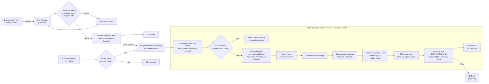

# 08 — CI/CD e infraestrutura

Este documento descreve como o ambiente da API é criado e como o código chega a ele: a infraestrutura como código (cluster kind criado pela CLI `kind`; namespace `revenda`, banco da API, segredos, API Gateway Kong e Prometheus/Grafana pelo Terraform), os manifestos Kubernetes da aplicação com kustomize, os pipelines de integração e entrega contínuas no GitHub Actions, as regras de governança do repositório, a segurança do runner self-hosted e o procedimento de rollback. A premissa do enunciado é que toda mudança, de implantação ou de código, passa por Pull Request e pipeline. As decisões estão nos [ADR-005](adrs/ADR-005-kind-terraform-nodeport.md), [ADR-006](adrs/ADR-006-ci-hospedado-cd-self-hosted.md), [ADR-010](adrs/ADR-010-kind-load-sem-registry.md), [ADR-011](adrs/ADR-011-segredos-terraform.md), [ADR-014](adrs/ADR-014-identidade-em-repositorio-proprio.md), [ADR-015](adrs/ADR-015-api-gateway-kong.md) e [ADR-016](adrs/ADR-016-prometheus-grafana.md).

> **Dois repositórios, dois pipelines.** O serviço de identidade (Keycloak, banco do Keycloak, realm `revenda`, segredos dele) é implantado pelo repositório [fiap-soat-revenda-identidade](https://github.com/Caina-Climaco/fiap-soat-revenda-identidade), com Terraform, state, CI, CD e runner próprios; a infraestrutura e os pipelines dele estão documentados no `README.md` daquele repositório. Este documento trata só da API, que **consome** o contrato da identidade e exige que ela esteja no ar antes do deploy.

## 1. Infraestrutura como código (CLI kind + Terraform)

O **cluster** é criado pela CLI `kind` a partir de `infra/kind/cluster.yaml`, e não pelo Terraform. O provider comunitário `tehcyx/kind` não tem assinatura de código e foi bloqueado pelo Smart App Control do Windows 11 no PC do runner ([ADR-005](adrs/ADR-005-kind-terraform-nodeport.md)). O cluster é a **plataforma local compartilhada** pelos dois repositórios: o `infra/kind/cluster.yaml` é idêntico nos dois, e o CD de cada um (e o script 04 de cada um) cria o cluster se ele faltar. O arquivo define:

- o nome `revenda` e um nó control-plane;
- a imagem do nó, `kindest/node:v1.34.11`, fixada por digest (release kind v0.33.0);
- `podSubnet: 10.244.0.0/16`;
- os `extraPortMappings` em `127.0.0.1`: `30080 → 8080` (API Gateway Kong, a entrada da API), `30180 → 8180` (Keycloak, Service implantado pelo repositório de identidade), `30432 → 15432` (`revenda-db`, só responde com `expor_banco_revenda = true`), `30300 → 3000` (Grafana) e `30900 → 9090` (Prometheus).

O kind só aplica `extraPortMappings` na criação do cluster: uma porta nova exige recriá-lo (README, seção "Migração para o API Gateway e o monitoramento").

A criação é idempotente, no CD e em `scripts/windows/04-subir-ambiente.ps1`:

```bash
kind get clusters | grep -qx revenda || kind create cluster --config infra/kind/cluster.yaml --wait 120s
kind export kubeconfig --name revenda      # no Windows (script 04): API em 127.0.0.1
# no CD (container na rede docker kind): kind export kubeconfig --internal --name revenda
```

O que é da API **dentro** do cluster é Terraform deste repositório (namespaces `revenda`, `gateway` e `observabilidade`); o que é da identidade é Terraform do repositório de identidade. Cada um tem o seu state e só toca os seus namespaces.

### 1.1 Providers

| Provider | Uso |
|---|---|
| `hashicorp/kubernetes` | Namespaces, Secrets, ConfigMaps, StatefulSet, Deployments (Kong, Prometheus, Grafana), Services, NetworkPolicies, ServiceAccount, Roles e RoleBindings |
| `hashicorp/helm` | Instala o `metrics-server` (necessário para o HPA) |
| `hashicorp/random` | Gera a senha do banco, o segredo do webhook e a senha do admin do Grafana (`random_password`) |

As versões dos providers são fixadas em `versions.tf` (`required_providers` com restrição `~>`) e o `.terraform.lock.hcl` é versionado. Os três providers são assinados pela HashiCorp. `kubernetes` e `helm` usam `config_path` (padrão `~/.kube/config`, variável `kubeconfig_path`) e `config_context = "kind-revenda"`.

### 1.2 Recursos

| Recurso | Detalhe |
|---|---|
| `kubernetes_namespace` | `revenda`, `gateway` e `observabilidade` (o `identidade` é criado pelo repositório de identidade) |
| `helm_release.metrics_server` | Chart `metrics-server` em `kube-system`, com `--kubelet-insecure-tls` (certificados autoassinados do kubelet no kind) |
| `random_password` | `revenda_db` (32 caracteres), `webhook_secret` (48; a API exige no mínimo 16), `grafana_admin` (24) |
| `kubernetes_secret` | `revenda-db-credentials` e `revenda-webhook-secret` (ns `revenda`); `kong-config` (ns `gateway`); `grafana-admin` (ns `observabilidade`) |
| PostgreSQL da API | StatefulSet `revenda-db` (`postgres:16.15-alpine`, PVC 1 Gi) + Service `revenda-db`: **NodePort 30432 por padrão** (`expor_banco_revenda = true`, publicado no host em `127.0.0.1:15432` para a demonstração do banco); ClusterIP com `expor_banco_revenda = false` |
| `kubernetes_network_policy` | `revenda-db` aceita só pods com rótulo `app` igual a `revenda-api` ou `revenda-migracao` (mais o tráfego do NodePort quando `expor_banco_revenda = true`). `revenda-api-somente-gateway` (`network_policies.tf`): a API (porta 8000) aceita só pods `app=kong` do ns `gateway`, `app=prometheus` do ns `observabilidade` e o tráfego do nó (probes do kubelet) |
| API Gateway (`gateway.tf`) | Kong `kong:3.9.3` em modo DB-less (Deployment `kong`, 1 réplica, não root, raiz somente leitura). Configuração declarativa: `templatefile` de `infra/kong/kong.yml.tftpl` (com `webhook_secret`, `kong_limite_geral_minuto` = 600 e `kong_limite_compra_minuto` = 60) num Secret `kong-config`; o *hash* da configuração anotado no pod reinicia o Kong quando ela muda. Service `kong` **NodePort 30080** (proxy) e `kong-status` ClusterIP 8100 (status e métricas). Admin API só em `127.0.0.1:8001` |
| Monitoramento (`observabilidade.tf`) | Prometheus `prom/prometheus:v3.14.0` (Deployment, ServiceAccount `prometheus`, Roles `prometheus-leitura-pods` nos ns `revenda` e `gateway`, ConfigMap `prometheus-config` com `infra/observabilidade/prometheus.yml` e `alertas.yml`, retenção 2 dias em `emptyDir`, Service **NodePort 30900**). Grafana `grafana/grafana:13.2.3` (Deployment, ConfigMaps `grafana-provisionamento` e `grafana-paineis` com os arquivos de `infra/observabilidade/grafana/`, Secret `grafana-admin`, acesso anônimo Viewer, Service **NodePort 30300**) |

O namespace `identidade` (Keycloak 26.7.1, `keycloak-db`, Secrets `keycloak-db-credentials`, `keycloak-admin`, `keycloak-gestor` e `keycloak-e2e`, NetworkPolicy do `keycloak-db` e o Job `keycloak-reconciliar`, que mantém o `gestor.loja` e o client técnico do e2e) é do repositório de identidade.

Fronteira de responsabilidade: a **CLI kind** cria o cluster; o **Terraform** deste repositório cuida da plataforma da API (namespaces, segredos, banco, metrics-server, Kong, Prometheus e Grafana), que muda raramente; o **kustomize** cuida da aplicação `revenda-api`, que muda a cada merge; o **repositório de identidade** cuida de tudo o que é do Keycloak.

### 1.3 State: onde fica e por quê

- Backend `local`, com caminho informado no `terraform init` (configuração parcial): `-backend-config="path=$USERPROFILE/.revenda/revenda-api.tfstate"`, sempre com `-reconfigure` (o caminho é fixo e vem só da linha de comando). `TF_DATA_DIR` também aponta para fora do repositório.
- O diretório fica no perfil do usuário do PC (`%USERPROFILE%\.revenda`). O runner em container o recebe por bind mount em `/revenda-state`: o state é um só para o script 04 (Windows) e para o CD (container), e os dois usam o Terraform 1.16.4. Cada lado tem o seu `TF_DATA_DIR`, porque os providers são de plataformas diferentes.
- O repositório de identidade usa outro arquivo no mesmo diretório (`identidade.tfstate`). Antes da separação ([ADR-014](adrs/ADR-014-identidade-em-repositorio-proprio.md)), havia um único `terraform.tfstate` com API e Keycloak; o script 04 avisa se ele ainda existir (procedimento de migração no [README](../README.md#8-migração-para-dois-repositórios)).
- **Por quê**: (1) o cluster só existe nesse PC, então um backend remoto não traria benefício de colaboração; (2) o state contém os segredos gerados em texto claro e, por isso, **nunca** pode ir para o repositório (lição da fase 2); (3) fora do *workspace* do runner, o state sobrevive à limpeza do checkout entre execuções; (4) um state por repositório impede que o pipeline da API leia ou altere os segredos da identidade.
- Evolução: backend remoto com criptografia e *locking* (ex.: S3 + DynamoDB, GCS ou Terraform Cloud) quando houver ambiente compartilhado.

### 1.4 Uma única aplicação

Como o cluster já existe quando o Terraform roda, os providers só leem o kubeconfig e o CD executa um único `terraform apply -auto-approve`, sem `-target`. O `terraform destroy` remove só o que é da API (os namespaces `revenda`, `gateway` e `observabilidade` e o metrics-server), nunca o cluster nem a identidade. `scripts/windows/05-destruir-ambiente.ps1` faz o `destroy` e remove o state; com `-ApagarCluster`, também roda `kind delete cluster --name revenda`, o que derruba a identidade junto.

### 1.5 Recriar o ambiente do zero

Ordem: identidade → infraestrutura da API → CD da API.

```bash
# Windows: scripts\windows\05-destruir-ambiente.ps1 -ApagarCluster; depois o 04 do repositório
# de identidade e o 04 deste repositório. Ou, à mão:
kind delete cluster --name revenda                # remove cluster e volumes (identidade inclusive)
rm -f ~/.revenda/revenda-api.tfstate*             # remove o state da API (segredos serão regenerados)
# (no repositório de identidade: apagar o identidade.tfstate e subir a identidade; ver o README de lá)
kind create cluster --config infra/kind/cluster.yaml --wait 120s   # se a identidade ainda não o criou
curl -fsS http://localhost:8180/realms/revenda/.well-known/openid-configuration >/dev/null
terraform -chdir=infra/terraform init -reconfigure -backend-config="path=$USERPROFILE/.revenda/revenda-api.tfstate"
terraform -chdir=infra/terraform apply
# Em seguida: GitHub > Actions > CD > Run workflow (branch main)
```

Depois de recriado, o CD reconstrói a imagem, carrega no kind, aplica a migração e os manifestos. Os dados anteriores são perdidos (ambiente acadêmico).

## 2. Manifestos Kubernetes (kustomize)

### 2.1 Estrutura

```text
k8s/
├── base/                    # aplicada a cada deploy
│   ├── kustomization.yaml   # namespace revenda; images: revenda-api -> tag neutra "dev"
│   ├── configmap.yaml       # revenda-api-config: DB_HOST, DB_PORT, OIDC_*, RESERVA_TTL_MINUTOS, LOG_LEVEL
│   ├── deployment.yaml
│   ├── service.yaml         # ClusterIP 80 -> porta http (8000); a entrada pelo host é o Kong
│   └── hpa.yaml
└── migracao/
    ├── kustomization.yaml
    └── job.yaml             # revenda-migracao: python -m revenda.migracao (seção 2.4)
```

No repositório a imagem tem a tag neutra `revenda-api:dev`. O CD **não** commita a tag do deploy: renderiza os manifestos com `kubectl kustomize`, troca `revenda-api:dev` por `revenda-api:<sha>` com `sed` num arquivo temporário e aplica esse arquivo com `kubectl apply -f`. O CI renderiza com o mesmo `kubectl kustomize` e valida o resultado com `kubeconform -strict`.

### 2.2 Deployment `revenda-api`

| Item | Valor |
|---|---|
| Réplicas | Controladas pelo HPA (mínimo 2); o campo `replicas` é omitido do Deployment para não conflitar com o HPA a cada `apply` |
| Estratégia | `RollingUpdate`, `maxUnavailable: 0`, `maxSurge: 1`; `revisionHistoryLimit: 5` |
| Imagem | `revenda-api:<sha>`, container `api`, `imagePullPolicy: IfNotPresent` (a imagem existe só no nó do kind; nunca usar `latest`, que forçaria `Always`) |
| Porta | 8000 (Uvicorn), nomeada `http` |
| `startupProbe` | `GET /health/live`, `periodSeconds: 2`, `failureThreshold: 30` |
| `livenessProbe` | `GET /health/live`, `periodSeconds: 10`, `failureThreshold: 3` |
| `readinessProbe` | `GET /health/ready` (verifica o banco), `periodSeconds: 5`, `failureThreshold: 3` |
| Recursos | `requests: cpu 100m, memory 128Mi`; `limits: cpu 500m, memory 256Mi` |
| `securityContext` | `runAsNonRoot`, `runAsUser: 10001`, `readOnlyRootFilesystem`, `allowPrivilegeEscalation: false`, `capabilities.drop: [ALL]`, `seccompProfile: RuntimeDefault`; `automountServiceAccountToken: false` |
| Volumes | `emptyDir` em `/tmp` (64Mi) |
| Env | `envFrom`: ConfigMap `revenda-api-config` e Secrets `revenda-db-credentials` e `revenda-webhook-secret` |
| Anotações do pod | `prometheus.io/scrape: "true"`, `prometheus.io/port: "8000"`, `prometheus.io/path: /metrics`, para a descoberta automática pelo Prometheus do namespace `observabilidade` ([12-observabilidade.md](12-observabilidade.md)) |
| Rótulos | `app: revenda-api` (seletor do Service, rótulo aceito pela NetworkPolicy do `revenda-db` e alvo da `revenda-api-somente-gateway`), rótulos `app.kubernetes.io/*` e `revenda.io/acesso-db: "true"` (este último informativo: nenhuma NetworkPolicy o usa; a regra do banco é por `app`) |

### 2.3 HPA

`autoscaling/v2`, `minReplicas: 2`, `maxReplicas: 5`, métrica de CPU com `averageUtilization: 60` (em relação ao `request` de 100m), `scaleDown.stabilizationWindowSeconds: 120`. Depende do `metrics-server` instalado pelo Terraform. O teste de carga `tests/carga/listagens.js` (k6) gera tráfego nas listagens públicas para observar o HPA ([09-testes.md](09-testes.md), seção 9.6).

### 2.4 Job de migração

`revenda-migracao`: mesma imagem da API, comando `python -m revenda.migracao` (no diretório `/app`, onde ficam `alembic.ini` e `migrations/`), `backoffLimit: 2`, `activeDeadlineSeconds: 300`, `ttlSecondsAfterFinished: 600`, `restartPolicy: Never`, mesmo `securityContext` da API e rótulo `app: revenda-migracao` (aceito pela NetworkPolicy do `revenda-db`). Autossuficiente: recebe `DB_HOST`/`DB_PORT` no próprio manifesto e as credenciais do Secret `revenda-db-credentials`, sem depender do ConfigMap da base.

O Job é **tolerante a rollback**. Antes de migrar, ele compara a revisão gravada no banco (`alembic_version`) com as revisões que a imagem conhece:

| Situação | Ação do Job |
|---|---|
| Banco vazio ou numa revisão conhecida pela imagem | `alembic upgrade head` |
| Banco numa revisão **desconhecida** pela imagem (criada por uma versão mais nova, caso típico de rollback) | Não altera nada e termina com sucesso |

Assim, reimplantar um SHA anterior não falha na migração: o schema mais novo permanece e, como as migrações seguem *expand/contract* ([06-dados.md](06-dados.md), seção 5.3), o código anterior continua compatível com ele. Detalhes em [06-dados.md](06-dados.md), seção 5.

## 3. Pipelines

### 3.1 Fluxo PR → CI → merge → CD → e2e



### 3.2 `ci.yml`: integração contínua

Gatilhos: `pull_request` para `main` e `push` na `main`. Runner: `ubuntu-latest`. `permissions: contents: read`. `concurrency` com grupo `ci-<número do PR ou ref>` e `cancel-in-progress: ${{ github.event_name == 'pull_request' }}`: um push novo no PR cancela a execução anterior do mesmo PR; na `main` nada é cancelado. Não há `paths-ignore`: os checks obrigatórios rodam em todo PR, inclusive nos só de documentação.

| Job | Passos | Falha quando |
|---|---|---|
| `qualidade` | Checkout; Python 3.12; uv com cache; `uv sync --frozen`; `ruff check`; `ruff format --check`; `mypy src`; `lint-imports` (contratos de camadas e módulos) | Erro de lint, formatação, tipagem ou violação da regra de dependência |
| `testes` | *Service container* `postgres:16-alpine` (banco `revenda_test`); `uv sync --frozen`; `uv run pytest -m "unit or integration" --cov=revenda --cov-branch --cov-report=term-missing --cov-report=xml --cov-fail-under=80` (os testes de integração aplicam `alembic upgrade head` do zero no início da sessão); publica o `coverage.xml` como artefato | Teste falho ou cobertura < 80% |
| `imagem` | Build com Buildx (tag `revenda-api:${{ github.sha }}`, sem push, cache do GitHub Actions); Trivy na imagem (`severity: CRITICAL,HIGH`, `ignore-unfixed: true`, `exit-code: 1`); Trivy `fs` com scanner `secret` no repositório. A `trivy-action` é fixada por SHA de commit | Vulnerabilidade crítica/alta corrigível ou segredo detectado |
| `infra` | `terraform fmt -check -recursive`; `terraform init -backend=false`; `terraform validate`; `kubectl kustomize` de `k8s/base` e `k8s/migracao` validado com `kubeconform -strict` (binário com checksum); configuração do Kong: `infra/kong/kong.yml.tftpl` renderizado com valores de teste (`sed`; falha se sobrar placeholder) e validado com `kong config parse` na imagem `kong:3.9.3`; monitoramento: `promtool check config`, `promtool check rules` e `promtool test rules infra/observabilidade/alertas.test.yml` na imagem `prom/prometheus:v3.14.0`, e o painel do Grafana validado com `jq` (uid `revenda-visao-geral`, todos os painéis com a fonte de dados `prometheus`); `infra/kind/cluster.yaml` validado com `yq` (YAML válido, os cinco `extraPortMappings` 30080, 30180, 30432, 30300 e 30900, imagem por digest); `hadolint` em `infra/runner/Dockerfile` e `shellcheck` em `infra/runner/entrypoint.sh`. O contrato do realm não é validado aqui: ele é testado no CI do repositório de identidade (job `realm`, contra um Keycloak real) | Formatação, configuração inválida (Terraform, Kong, Prometheus), teste de alerta falho, painel inválido ou manifesto fora do schema |
| `titulo-pr` | Só em `pull_request`: valida o título do PR contra a expressão regular de Conventional Commits | Título fora do padrão (não é *required check*) |

Os quatro primeiros jobs rodam em paralelo e são os *required status checks* da `main`. O CI não tem acesso a segredos nem ao cluster.

### 3.3 `cd.yml`: entrega contínua

Gatilhos: `push` na `main` (ou seja, PR mergeado) e `workflow_dispatch` com input opcional `ref` (rollback). Runner: `runs-on: [self-hosted, Linux, kind-local]`, o container Linux `revenda-runner` no Docker Desktop do PC do autor, ligado à rede docker `kind`. Por estar nessa rede, o runner usa o kubeconfig **interno** (`kind export kubeconfig --internal`, API em `https://revenda-control-plane:6443`) e testa a aplicação pelo nome do nó: `http://revenda-control-plane:30080` (API, pelo Kong), `http://revenda-control-plane:30180` (Keycloak, implantado pelo repositório de identidade), `:30900` (Prometheus) e `:30300` (Grafana), e não por `localhost:8080`/`8180`, que são portas do host Windows. O `iss` dos tokens continua `http://localhost:8180/realms/revenda`, porque `KC_HOSTNAME` é fixo no Keycloak.

O CD da API não implanta nem altera o Keycloak: ele só confere que o realm está publicado e, no e2e, lê do namespace `identidade` os Secrets de contrato `keycloak-gestor` e `keycloak-e2e`. O state fica em `/revenda-state/revenda-api.tfstate` (variável `STATE_FILE`; bind mount de `%USERPROFILE%\.revenda`, o mesmo arquivo do script 04), com `TF_DATA_DIR` no volume do container (providers Linux). `environment: local`. `concurrency: { group: deploy-local, cancel-in-progress: false }`: deploys são enfileirados, nunca interrompidos no meio. `permissions: contents: read`.

| Passo | O que faz | Critério de sucesso |
|---|---|---|
| 1. Checkout | `actions/checkout` do SHA do push ou do `ref` informado | — |
| 2. Validação da `ref` (só `workflow_dispatch`) | Busca `origin/main` e recusa o deploy se o commit pedido não for ancestral dela (`git merge-base --is-ancestor`) | Só commits que já passaram pela `main` são implantados |
| 3. Contexto | Calcula `SHA` e `IMAGEM=revenda-api:<sha>`; confere o bind mount do state e as ferramentas no PATH | — |
| 4. Cluster kind | Se `kind get clusters` não lista `revenda`: `kind create cluster --config infra/kind/cluster.yaml --wait 120s`; depois `kind export kubeconfig --internal --name revenda` | Contexto `kind-revenda` acessível de dentro do container |
| 5. Serviço de identidade publicado | `curl` em `http://revenda-control-plane:30180/realms/revenda/.well-known/openid-configuration`, até 24 tentativas a cada 5 s; se não responder, falha com a mensagem "Implante antes o serviço de identidade (repositório fiap-soat-revenda-identidade)" | Realm `revenda` respondendo, antes de qualquer alteração na API |
| 6. Terraform | `terraform init -reconfigure -backend-config="path=/revenda-state/revenda-api.tfstate"`; um único `terraform apply -auto-approve` (namespace `revenda`, segredos, `revenda-db`, NetworkPolicies, metrics-server, Kong no ns `gateway`, Prometheus e Grafana no ns `observabilidade`) | Plataforma da API convergida (idempotente) |
| 7. Build | `docker build -t revenda-api:<sha> .` (reaproveita a imagem se ela já existir no Docker local, caso de rollback) | Imagem construída |
| 8. Carga no kind | `kind load docker-image revenda-api:<sha> --name revenda` | Imagem disponível no nó |
| 9. Migração | `kubectl delete job revenda-migracao --ignore-not-found --wait=true`; `kubectl kustomize k8s/migracao` + `sed` da imagem + `kubectl apply -f`; espera `complete` ou `failed` em paralelo (até 300 s) | Job com sucesso; em falha, imprime `describe` e logs e encerra **sem** alterar o Deployment |
| 10. Deploy | `kubectl kustomize k8s/base` + `sed` da imagem + `kubectl apply -f`; anotação `kubernetes.io/change-cause`; `kubectl rollout status deployment/revenda-api --timeout=180s`; confere a imagem final do container `api` | Todas as réplicas novas *ready* com a imagem do SHA |
| 11. Espera | `GET /health/ready` da API (até 180 s), pelo Kong em `revenda-control-plane:30080` | Resposta 2xx (API e gateway no ar) |
| 12. Monitoramento | Consulta a API HTTP do Prometheus: `count(up{job="revenda-api"} == 1)` e `count(up{job="kong"} == 1)` maiores que zero (até 24 tentativas a cada 5 s); `/api/v1/rules` com pelo menos 3 grupos; `GET /api/health` do Grafana e o painel `revenda-visao-geral` pela API do Grafana | Coleta da API e do Kong ativa, alertas carregados, painel provisionado ([ADR-016](adrs/ADR-016-prometheus-grafana.md)) |
| 13. e2e | Lê dos Secrets, via `kubectl`, o segredo do webhook (`revenda/revenda-webhook-secret`) e, do contrato com a identidade, a senha do gestor (`identidade/keycloak-gestor`) e o client técnico `revenda-e2e-admin` (`identidade/keycloak-e2e`: `E2E_ADMIN_CLIENT_ID` e `E2E_ADMIN_CLIENT_SECRET`), todos mascarados com `::add-mask::`; o admin do realm `master` não é usado; cria um venv com `tests/e2e/requirements.txt`; `pytest tests/e2e -m e2e` com `E2E_EXIGIR=1`, `E2E_GATEWAY=1` (os testes do gateway são obrigatórios) e relatório JUnit | Fluxo início-a-fim verde, pelo Kong ([09-testes.md](09-testes.md)) |
| 14. Diagnóstico (em falha) | Pods de todos os namespaces, eventos, logs da API, logs do Kong (`kubectl -n gateway logs deployment/kong`) e pods do ns `observabilidade` (os logs do Keycloak são diagnosticados no repositório de identidade) | — |
| 15. Resumo | `$GITHUB_STEP_SUMMARY`: SHA, imagem, réplicas prontas, resultado e contagem do e2e, URLs locais (API pelo gateway, Grafana, Prometheus, Keycloak) | — |

Se o e2e falhar após o rollout, o job falha (deploy marcado como vermelho) e o autor executa o rollback da seção 6. O rollback não é automático, para preservar o estado para diagnóstico.

## 4. Governança Git

### 4.1 Proteção da `main`

Configurada por *branch protection rule* no GitHub (`scripts/windows/02-criar-repositorio.ps1`):

| Regra | Valor |
|---|---|
| Exigir Pull Request antes do merge | Sim |
| Aprovações exigidas | **0**: trabalho individual; o GitHub não permite que o autor aprove o próprio PR. A revisão é substituída pelo CI obrigatório e pelo checklist do template |
| *Status checks* obrigatórios | `qualidade`, `testes`, `imagem`, `infra`; branch atualizada com a `main` antes do merge |
| Force push e exclusão da branch | Bloqueados |
| Incluir administradores | Sim (o próprio autor não contorna as regras) |
| Método de merge | Somente *squash merge*; o título do PR vira a mensagem do commit na `main` |
| Histórico linear | Sim |

### 4.2 Fluxo de branches

| Prefixo | Uso | Exemplo |
|---|---|---|
| `feat/*` | Nova funcionalidade | `feat/webhook-pagamento` |
| `fix/*` | Correção | `fix/ordenacao-vendidos` |
| `docs/*` | Documentação | `docs/adr-concorrencia` |
| `infra/*` | Terraform, manifestos, pipelines | `infra/hpa-revenda-api` |

Branches de vida curta, criadas a partir da `main` e apagadas após o merge.

### 4.3 Conventional Commits

Títulos de PR no formato `tipo(escopo): descrição`, com tipos `feat`, `fix`, `docs`, `refactor`, `test`, `chore`, `ci`, `build`, `perf`, `style` e `revert`, e escopos como `catalogo`, `vendas`, `infra`, `ci` (mudanças no Keycloak e no realm são PRs do repositório de identidade). Exemplos: `feat(vendas): efetivar venda via webhook`, `fix(catalogo): ordenar vendidos por preço`. Como `infra` não é um tipo do padrão, mudanças de infraestrutura usam `build`, `ci` ou `chore` com escopo `infra` (ex.: `build(infra): adicionar HPA da revenda-api`), mesmo vindo de uma branch `infra/*`. O job `titulo-pr` do CI valida o título com uma expressão regular; o script `abrir-pr.ps1` faz a mesma checagem antes de abrir o PR.

### 4.4 Template de PR (`.github/pull_request_template.md`)

| Seção | Conteúdo |
|---|---|
| **O que muda** | A mudança em 1 a 3 frases |
| **Por que** | História, requisito (RF/RNF) ou ADR que motiva a mudança |
| **Tipo** | Caixas para `feat`, `fix`, `infra` (Terraform, manifestos, pipelines), `docs` e `test` / `refactor` / `chore` |
| **Checklist** | Título segue Conventional Commits; testes adicionados ou atualizados e cobertura ≥ 80%; documentação (`docs/`, README ou ADR) atualizada quando aplicável; nenhum segredo, kubeconfig, `.env` ou `tfstate` adicionado; nenhum dado pessoal (nome, CPF, e-mail, telefone) entra no banco da API |

## 5. Segurança do runner self-hosted

O repositório é público, e a documentação do GitHub desaconselha runners self-hosted em repositórios públicos. Os controles abaixo existem por isso ([ADR-006](adrs/ADR-006-ci-hospedado-cd-self-hosted.md)).

| Controle | Detalhe |
|---|---|
| Só código revisado | O `cd.yml` é o único workflow self-hosted e dispara apenas em `push` na `main` e em `workflow_dispatch`; **nenhum** workflow com `runs-on: self-hosted` reage a `pull_request`. O CI dos PRs roda só no runner hospedado |
| `ref` restrita à `main` | No `workflow_dispatch`, o CD recusa qualquer `ref` que não seja ancestral de `origin/main`: não é possível implantar uma branch não mergeada |
| Label dedicada | Runner registrado **neste** repositório com a label `kind-local`; somente o `cd.yml` a utiliza. O repositório de identidade tem o próprio runner (`revenda-runner-identidade`), registrado só lá: um runner nunca executa jobs do outro repositório |
| PRs de forks | Configuração do repositório que exige aprovação para executar workflows de colaboradores externos (aplicada pelo script 02) |
| Runner em container | O runner nativo para Windows foi bloqueado pelo Smart App Control, então ele roda no container Linux `revenda-runner` (`infra/runner/Dockerfile`, base `ghcr.io/actions/actions-runner:2.337.0`; kind, kubectl, Terraform e Python com versão fixa e checksum). Ele é instalado e removido por `scripts/windows/03-instalar-runner.ps1` e reinicia sozinho (`--restart unless-stopped`). Só são montados o socket do Docker, o volume `revenda-runner-persist` (registro e `TF_DATA_DIR`) e `%USERPROFILE%\.revenda` (state; o CD da API só lê e grava `revenda-api.tfstate`) |
| Usuário sem root | Dentro do container o runner roda como `runner` (UID 1001). O entrypoint descobre o GID do `/var/run/docker.sock` e põe o usuário nesse grupo. Ressalva: o socket do Docker equivale, na prática, a privilégio de administrador sobre o Docker do host, e quem controla um job controla os containers do PC. Por isso só código já revisado e mergeado na `main` roda nele; em produção o ideal seria um runner efêmero isolado em VM |
| Token de registro | Uso único, obtido via `gh api` no momento da instalação e passado só por variável de ambiente (nunca na linha de comando nem no log). O entrypoint o apaga do ambiente antes de iniciar o runner |
| Environment `local` | O job de CD usa o environment `local`, que admite regras de proteção (ex.: restringir à branch `main`) e segredos de environment, se necessários |
| Segredos | O runner não guarda segredos da aplicação no GitHub; os valores vêm do Terraform/cluster e são mascarados nos logs |
| Workspace | Checkout limpo a cada execução; state do Terraform fora do workspace |
| Atualização | O runner se atualiza sozinho dentro do container. Ao recriar o container, ele volta à versão da imagem e se atualiza de novo. Para mudar a base, troque o `ARG RUNNER_VERSION` do Dockerfile (por PR) e rode o script 03 |

## 6. Rollback

Como cada imagem é identificada pelo SHA, voltar uma versão é reimplantar o SHA anterior. Há dois procedimentos.

**A. Reimplantar o SHA anterior pelo pipeline (preferencial, auditável)**

1. Identificar o último SHA bom (histórico de execuções do CD ou `git log main`).
2. GitHub → Actions → CD → *Run workflow*, informando `ref = <sha-anterior>`. O SHA precisa ser ancestral de `origin/main`; qualquer outra `ref` é recusada no primeiro passo.
3. O CD faz checkout desse SHA, reaproveita `revenda-api:<sha-anterior>` se a imagem ainda estiver no Docker local (ou a reconstrói), aplica e executa o e2e.
4. Migração: o Job da versão anterior encontra o banco numa revisão que a imagem dele não conhece (criada pela versão mais nova), **não altera o schema e termina com sucesso**; o rollout segue. Não há `alembic downgrade` automático: a compatibilidade vem da regra *expand/contract* ([06-dados.md](06-dados.md), seção 5.3).
5. Atenção: o Terraform também é aplicado com a versão daquele SHA; se o PR problemático alterou infraestrutura, a infraestrutura da API também é revertida. O rollback da API não mexe na identidade, que tem rollback próprio no repositório dela. Um SHA anterior ao API Gateway ([ADR-015](adrs/ADR-015-api-gateway-kong.md)) remove o Kong, o Prometheus e o Grafana e devolve o NodePort 30080 ao Service `revenda-api`; para voltar depois a um SHA com o gateway, o Service `revenda-api` precisa deixar de ocupar a porta 30080 antes do `terraform apply` (`kubectl -n revenda delete service revenda-api`; o CD recria o Service como ClusterIP no passo de deploy), senão a criação do Service `kong` falha com a porta já alocada. Um SHA anterior à separação ([ADR-014](adrs/ADR-014-identidade-em-repositorio-proprio.md)) é recusado pelo CD (o passo de validação falha se o commit ainda tiver `infra/terraform/keycloak.tf` ou `keycloak/`): o Terraform dele declarava o Keycloak e usava o state `terraform.tfstate`.

**B. Emergencial no cluster**

```bash
kubectl -n revenda rollout undo deployment/revenda-api
kubectl -n revenda rollout status deployment/revenda-api
```

Retorna à *ReplicaSet* anterior em segundos (o CD aplica a imagem final de uma vez, sem ReplicaSet intermediário, para que o `undo` volte de fato à versão anterior). Em seguida, a correção definitiva deve entrar por PR (`git revert` do commit numa branch `fix/*`), para que a `main` volte a refletir o que está implantado e o próximo deploy não reintroduza o problema.
