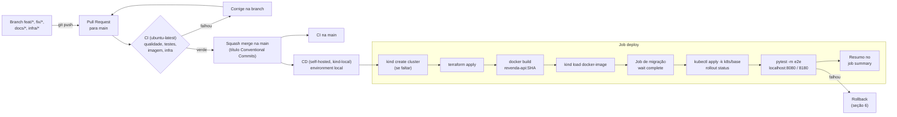

# 08 — CI/CD e infraestrutura

Este documento descreve como o ambiente é criado e como o código chega a ele: a infraestrutura como código (cluster kind criado pela CLI `kind`; namespaces, bancos, Keycloak e segredos pelo Terraform), os manifestos Kubernetes da aplicação com kustomize, os pipelines de integração e entrega contínuas no GitHub Actions, as regras de governança do repositório, a segurança do runner self-hosted e o procedimento de rollback. A premissa do enunciado é que toda mudança, de implantação ou de código, passa por Pull Request e pipeline. As decisões estão nos [ADR-005](adrs/ADR-005-kind-terraform-nodeport.md), [ADR-006](adrs/ADR-006-ci-hospedado-cd-self-hosted.md), [ADR-010](adrs/ADR-010-kind-load-sem-registry.md) e [ADR-011](adrs/ADR-011-segredos-terraform.md).

## 1. Infraestrutura como código (CLI kind + Terraform)

O **cluster** é criado pela CLI `kind` a partir de `infra/kind/cluster.yaml`, e não pelo Terraform. O provider comunitário `tehcyx/kind` não tem assinatura de código e foi bloqueado pelo Smart App Control do Windows 11 no PC do runner ([ADR-005](adrs/ADR-005-kind-terraform-nodeport.md)). O arquivo define:

- o nome `revenda` e um nó control-plane;
- a imagem do nó, `kindest/node:v1.34.11`, fixada por digest (release kind v0.33.0);
- `podSubnet: 10.244.0.0/16`;
- os `extraPortMappings` em `127.0.0.1`: `30080 → 8080` (API), `30180 → 8180` (Keycloak) e `30432 → 15432` (`revenda-db`, só responde com `expor_banco_revenda = true`).

A criação é idempotente, no CD e em `scripts/windows/04-subir-ambiente.ps1`:

```bash
kind get clusters | grep -qx revenda || kind create cluster --config infra/kind/cluster.yaml --wait 120s
kind export kubeconfig --name revenda      # contexto kind-revenda usado pelos providers
```

Todo o resto (o que fica **dentro** do cluster) é Terraform.

### 1.1 Providers

| Provider | Uso |
|---|---|
| `hashicorp/kubernetes` | Namespaces, Secrets, ConfigMaps, StatefulSets, Deployments, Services, NetworkPolicies |
| `hashicorp/helm` | Instala o `metrics-server` (necessário para o HPA) |
| `hashicorp/random` | Gera as senhas e o segredo do webhook (`random_password`) |

As versões dos providers são fixadas em `versions.tf` (`required_providers` com restrição `~>`) e o `.terraform.lock.hcl` é versionado. Os três providers são assinados pela HashiCorp. `kubernetes` e `helm` usam `config_path` (padrão `~/.kube/config`, variável `kubeconfig_path`) e `config_context = "kind-revenda"`.

### 1.2 Recursos

| Recurso | Detalhe |
|---|---|
| `kubernetes_namespace` | `revenda` e `identidade` |
| `helm_release.metrics_server` | Chart `metrics-server` em `kube-system`, com `--kubelet-insecure-tls` (certificados autoassinados do kubelet no kind) |
| `random_password` | `revenda_db`, `keycloak_db`, `keycloak_admin`, `keycloak_gestor`, `webhook_secret` (32+ caracteres) |
| `kubernetes_secret` | `revenda-db-credentials` e `revenda-webhook-secret` (ns `revenda`); `keycloak-db-credentials`, `keycloak-admin` e `keycloak-gestor` (ns `identidade`) |
| PostgreSQL da API | StatefulSet `revenda-db` (`postgres:16-alpine`, PVC 1 Gi) + Service ClusterIP `revenda-db` |
| PostgreSQL do Keycloak | StatefulSet `keycloak-db` (`postgres:16-alpine`, PVC 1 Gi) + Service ClusterIP `keycloak-db` |
| Keycloak | ConfigMap com `keycloak/realm-revenda.json`; Deployment `keycloak` (`quay.io/keycloak/keycloak:26.x`, `start-dev --import-realm`, `KC_HOSTNAME=http://localhost:8180`, `KC_HOSTNAME_BACKCHANNEL_DYNAMIC=true`, `KC_HEALTH_ENABLED=true`, admin via `KC_BOOTSTRAP_ADMIN_USERNAME/PASSWORD`); Service NodePort 30180 |
| `kubernetes_network_policy` | `revenda-db` aceita só pods com rótulo `app` igual a `revenda-api` ou `revenda-migracao`; `keycloak-db` aceita só pods `app=keycloak` |

O arquivo de realm usa *placeholders* de variáveis de ambiente (ex.: `${GESTOR_PASSWORD}`) resolvidos pelo Keycloak na importação; a senha do `gestor.loja` vem do Secret `keycloak-gestor` e, portanto, não fica versionada. Como o import só cria o realm na primeira subida, o Job `keycloak-gestor-senha` (kcadm.sh) reaplica a senha do Secret de forma idempotente a cada `apply`.

Fronteira de responsabilidade: a **CLI kind** cria o cluster; o **Terraform** cuida do restante da plataforma (namespaces, segredos, bancos, Keycloak, metrics-server), que muda raramente; o **kustomize** cuida da aplicação `revenda-api`, que muda a cada merge.

### 1.3 State: onde fica e por quê

- Backend `local`, com caminho informado no `terraform init` (configuração parcial): `-backend-config="path=$USERPROFILE/.revenda/terraform.tfstate"`. `TF_DATA_DIR` também aponta para fora do repositório.
- O diretório fica no perfil do usuário do PC (`%USERPROFILE%\.revenda`). O runner em container o recebe por bind mount em `/revenda-state`: o state é um só para o script 04 (Windows) e para o CD (container), e os dois usam o Terraform 1.16.4. Cada lado tem o seu `TF_DATA_DIR`, porque os providers são de plataformas diferentes.
- **Por quê**: (1) o cluster só existe nesse PC, então um backend remoto não traria benefício de colaboração; (2) o state contém os segredos gerados em texto claro e, por isso, **nunca** pode ir para o repositório (lição da fase 2); (3) fora do *workspace* do runner, o state sobrevive à limpeza do checkout entre execuções.
- Evolução: backend remoto com criptografia e *locking* (ex.: S3 + DynamoDB, GCS ou Terraform Cloud) quando houver ambiente compartilhado.

### 1.4 Uma única aplicação

Como o cluster já existe quando o Terraform roda, os providers só leem o kubeconfig e o CD executa um único `terraform apply -auto-approve`, sem `-target`. O `terraform destroy` remove o conteúdo do cluster, mas não o cluster: ele é apagado por `kind delete cluster --name revenda` (`scripts/windows/05-destruir-ambiente.ps1` faz os dois e remove o state).

### 1.5 Recriar o ambiente do zero

```bash
# Windows: scripts\windows\05-destruir-ambiente.ps1 e depois 04-subir-ambiente.ps1, ou:
kind delete cluster --name revenda           # remove cluster e volumes
rm -f ~/.revenda/terraform.tfstate*          # remove state (segredos serão regenerados)
# Em seguida: GitHub > Actions > CD > Run workflow (branch main)
# ou, localmente:
kind create cluster --config infra/kind/cluster.yaml --wait 120s
terraform -chdir=infra/terraform init -backend-config="path=$USERPROFILE/.revenda/terraform.tfstate"
terraform -chdir=infra/terraform apply
```

Depois de recriado, o CD reconstrói a imagem, carrega no kind, aplica a migração e os manifestos. Os dados anteriores são perdidos (ambiente acadêmico).

## 2. Manifestos Kubernetes (kustomize)

### 2.1 Estrutura

```text
k8s/
├── base/                    # aplicada a cada deploy
│   ├── kustomization.yaml   # images: revenda-api -> revenda-api:<sha> (definido pelo CD)
│   ├── configmap.yaml       # revenda-api-config: OIDC_ISSUER, OIDC_JWKS_URL, OIDC_AUDIENCE, RESERVA_TTL_MINUTOS, LOG_LEVEL
│   ├── deployment.yaml
│   ├── service.yaml         # NodePort 30080 -> 8000
│   └── hpa.yaml
└── migracao/
    ├── kustomization.yaml
    └── job.yaml             # revenda-migracao: alembic upgrade head
```

O CD define a tag com `kustomize edit set image revenda-api=revenda-api:${GITHUB_SHA}` no *workspace* (a alteração não é commitada). No repositório a tag é um valor neutro, e o CI valida os manifestos renderizados com `kubeconform`.

### 2.2 Deployment `revenda-api`

| Item | Valor |
|---|---|
| Réplicas | Controladas pelo HPA (mínimo 2); o campo `replicas` é omitido do Deployment para não conflitar com o HPA a cada `apply` |
| Estratégia | `RollingUpdate`, `maxUnavailable: 0`, `maxSurge: 1` |
| Imagem | `revenda-api:<sha>`, `imagePullPolicy: IfNotPresent` (a imagem existe só no nó do kind; nunca usar `latest`, que forçaria `Always`) |
| Porta | 8000 (Uvicorn) |
| `startupProbe` | `GET /health/live`, `periodSeconds: 2`, `failureThreshold: 30` |
| `livenessProbe` | `GET /health/live`, `periodSeconds: 10`, `failureThreshold: 3` |
| `readinessProbe` | `GET /health/ready` (verifica o banco), `periodSeconds: 5`, `failureThreshold: 3` |
| Recursos | `requests: cpu 100m, memory 128Mi`; `limits: cpu 500m, memory 256Mi` |
| `securityContext` | `runAsNonRoot`, `runAsUser: 10001`, `readOnlyRootFilesystem`, `allowPrivilegeEscalation: false`, `capabilities.drop: [ALL]`, `seccompProfile: RuntimeDefault` |
| Volumes | `emptyDir` em `/tmp` |
| Env | ConfigMap `revenda-api-config`; Secrets `revenda-db-credentials` e `revenda-webhook-secret` via `secretKeyRef` |
| Rótulos | `app.kubernetes.io/name: revenda-api`, `revenda.io/acesso-db: "true"` |

### 2.3 HPA

`autoscaling/v2`, `minReplicas: 2`, `maxReplicas: 5`, métrica de CPU com `averageUtilization: 60` (em relação ao `request` de 100m). Depende do `metrics-server` instalado pelo Terraform. A demonstração opcional usa carga nas listagens públicas ([09-testes.md](09-testes.md)).

### 2.4 Job de migração

`revenda-migracao`: mesma imagem, comando `alembic upgrade head`, `backoffLimit: 2`, `activeDeadlineSeconds: 300`, `restartPolicy: Never`, mesmo `securityContext` e rótulo de acesso ao banco. Executado antes do rollout; detalhes em [06-dados.md](06-dados.md), seção 5.

## 3. Pipelines

### 3.1 Fluxo PR → CI → merge → CD → e2e



### 3.2 `ci.yml` — integração contínua

Gatilhos: `pull_request` para `main` e `push` na `main`. Runner: `ubuntu-latest`. `permissions: contents: read`. `concurrency` por *ref* com `cancel-in-progress: true` (um push novo no PR cancela a execução anterior).

| Job | Passos | Falha quando |
|---|---|---|
| `qualidade` | Checkout; setup Python 3.12 com cache; instala dependências; `ruff check`; `ruff format --check`; `mypy src`; `lint-imports` (contratos de camadas e módulos) | Erro de lint, formatação, tipagem ou violação da regra de dependência |
| `testes` | *Service container* `postgres:16`; `alembic upgrade head`; `pytest tests/unit tests/integration --cov=revenda --cov-fail-under=80`; publica relatório de cobertura como artefato | Teste falho ou cobertura < 80% |
| `imagem` | `docker build` (tag `revenda-api:${{ github.sha }}`, sem push); Trivy na imagem (`severity: CRITICAL,HIGH`, `ignore-unfixed: true`, `exit-code: 1`); Trivy `fs` com scanner `secret` no repositório | Vulnerabilidade crítica/alta corrigível ou segredo detectado |
| `infra` | `terraform fmt -check -recursive`; `terraform init -backend=false`; `terraform validate`; `infra/kind/cluster.yaml` validado com `yq` (YAML válido, os três `extraPortMappings`, imagem por digest); `hadolint` em `infra/runner/Dockerfile` e `shellcheck` em `infra/runner/entrypoint.sh`; `kustomize build k8s/base` e `k8s/migracao` validados com `kubeconform -strict` | Formatação, configuração inválida ou manifesto fora do schema |

Os quatro jobs rodam em paralelo e são *required status checks* da `main`. O CI não tem acesso a segredos nem ao cluster.

### 3.3 `cd.yml` — entrega contínua

Gatilhos: `push` na `main` (ou seja, PR mergeado) e `workflow_dispatch` (com input opcional `ref` para rollback). Runner: `runs-on: [self-hosted, Linux, kind-local]`: container Linux `revenda-runner` no Docker Desktop do PC do autor, na rede docker `kind`, com bash nativo. Por isso o kubeconfig é o interno (`kind export kubeconfig --internal`, API em `https://revenda-control-plane:6443`) e o health/e2e usa `http://revenda-control-plane:30080` (API) e `http://revenda-control-plane:30180` (Keycloak). O `iss` dos tokens continua `http://localhost:8180/realms/revenda`, porque `KC_HOSTNAME` é fixo. O state fica em `/revenda-state/terraform.tfstate` (bind mount de `%USERPROFILE%\.revenda`, o mesmo arquivo do script 04), com `TF_DATA_DIR` no volume do container (providers Linux). `environment: local`. `concurrency: { group: deploy-local, cancel-in-progress: false }` (deploys são enfileirados, nunca interrompidos no meio). `permissions: contents: read`.

| Passo | O que faz | Critério de sucesso |
|---|---|---|
| 1. Checkout | `actions/checkout` do SHA do push (ou do `ref` informado) | — |
| 2. Cluster kind | Se `kind get clusters` não lista `revenda`: `kind create cluster --config infra/kind/cluster.yaml --wait 120s`; depois `kind export kubeconfig --name revenda` | Contexto `kind-revenda` no kubeconfig |
| 3. Terraform | `init` com backend local fora do repo; um único `apply` | Plataforma convergida (idempotente) |
| 4. Build | `docker build -t revenda-api:${SHA} .` | Imagem construída |
| 5. Carga no kind | `kind load docker-image revenda-api:${SHA} --name revenda` | Imagem disponível no nó |
| 6. Migração | `kubectl delete job revenda-migracao --ignore-not-found`; `kustomize edit set image` em `k8s/migracao`; `kubectl apply -k k8s/migracao`; `kubectl wait --for=condition=complete --timeout=300s` | Job `Complete`; em falha, imprime `kubectl logs job/revenda-migracao` e encerra **sem** alterar o Deployment |
| 7. Deploy | `kustomize edit set image` em `k8s/base`; `kubectl apply -k k8s/base`; `kubectl rollout status deployment/revenda-api --timeout=180s` | Todas as réplicas novas *ready* |
| 8. Smoke e e2e | Aguarda `GET localhost:8080/health/ready` e o discovery do Keycloak em `localhost:8180`; lê o segredo do webhook e a senha do gestor dos Secrets via `kubectl` (mascarados com `::add-mask::`); `pytest -m e2e` | Fluxo início-a-fim verde ([09-testes.md](09-testes.md)) |
| 9. Resumo | Escreve no `$GITHUB_STEP_SUMMARY`: SHA implantado, imagem, réplicas, resultado do e2e, URLs locais | — |

Se o e2e falhar após o rollout, o job falha (deploy marcado como vermelho) e o autor executa o rollback da seção 6. O rollback não é automático para preservar o estado para diagnóstico.

## 4. Governança Git

### 4.1 Proteção da `main`

Configurada por *branch protection rule* (ou *ruleset*) no GitHub:

| Regra | Valor |
|---|---|
| Exigir Pull Request antes do merge | Sim |
| Aprovações exigidas | **0** — trabalho individual; o GitHub não permite que o autor aprove o próprio PR. A revisão é substituída pelo CI obrigatório e pelo checklist do template |
| *Status checks* obrigatórios | `qualidade`, `testes`, `imagem`, `infra`; branch atualizada com a `main` antes do merge |
| Force push e exclusão da branch | Bloqueados |
| Incluir administradores | Sim (o próprio autor não contorna as regras) |
| Método de merge | Somente *squash merge*; o título do PR vira a mensagem do commit na `main` |
| Histórico linear | Sim |

### 4.2 Fluxo de branches

| Prefixo | Uso | Exemplo |
|---|---|---|
| `feat/*` | Nova funcionalidade | `feat/webhook-pagamento` |
| `fix/*` | Correção | `fix/ordenacao-vendidos` |
| `docs/*` | Documentação | `docs/adr-concorrencia` |
| `infra/*` | Terraform, manifestos, pipelines | `infra/hpa-revenda-api` |

Branches de vida curta, criadas a partir da `main` e apagadas após o merge.

### 4.3 Conventional Commits

Mensagens e títulos de PR no formato `tipo(escopo): descrição`, com tipos `feat`, `fix`, `docs`, `refactor`, `test`, `chore`, `ci`, `build` e escopos `catalogo`, `vendas`, `identidade`, `infra`, `ci`. Exemplos: `feat(vendas): efetivar venda via webhook`, `fix(catalogo): ordenar vendidos por preço`. Como `infra` não é um tipo do padrão, mudanças de infraestrutura usam `build`, `ci` ou `chore` com escopo `infra` (ex.: `build(infra): adicionar HPA da revenda-api`), mesmo vindo de uma branch `infra/*`. O título do PR é validado por uma *action* de lint de título no CI.

### 4.4 Template de PR (`.github/pull_request_template.md`)

Seções: **O que muda e por quê**; **Como testar**; **Tipo** (feat/fix/docs/infra); **Checklist**: testes adicionados ou atualizados; documentação atualizada (ADR, se houver decisão nova); migração compatível com a versão anterior; nenhum segredo, tfstate, kubeconfig ou `.env` adicionado; impacto em dados pessoais avaliado.

## 5. Segurança do runner self-hosted

| Controle | Detalhe |
|---|---|
| Só código revisado | O `cd.yml` dispara apenas em `push` na `main` e `workflow_dispatch`; **nenhum** workflow com `runs-on: self-hosted` reage a `pull_request` |
| Label dedicada | Runner registrado com a label `kind-local`; somente o `cd.yml` a utiliza |
| PRs de forks | Configuração do repositório "Require approval for all outside collaborators" para executar workflows; o repositório é público, então esse controle é obrigatório |
| Runner em container | O runner nativo para Windows foi bloqueado pelo Smart App Control, então ele roda no container Linux `revenda-runner` (`infra/runner/Dockerfile`, base `ghcr.io/actions/actions-runner:2.337.0`; kind, kubectl, Terraform e Python com versão fixa e checksum). Ele é instalado e removido por `scripts/windows/03-instalar-runner.ps1` e reinicia sozinho (`--restart unless-stopped`). Só são montados o socket do Docker, o volume `revenda-runner-persist` (registro e `TF_DATA_DIR`) e `%USERPROFILE%\.revenda` (state) |
| Usuário sem root | Dentro do container o runner roda como `runner` (UID 1001). O entrypoint descobre o GID do `/var/run/docker.sock` e põe o usuário nesse grupo. Ressalva: o socket do Docker equivale, na prática, a privilégio de administrador sobre o Docker do host, e quem controla um job controla os containers do PC. Por isso só código já revisado e mergeado na `main` roda nele; em produção o ideal seria um runner efêmero isolado em VM |
| Token de registro | Uso único, obtido via `gh api` no momento da instalação e passado só por variável de ambiente (nunca na linha de comando nem no log). O entrypoint o apaga do ambiente antes de iniciar o runner |
| Environment `local` | O job de CD usa o environment `local`, permitindo regras de proteção (ex.: restringir a branch `main`) e segredos de environment, se necessários |
| Segredos | O runner não guarda segredos da aplicação no GitHub; os valores vêm do Terraform/cluster e são mascarados nos logs |
| Workspace | Checkout limpo a cada execução; state do Terraform fora do workspace |
| Atualização | O runner se atualiza sozinho dentro do container. Ao recriar o container, ele volta à versão da imagem e se atualiza de novo. Para mudar a base, troque o `ARG RUNNER_VERSION` do Dockerfile (por PR) e rode o script 03 |

## 6. Rollback

Como cada imagem é identificada pelo SHA, voltar uma versão é reimplantar o SHA anterior. Há dois procedimentos:

**A. Reimplantar o SHA anterior pelo pipeline (preferencial, auditável)**

1. Identificar o último SHA bom (histórico de execuções do CD ou `git log main`).
2. GitHub → Actions → CD → *Run workflow*, informando `ref = <sha-anterior>`.
3. O CD faz checkout desse SHA, reconstrói (ou reaproveita, se ainda presente no nó) `revenda-api:<sha-anterior>`, aplica e executa o e2e.
4. Atenção: o Terraform também é aplicado com a versão daquele SHA; se o PR problemático alterou infraestrutura, a infraestrutura também é revertida.
5. A migração `alembic upgrade head` do SHA anterior não desfaz migrações mais novas (*forward-only*); por isso as migrações devem ser compatíveis com a versão anterior (expand/contract, [06-dados.md](06-dados.md)).

**B. Emergencial no cluster**

```bash
kubectl -n revenda rollout undo deployment/revenda-api
kubectl -n revenda rollout status deployment/revenda-api
```

Retorna à *ReplicaSet* anterior em segundos. Em seguida, a correção definitiva deve entrar por PR (revert do commit com `git revert` em uma branch `fix/*`), para que a `main` volte a refletir o que está implantado e o próximo deploy não reintroduza o problema.
