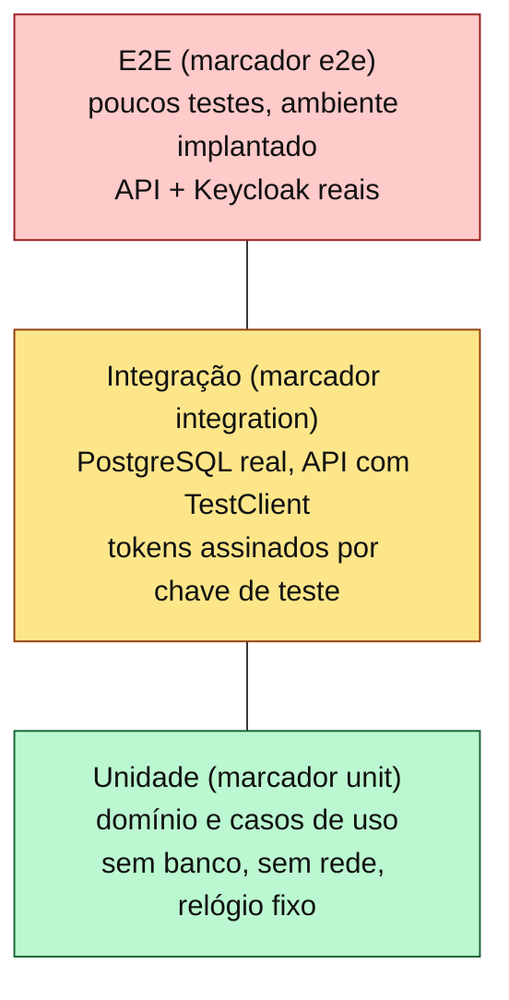

# 9. Testes

Este documento define a estratégia de testes da API de revenda de veículos: os níveis da pirâmide e o que cada um cobre, as ferramentas, como executar cada nível localmente, os critérios de aceitação da suíte e os cenários de comportamento (BDD) escritos em Gherkin. Os cenários são a especificação executável das regras de [02-modelagem-ddd.md](02-modelagem-ddd.md) e estão ligados aos requisitos pela matriz de [03-requisitos.md](03-requisitos.md).

## 9.1 Pirâmide de testes



| Nível | Marcador | Proporção esperada | Cobre | Não cobre | Depende de |
|---|---|---|---|---|---|
| Unidade | `unit` | ~70% dos testes | Agregados `Veiculo` e `Venda` (transições, invariantes, expiração, idempotência), value objects (código de pagamento, preço, ano), casos de uso com repositórios em memória, `CatalogoPort` falso e relógio fixo; validação de JWT com chave RSA gerada no teste; regras de arquitetura (imports) | SQL, HTTP, Keycloak | Nada externo |
| Integração | `integration` | ~25% | Repositórios SQLAlchemy contra PostgreSQL 16 (ordenação, paginação, índice único parcial, UPDATE condicional); concorrência real (N compras simultâneas do mesmo veículo); API completa com `TestClient` (status HTTP, `problem+json`, autorização por papel, webhook); migrações Alembic aplicadas do zero | Keycloak real, cluster | PostgreSQL (docker compose localmente; *service container* no CI) |
| Ponta a ponta | `e2e` | ~5% | Fluxo do roteiro do vídeo contra o ambiente implantado no kind: tokens reais do Keycloak, compra, webhook, efetivação, listagens | Casos de borda já cobertos abaixo | Cluster kind com API (8080) e Keycloak (8180, implantado pelo repositório de identidade) |
| Carga | — (script k6, fora do pytest) | — | Meta de desempenho das listagens (RNF-10) e reação do HPA (RNF-09) | Correção funcional | Cluster kind ou docker compose, k6 |

## 9.2 Ferramentas

| Ferramenta | Uso |
|---|---|
| pytest | Executor de todos os níveis; marcadores `unit`, `integration`, `e2e` registrados no `pyproject.toml` com `--strict-markers` |
| pytest-cov | Cobertura de linhas e ramos, com `--cov-fail-under=80` |
| FastAPI `TestClient` (httpx) | Testes de API em processo |
| httpx | Cliente HTTP dos testes e2e |
| cryptography + PyJWT | Geração de par de chaves RSA de teste e emissão de tokens; JWKS falso injetado na dependência de autenticação |
| PostgreSQL 16 (`postgres:16-alpine`) | Banco dos testes de integração (docker compose local; *service container* no CI) |
| Alembic | Aplica as migrações no banco de teste antes da suíte de integração |
| ruff, mypy | Lint, formatação e tipos (não são testes, mas bloqueiam o CI) |
| k6 | Teste de carga nas listagens (`tests/carga/listagens.js`) |

Os cenários Gherkin da seção 9.5 são especificação: são implementados como funções pytest comuns (sem pytest-bdd), cujo nome e *docstring* citam o identificador do cenário (ex.: `test_bdd_03_compra_concorrente`), mantendo a rastreabilidade sem uma dependência a mais.

## 9.3 Como executar localmente

Pré-requisitos: Python 3.12, Docker e, para e2e, o ambiente implantado (ver README e [08-ci-cd-infra.md](08-ci-cd-infra.md)).

```bash
# 1. Dependências de desenvolvimento
uv sync --frozen   # cria .venv com dependências de desenvolvimento (uv.lock)

# 2. Unidade (rápido, sem dependências externas)
uv run pytest -m unit

# 3. Integração (sobe só o PostgreSQL do docker compose; requer o .env da opção A do README)
docker compose up -d postgres
export TEST_DATABASE_URL="postgresql+psycopg://revenda:<DB_PASSWORD do .env>@localhost:5432/revenda_test"
uv run pytest -m integration

# 4. Unidade + integração com cobertura (mesmo critério do CI)
uv run pytest -m "unit or integration" --cov=revenda --cov-branch \
  --cov-report=term-missing --cov-report=xml --cov-fail-under=80

# 5. Ponta a ponta contra o ambiente implantado no kind (identidade e API no ar)
export E2E_API_URL="http://localhost:8080"
export E2E_KEYCLOAK_URL="http://localhost:8180"
segredo() { kubectl -n "$1" get secret "$2" -o jsonpath="{.data.$3}" | base64 -d; }
export E2E_WEBHOOK_SECRET="$(segredo revenda revenda-webhook-secret WEBHOOK_SECRET)"
export E2E_GESTOR_PASSWORD="$(segredo identidade keycloak-gestor GESTOR_PASSWORD)"
export E2E_KC_CLIENT_SECRET="$(segredo identidade keycloak-e2e E2E_ADMIN_CLIENT_SECRET)"
# E2E_KC_CLIENT_ID é opcional (padrão revenda-e2e-admin; o mesmo valor de keycloak-e2e/E2E_ADMIN_CLIENT_ID)
pip install -r tests/e2e/requirements.txt   # e2e não depende do pacote revenda
pytest tests/e2e -m e2e -o addopts="" -v
```

Observações:

- Os testes `e2e` ficam fora da execução padrão (`addopts = -m "not e2e"` no `pyproject.toml`); só rodam quando selecionados explicitamente.
- O e2e obtém tokens pelo client `revenda-e2e` (password grant), habilitado somente no realm do ambiente local; cria seus próprios clientes de teste com nomes aleatórios para poder ser executado repetidas vezes, pela Admin API do realm `revenda`, com o client técnico `revenda-e2e-admin` (client credentials, só `manage-users`, `view-users` e `query-users`). O admin do realm `master` não é usado. Os dois clients e os Secrets `keycloak-gestor` e `keycloak-e2e` são parte do contrato publicado pelo [repositório de identidade](https://github.com/Caina-Climaco/fiap-soat-revenda-identidade).
- Variáveis do e2e: `E2E_API_URL` e `E2E_KEYCLOAK_URL` (opcionais), `E2E_GESTOR_PASSWORD`, `E2E_WEBHOOK_SECRET` e `E2E_KC_CLIENT_SECRET` (obrigatórias), `E2E_KC_CLIENT_ID` (padrão `revenda-e2e-admin`), `E2E_GESTOR_USERNAME` (padrão `gestor.loja`), `E2E_RESERVA_TTL_MINUTOS` (padrão 30) e `E2E_EXIGIR` (`1` transforma variável ausente em erro).
- O docker compose cria o banco `revenda_test` na primeira subida do serviço `postgres`, com o usuário `revenda` e a senha `DB_PASSWORD` do `.env`. Sem `TEST_DATABASE_URL`, os testes de integração são pulados com aviso.
- No CI, a etapa de integração usa o *service container* `postgres:16-alpine` (credenciais fixas de teste, sem segredo real); no CD, o e2e roda no runner self-hosted após o rollout, contra `http://revenda-control-plane:30080` e `:30180`. O contrato do realm em si (papéis, clients, escopos, perfil de usuário) é testado no CI do repositório de identidade, job `realm`.

## 9.4 Critérios da suíte

| Critério | Valor |
|---|---|
| Cobertura de linhas em `src/revenda` (unit + integration) | ≥ 80%; o CI falha abaixo disso |
| Cobertura do domínio (`*/domain`) | Meta de 95% (acompanhada, não bloqueante) |
| Testes de unidade | Sem rede, sem banco, sem `sleep`; tempo total < 10 s |
| Testes de integração | Banco isolado; cada teste em transação revertida ou com limpeza das tabelas; tempo total < 2 min |
| Determinismo | Relógio injetado (`Clock`) em todos os testes que envolvem tempo; nenhum teste depende da hora real |
| Falhas intermitentes | Teste instável é corrigido ou removido no mesmo PR em que for detectado; não há *retry* automático |
| Gate de merge | ruff, mypy, unit + integration com cobertura, build, Trivy e validações de infraestrutura verdes |
| Gate de deploy | e2e verde ao final do CD |

## 9.5 Cenários BDD

| ID | Cenário | Nível onde é automatizado | Requisitos |
|---|---|---|---|
| BDD-01 | Compra com sucesso e efetivação | e2e e integração | RF-05, RF-07, RF-08, RF-11 |
| BDD-02 | Pagamento recusado | integração e e2e | RF-09 |
| BDD-03 | Compra concorrente | integração | RF-05, RNF-07 |
| BDD-04 | Compra sem cadastro (401) | integração e e2e | RF-04, RN-06 |
| BDD-05 | Gestor tentando comprar (403) | integração e e2e | RF-04, RN-05 |
| BDD-06 | Edição de veículo reservado (409) | unidade e integração | RF-02, RN-02 |
| BDD-07 | Webhook com segredo inválido | integração | RNF-03, RN-19 |
| BDD-08 | Reserva expirada | unidade e integração (relógio fixo) | RF-15, RN-04, RN-14 |
| BDD-09 | Listagens ordenadas por preço | integração e e2e | RF-06, RF-07, RN-17 |

### 9.5.1 BDD-01 — Compra com sucesso e efetivação

```gherkin
# language: pt
Funcionalidade: Compra de veículo pela internet
  Como cliente cadastrado
  Quero comprar um veículo anunciado
  Para que a compra seja efetivada após a confirmação do pagamento

  Contexto:
    Dado que o gestor cadastrou o veículo "Fiat Argo 2022 prata" por R$ 72.000,00
    E que existe um cliente cadastrado e autenticado com o papel "cliente"

  Cenário: Compra iniciada, pagamento aprovado e venda efetivada
    Quando o cliente solicita a compra do veículo
    Então a resposta tem status 201
    E a venda está "AGUARDANDO_PAGAMENTO" com preço de venda R$ 72.000,00
    E a venda possui um código de pagamento no formato "PAG-" seguido de 12 hexadecimais
    E a venda possui data de expiração 30 minutos após a criação
    E o veículo não aparece na lista de veículos à venda
    Quando o gateway notifica o pagamento "APROVADO" para o código de pagamento com o segredo correto
    Então a resposta tem status 200
    E a venda está "EFETIVADA" com data de efetivação preenchida
    E o veículo está "VENDIDO"
    E o veículo aparece na lista de veículos vendidos
    E a venda aparece em "minhas compras" do cliente como "EFETIVADA"

  Cenário: Notificação de aprovação repetida não tem efeito
    Dado que a venda do cliente já está "EFETIVADA"
    Quando o gateway notifica novamente o pagamento "APROVADO" para o mesmo código
    Então a resposta tem status 200
    E a venda continua "EFETIVADA" com a mesma data de efetivação
```

### 9.5.2 BDD-02 — Pagamento recusado

```gherkin
# language: pt
Funcionalidade: Recusa de pagamento

  Cenário: Pagamento recusado cancela a venda e devolve o veículo à venda
    Dado que o cliente iniciou a compra do veículo "VW Polo 2021 branco"
    E que a venda está "AGUARDANDO_PAGAMENTO"
    Quando o gateway notifica o pagamento "RECUSADO" para o código de pagamento com o segredo correto
    Então a resposta tem status 200
    E a venda está "CANCELADA" com motivo "PAGAMENTO_RECUSADO"
    E o veículo está "A_VENDA"
    E o veículo volta a aparecer na lista de veículos à venda
```

### 9.5.3 BDD-03 — Compra concorrente

```gherkin
# language: pt
Funcionalidade: Proteção contra venda dupla

  Cenário: Dois clientes compram o mesmo veículo ao mesmo tempo
    Dado que o veículo "Honda Civic 2020 preto" está "A_VENDA"
    E que existem 10 clientes autenticados
    Quando os 10 clientes solicitam a compra do veículo simultaneamente
    Então exatamente 1 resposta tem status 201
    E as outras 9 respostas têm status 409 com tipo de problema "veiculo-indisponivel"
    E existe exatamente 1 venda ativa para o veículo
    E o veículo está "RESERVADO"
```

Implementação: teste de integração com `threading.Barrier` e uma sessão de banco por thread, para que as transações concorram de fato no PostgreSQL.

### 9.5.4 BDD-04 — Compra sem cadastro

```gherkin
# language: pt
Funcionalidade: Compra exige cadastro prévio

  Cenário: Visitante anônimo tenta comprar
    Dado que o veículo "Renault Kwid 2023 vermelho" está "A_VENDA"
    E que o visitante não está autenticado
    Quando o visitante solicita a compra do veículo sem token de acesso
    Então a resposta tem status 401
    E o corpo da resposta é do tipo "application/problem+json"
    E o veículo continua "A_VENDA"
    E nenhuma venda é criada
```

### 9.5.5 BDD-05 — Gestor tentando comprar

```gherkin
# language: pt
Funcionalidade: Segregação de funções

  Cenário: Gestor da loja tenta comprar um veículo
    Dado que o veículo "Chevrolet Onix 2022 cinza" está "A_VENDA"
    E que o usuário autenticado possui o papel "gestor"
    Quando o gestor solicita a compra do veículo
    Então a resposta tem status 403
    E o veículo continua "A_VENDA"
    E nenhuma venda é criada
```

### 9.5.6 BDD-06 — Edição de veículo reservado

```gherkin
# language: pt
Funcionalidade: Edição restrita a veículos à venda

  Cenário: Gestor tenta alterar o preço de um veículo reservado
    Dado que o veículo "Toyota Corolla 2019 prata" custa R$ 95.000,00
    E que um cliente iniciou a compra do veículo
    Quando o gestor altera o preço do veículo para R$ 90.000,00
    Então a resposta tem status 409 com tipo de problema "veiculo-nao-editavel"
    E o preço do veículo continua R$ 95.000,00
    E o preço de venda da compra continua R$ 95.000,00

  Cenário: Gestor altera o preço de um veículo à venda
    Dado que o veículo "Toyota Corolla 2019 prata" está "A_VENDA" por R$ 95.000,00
    Quando o gestor altera o preço do veículo para R$ 90.000,00
    Então a resposta tem status 200
    E o preço do veículo passa a ser R$ 90.000,00
```

### 9.5.7 BDD-07 — Webhook com segredo inválido

```gherkin
# language: pt
Funcionalidade: Autenticação do gateway de pagamento

  Esquema do Cenário: Notificação sem o segredo correto é rejeitada
    Dado que existe uma venda "AGUARDANDO_PAGAMENTO" com código de pagamento conhecido
    Quando o gateway notifica o pagamento "APROVADO" com o cabeçalho X-Webhook-Secret <cabecalho>
    Então a resposta tem status 401
    E a venda continua "AGUARDANDO_PAGAMENTO"
    E o veículo continua "RESERVADO"

    Exemplos:
      | cabecalho          |
      | ausente            |
      | vazio              |
      | "segredo-errado"   |
```

### 9.5.8 BDD-08 — Reserva expirada

```gherkin
# language: pt
Funcionalidade: Expiração da reserva

  Contexto:
    Dado que o prazo de reserva configurado é de 30 minutos
    E que o cliente A iniciou a compra do veículo "Hyundai HB20 2021 azul" às 10:00
    E que nenhum resultado de pagamento foi recebido

  Cenário: Outro cliente compra o veículo após a expiração
    Dado que o relógio marca 10:31
    Quando o cliente B solicita a compra do veículo
    Então a resposta tem status 201
    E a venda do cliente A está "CANCELADA" com motivo "RESERVA_EXPIRADA"
    E existe exatamente 1 venda ativa para o veículo, pertencente ao cliente B

  Cenário: Pagamento aprovado chega depois da expiração
    Dado que o relógio marca 10:31
    Quando o gateway notifica o pagamento "APROVADO" para o código da venda do cliente A
    Então a resposta tem status 409 com tipo de problema "reserva-expirada"
    E a venda do cliente A está "CANCELADA" com motivo "RESERVA_EXPIRADA"
    E o veículo está "A_VENDA"

  Cenário: Veículo com reserva vencida volta à vitrine
    Dado que o relógio marca 10:31
    Quando um visitante lista os veículos à venda
    Então o veículo "Hyundai HB20 2021 azul" aparece na lista
```

### 9.5.9 BDD-09 — Listagens ordenadas por preço

```gherkin
# language: pt
Funcionalidade: Listagens públicas ordenadas por preço

  Contexto:
    Dado que existem os veículos:
      | veiculo                | preco      | status   |
      | Fiat Mobi 2020         | 45.000,00  | A_VENDA  |
      | Jeep Compass 2022      | 150.000,00 | A_VENDA  |
      | Fiat Argo 2022         | 72.000,00  | A_VENDA  |
      | Honda HR-V 2021        | 120.000,00 | VENDIDO  |
      | Renault Sandero 2019   | 55.000,00  | VENDIDO  |

  Cenário: Veículos à venda do mais barato para o mais caro
    Quando um visitante lista os veículos à venda
    Então a resposta tem status 200
    E os veículos aparecem na ordem "Fiat Mobi 2020", "Fiat Argo 2022", "Jeep Compass 2022"
    E o total informado é 3

  Cenário: Veículos vendidos do mais barato para o mais caro
    Quando um visitante lista os veículos vendidos
    Então a resposta tem status 200
    E os veículos aparecem na ordem "Renault Sandero 2019", "Honda HR-V 2021"
    E o total informado é 2

  Cenário: Paginação mantém a ordem
    Quando um visitante lista os veículos à venda com limite 2 e deslocamento 2
    Então a lista contém apenas "Jeep Compass 2022"
    E o total informado é 3
```

## 9.6 Teste de carga (k6)

Objetivo: evidenciar RNF-10 (p95 < 300 ms nas listagens públicas) e observar o HPA (RNF-09). O script é `tests/carga/listagens.js`, para o [k6](https://grafana.com/docs/k6/latest/), com instruções em `tests/carga/README.md`:

| Item | Valor |
|---|---|
| Alvo | `GET /api/v1/veiculos/a-venda` e `GET /api/v1/veiculos/vendidos` com `limite=20` (públicos, sem token); cada iteração confere status 200 e a presença de `itens` |
| Carga | 20 usuários virtuais (VUs) durante 1 minuto |
| *Thresholds* | `http_req_duration` com `p(95)<300` (ms) e `http_req_failed` com `rate<0.01` (erro < 1%) |
| Resultado | O k6 termina com código diferente de zero se algum *threshold* falhar |

```bash
# Contra o ambiente implantado (kind) ou o docker compose: a API em localhost:8080
k6 run tests/carga/listagens.js
# Outra URL: variável API_URL (padrão http://localhost:8080)
k6 run -e API_URL=http://localhost:8080 tests/carga/listagens.js

# Em outro terminal, para acompanhar o HPA e o consumo dos pods:
kubectl -n revenda get hpa revenda-api -w
kubectl -n revenda top pods
```

Para um cenário mais próximo do estoque real, cadastre antes algumas centenas de veículos com o token do gestor (como no exemplo com curl do README). O resumo do k6 (p95, taxa de erro, requisições por segundo) e a captura do HPA servem de evidência para o vídeo. Durante a carga, `GET /metrics` mostra o histograma de latência crescendo por rota ([12-observabilidade.md](12-observabilidade.md)).
