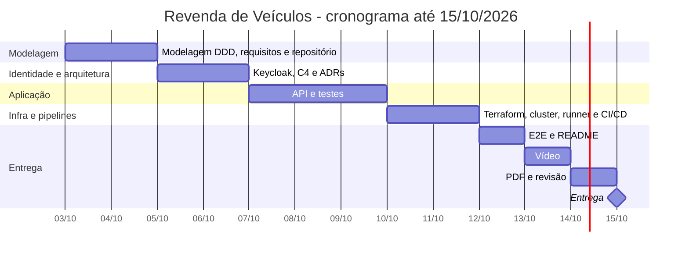

# 10. Plano de execução

Este documento organiza a execução do projeto até a entrega de 15/10/2026: backlog em épicos e histórias com critérios de aceite, Definition of Ready (DoR), Definition of Done (DoD), cronograma e riscos com mitigação. Serve para o autor acompanhar o progresso e para o avaliador entender como o escopo foi fatiado.

## 10.1 Backlog

Cada história vira uma ou mais issues no GitHub e é entregue por Pull Request. Identificadores: `EP-xx` (épico) e `HU-xx` (história).

### EP-01 — Modelagem e documentação base

| ID | História | Critérios de aceite |
|---|---|---|
| HU-01 | Como avaliador, quero a modelagem DDD documentada para entender o domínio | Domain Storytelling, Event Storming, linguagem ubíqua, contextos, agregados, máquinas de estado e regras RN-xx publicados em `docs/02`; diagramas Mermaid renderizam no GitHub |
| HU-02 | Como avaliador, quero requisitos rastreáveis | RF e RNF numerados, origem indicada, matriz RF → endpoint → caso de uso → teste em `docs/03` |
| HU-03 | Como autor, quero o repositório criado e protegido | Repositório público; `main` protegida (PR obrigatório, CI obrigatório, sem force push, inclui admins); template de PR; `.gitignore` cobre `*.tfstate`, kubeconfig, `.env` |

### EP-02 — Identidade e acesso

| ID | História | Critérios de aceite |
|---|---|---|
| HU-04 | Como visitante, quero me cadastrar para poder comprar | Tela de registro do realm `revenda` pede nome, sobrenome, e-mail, CPF, telefone e senha; novo usuário recebe papel `cliente` |
| HU-05 | Como gestor, quero acessar a API com meu papel | Usuário seed `gestor.loja` com papel `gestor`; token contém `realm_access.roles` e audiência `revenda-api` |
| HU-06 | Como avaliador, quero autenticar pelo Swagger | Botão Authorize em `/docs` usa Authorization Code + PKCE com client público `revenda-swagger` |
| HU-07 | Como API, quero validar tokens | JWT RS256 validado via JWKS com cache; `iss`, `exp` e audiência verificados; falha → 401 `problem+json` |

### EP-03 — Catálogo

| ID | História | Critérios de aceite |
|---|---|---|
| HU-08 | Como gestor, quero cadastrar veículos | `POST /api/v1/veiculos` → 201 com `Location`; validações RN-15; não gestor → 403; anônimo → 401 |
| HU-09 | Como gestor, quero editar veículos à venda | `PATCH /api/v1/veiculos/{id}` → 200; veículo não `A_VENDA` → 409; inexistente → 404 |
| HU-10 | Como visitante, quero ver veículos à venda e vendidos por preço | `GET /api/v1/veiculos/a-venda` e `GET /api/v1/veiculos/vendidos` ordenados por preço asc com desempate determinístico; paginação `limite`/`deslocamento` |
| HU-11 | Como visitante, quero ver os detalhes de um veículo | `GET /api/v1/veiculos/{id}` → 200 ou 404 |

### EP-04 — Vendas

| ID | História | Critérios de aceite |
|---|---|---|
| HU-12 | Como cliente, quero comprar um veículo | `POST /api/v1/vendas` → 201 `AGUARDANDO_PAGAMENTO` com `codigo_pagamento` e `expira_em`; veículo `RESERVADO`; preço congelado |
| HU-13 | Como loja, quero impedir venda dupla | Teste de concorrência: 1 sucesso e N−1 respostas 409; índice único parcial criado pela migração |
| HU-14 | Como cliente, quero ver minhas compras | `GET /api/v1/vendas/minhas` lista apenas as do `sub` do token |
| HU-15 | Como gestor, quero acompanhar as vendas | `GET /api/v1/vendas?status=` e `GET /api/v1/vendas/{id}` com `comprador_id`; cliente em venda alheia → 404 |
| HU-16 | Como cliente ou gestor, quero cancelar uma compra pendente | `POST /api/v1/vendas/{id}/cancelar` → 200 `CANCELADA` com motivo conforme o papel; venda não pendente → 409; veículo liberado |
| HU-17 | Como loja, quero que reservas abandonadas expirem | Venda vencida é cancelada com `RESERVA_EXPIRADA` ao ser tocada (compra, webhook, cancelamento, listagem à venda); testes com relógio fixo |

### EP-05 — Pagamento (webhook)

| ID | História | Critérios de aceite |
|---|---|---|
| HU-18 | Como gateway, quero informar pagamento aprovado | `POST /api/v1/pagamentos/webhook` com `APROVADO` → venda `EFETIVADA`, veículo `VENDIDO`; repetição → 200 sem efeito |
| HU-19 | Como gateway, quero informar pagamento recusado | `RECUSADO` → venda `CANCELADA` (`PAGAMENTO_RECUSADO`), veículo `A_VENDA` |
| HU-20 | Como loja, quero que só o gateway efetive vendas | Segredo ausente ou inválido → 401 sem alteração; código desconhecido → 404; venda expirada ou em estado final incompatível → 409 |

### EP-06 — Infraestrutura

| ID | História | Critérios de aceite |
|---|---|---|
| HU-21 | Como operador, quero o cluster provisionado por código | `kind create cluster --config infra/kind/cluster.yaml` cria o cluster `revenda` (idempotente no CD e no script 04); `terraform apply` cria o namespace `revenda`, o `revenda-db`, metrics-server e secrets com senhas aleatórias, com state próprio (`revenda-api.tfstate`); o namespace `identidade` vem do repositório de identidade ([ADR-014](adrs/ADR-014-identidade-em-repositorio-proprio.md)); `fmt` e `validate` limpos |
| HU-22 | Como operador, quero o Keycloak isolado | Keycloak e seu PostgreSQL no namespace `identidade`, em repositório próprio ([fiap-soat-revenda-identidade](https://github.com/Caina-Climaco/fiap-soat-revenda-identidade)) com Terraform, state, CI e CD próprios; acessível em `http://localhost:8180`; a API só consome o contrato (issuer, JWKS, audiência, papéis) |
| HU-23 | Como operador, quero a API implantada com boas práticas | Deployment com 2 réplicas, probes, *resources*, usuário não root, FS somente leitura; Service ClusterIP atrás do API Gateway Kong (host 8080, ADR-015); HPA 2..5; Job de migração |

### EP-07 — CI/CD

| ID | História | Critérios de aceite |
|---|---|---|
| HU-24 | Como autor, quero CI em todo PR | `ci.yml`: ruff, mypy, pytest unit + integration com cobertura ≥ 80%, build, Trivy, `terraform fmt`/`validate`, kubeconform; obrigatório na proteção da `main` |
| HU-25 | Como autor, quero deploy automático ao mergear | `cd.yml` no runner `kind-local`: cluster kind (se faltar), verificação do realm `revenda` publicado (falha cedo sem a identidade), terraform apply, build `revenda-api:<sha>`, `kind load`, kustomize apply, Job de migração, rollout, e2e e resumo no job summary |
| HU-26 | Como autor, quero o runner self-hosted seguro | Runner com label `kind-local`; CD só em push na `main` e `workflow_dispatch`; PRs de fork exigem aprovação para rodar workflows |

### EP-08 — Qualidade e entrega

| ID | História | Critérios de aceite |
|---|---|---|
| HU-27 | Como avaliador, quero ver o fluxo ponta a ponta automatizado | `pytest -m e2e` cobre o roteiro do vídeo e passa no CD |
| HU-28 | Como avaliador, quero um README completo | O que é, como foi implementado, como rodar localmente, como testar, credenciais locais, links para `docs/` |
| HU-29 | Como avaliador, quero o vídeo da solução | Vídeo mostra infraestrutura, pipeline, cadastro de cliente e veículo, compra, efetivação e separação dos bancos |
| HU-30 | Como avaliador, quero o PDF de entrega | PDF com nome, links dos dois repositórios (API e identidade) e do vídeo, resumo da solução |

## 10.2 Definition of Ready (DoR)

Uma história entra em desenvolvimento quando:

1. Tem objetivo descrito no formato "como… quero… para…" ou equivalente.
2. Tem critérios de aceite verificáveis (status HTTP, estado resultante, comando a executar).
3. Os termos usados constam da linguagem ubíqua ([02-modelagem-ddd.md](02-modelagem-ddd.md)) ou foram adicionados a ela.
4. As regras de negócio envolvidas (RN-xx) estão identificadas.
5. Dependências (outras histórias, infraestrutura, decisões) estão resolvidas ou registradas em ADR.
6. Cabe em no máximo um dia de trabalho; se não couber, é dividida.

## 10.3 Definition of Done (DoD)

Uma história está pronta quando:

1. O código está na `main` por Pull Request com CI verde (ruff, mypy, testes, cobertura ≥ 80%, build, Trivy, validações de infraestrutura).
2. Há testes no nível adequado da pirâmide para cada critério de aceite; cenários BDD relacionados passam.
3. O CD implantou a mudança no cluster local e o e2e passou (para histórias que afetam a API ou a infraestrutura).
4. Nenhum segredo, state do Terraform, kubeconfig ou `.env` foi versionado.
5. A documentação afetada foi atualizada no mesmo PR (`docs/`, README, ADR quando houver decisão nova, matriz de rastreabilidade).
6. Mensagens de commit seguem Conventional Commits e o PR usa o template do repositório.
7. Os diagramas Mermaid alterados renderizam no GitHub.

## 10.4 Cronograma

| Período | Entregas | Histórias |
|---|---|---|
| 03–04/10 | Modelagem DDD, requisitos, criação e proteção do repositório, esqueleto do projeto | HU-01, HU-02, HU-03 |
| 05–06/10 | Realm Keycloak (registro, papéis, clients), diagramas C4, ADRs | HU-04 a HU-07 |
| 07–09/10 | API (Catálogo, Vendas, webhook), migrações, testes de unidade e integração | HU-08 a HU-20 |
| 10–11/10 | Terraform, cluster kind, runner self-hosted, pipelines de CI e CD | HU-21 a HU-26 |
| 12/10 | Testes e2e no CD e README | HU-27, HU-28 |
| 13/10 | Gravação e edição do vídeo | HU-29 |
| 14/10 | PDF de entrega e revisão geral (documentação, links, execução do zero) | HU-30 |
| 15/10 | Entrega | — |

Folga: não há dia livre no cronograma; a mitigação é a ordem de prioridade abaixo, aplicada se houver atraso.

1. Must: RF-01 a RF-09, RF-15, RF-16, CI, CD, e2e, README, vídeo, PDF.
2. Should: RF-12 a RF-14, RF-17, RF-18, NetworkPolicy, HPA.
3. Could: teste de carga, cobertura de domínio acima de 95%.

## 10.5 Riscos

| # | Risco | Probabilidade | Impacto | Mitigação | Plano de contingência |
|---|---|---|---|---|---|
| R-01 | PC do autor desligado ou suspenso impede o CD (runner self-hosted offline) e o job fica na fila | Média | Médio | Desativar suspensão durante as janelas de trabalho; runner em container Linux com `--restart unless-stopped`, que volta junto com o Docker Desktop; `workflow_dispatch` para reexecutar o deploy | Ligar o PC e reexecutar o workflow; o job enfileirado expira e é disparado de novo manualmente |
| R-02 | Consumo de memória do Keycloak (JVM) esgota recursos do PC junto com cluster, IDE e gravação de vídeo | Alta | Médio | *limit* de memória do Keycloak em 1536Mi (*request* 768Mi), com o heap no padrão da imagem (percentual da memória do container); cluster de um nó; fechar aplicações pesadas durante a gravação | Reduzir réplicas da API para 1 durante a gravação, documentando o motivo |
| R-03 | Mudança de versão ou bloqueio dos providers Terraform (`tehcyx/kind`, `helm`, `kubernetes`) quebra o `apply` | Média | Alto | Versões fixadas em `required_providers` e `.terraform.lock.hcl` versionado; atualização só por PR | Reverter o lock file para a última versão funcional. **Materializado em 03/10/2026:** o `terraform-provider-kind.exe` (comunitário, sem assinatura de código) foi bloqueado pelo Smart App Control do Windows 11. **Mitigação aplicada:** o cluster passou a ser criado pela CLI `kind` (assinada, `infra/kind/cluster.yaml`) e o provider foi removido; o Terraform ficou só com `kubernetes`, `helm` e `random`, assinados pela HashiCorp ([ADR-005](adrs/ADR-005-kind-terraform-nodeport.md)) |
| R-04 | Keycloak 26.x muda configuração (user profile, hostname, import de realm) e o realm não importa | Média | Alto | Tag de imagem fixa (`quay.io/keycloak/keycloak:26.7.1`, sem `latest`); realm exportado da mesma versão; teste de import no docker compose antes do cluster (hoje automatizado no job `realm` do CI do repositório de identidade) | Ajustar o `realm-revenda.json` (no repositório de identidade) exportando de uma instância em execução |
| R-05 | Suporte a NetworkPolicy no kindnet diferente do esperado | Média | Baixo | Verificar a versão do kind e testar o bloqueio com um pod de teste | Manter os manifestos e documentar a política como intenção em [07-seguranca-lgpd.md](07-seguranca-lgpd.md) |
| R-06 | Teste de concorrência instável (depende de agendamento de threads) | Média | Médio | Barreira de sincronização, várias tentativas simultâneas (10), asserção no estado final do banco e não só nas respostas | Aumentar o número de threads e isolar o teste em marcador próprio |
| R-07 | Vazamento de segredo em commit (repetição do problema da fase 2) | Baixa | Alto | `.gitignore` desde o primeiro commit; segredos só via Terraform/Secret; item de checagem no template de PR; secret scanning do GitHub ativo | Rotacionar o segredo (`terraform apply -replace`) e reescrever o histórico se necessário |
| R-08 | Atraso no cronograma sem folga | Alta | Alto | Ordem de prioridade Must/Should/Could; histórias de no máximo um dia; documentação escrita junto com o código | Cortar itens Should/Could e registrar no README o que ficou fora |
| R-09 | Runner self-hosted executando código não revisado | Baixa | Alto | CD só em push na `main` protegida; PRs de fork exigem aprovação; CI no runner hospedado do GitHub | Remover o runner do repositório até investigar |
| R-10 | State local do Terraform perdido ou corrompido no PC do runner | Baixa | Médio | State fora do repositório em diretório fixo do runner, com cópia antes de cada `apply` | Recriar o cluster do zero (ambiente é descartável; dados são de demonstração) |
| R-11 | Porta 8080, 8180, 3000 ou 9090 ocupada no host impede o mapeamento do kind | Baixa | Baixo | Portas documentadas no README e definidas em `infra/kind/cluster.yaml` | Alterar as portas no arquivo (nos dois repositórios) e recriar o cluster |
| R-12 | Abuso das rotas públicas e do webhook (excesso de requisições, tentativa de forjar pagamento) | Baixa | Médio | **Mitigado** pelo API Gateway ([ADR-015](adrs/ADR-015-api-gateway-kong.md)): Kong como única entrada, *rate limiting* por IP (600/min em `/api/v1`, 60/min na compra), key-auth + ACL no webhook, payload ≤ 1 MB; mais limites de paginação, validações estritas de entrada e HPA. Risco residual: contadores locais a uma réplica do Kong e limite da compra por IP, não por comprador | Baixar os limites nas variáveis do Terraform e reaplicar; alerta `KongRejeicoesNaBorda` indica abuso em curso |
| R-13 | Degradação não percebida a tempo | Média | Baixo | **Mitigado** pelo monitoramento no cluster ([ADR-016](adrs/ADR-016-prometheus-grafana.md)): Prometheus coleta API e Kong, painel no Grafana e 8 regras de alerta avaliadas continuamente, com testes no CI e verificação no CD. Risco residual: sem Alertmanager, ninguém é notificado; o alerta só é visto no painel ou em `localhost:9090/alerts` | Acrescentar Alertmanager (ou um APM) com notificação para o canal da equipe ([12-observabilidade.md](12-observabilidade.md)) |
| R-14 | API implantada sem o serviço de identidade no ar, ou contratos divergentes entre os dois repositórios (papéis, audiência, clients) | Média | Alto | Ordem de implantação documentada (identidade → API); CD e script 04 da API conferem o realm `revenda` antes do `terraform apply` e falham cedo; contrato documentado e testado no CI do repositório de identidade; valores consumidos concentrados em `k8s/base/configmap.yaml` ([ADR-014](adrs/ADR-014-identidade-em-repositorio-proprio.md)) | Implantar a identidade (script 04 ou CD de lá) e reexecutar o CD da API; em mudança de contrato, coordenar PRs nos dois repositórios |
